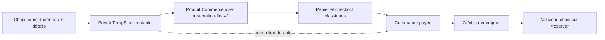
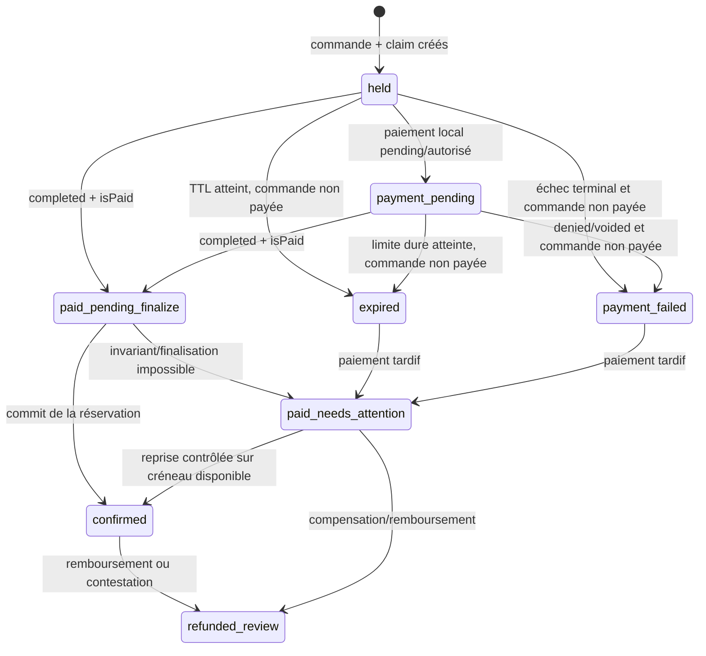
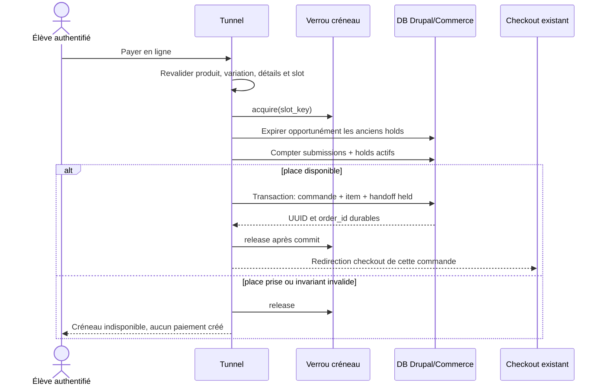
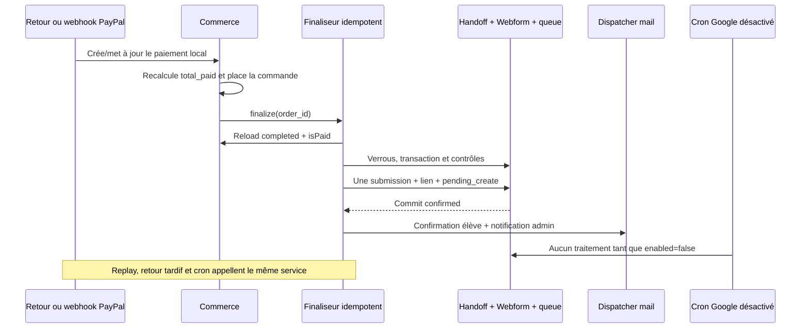

# Handoff paiement en ligne vers créneau — architecture 2026

Date de l'audit : 13 août 2026

Branche de référence : `release/prod` à `2c9f1fc5`

Portée de cette livraison : conception et plan de tests uniquement

Ce document décrit la prochaine implémentation sûre du paiement en ligne après
choix du cours, du créneau et des détails. Il ne constitue pas une
implémentation. Cette livraison ne modifie ni code, ni schéma, ni configuration,
ni produit Commerce et n'effectue aucun appel de paiement ou Google.

## Statut des affirmations

Pour ne pas confondre le comportement observé et le design proposé, les termes
suivants sont utilisés dans tout le document :

- **Confirmé — dépôt** : comportement démontré par le code ou la configuration
  versionnée dans ce worktree ;
- **Confirmé — source verrouillée** : comportement lu dans les versions contrib
  verrouillées par `composer.lock` ; il n'a pas été exercé dans ce worktree ;
- **Inférence** : risque déduit de l'ordre des opérations ou de l'absence d'une
  garde, à confirmer par un test d'exécution ou de concurrence ;
- **Recommandation** : comportement cible de futures PR ;
- **À vérifier en runtime** : état actif d'une base ou d'un environnement que le
  dépôt seul ne permet pas d'établir.

Les références de lignes correspondent à `release/prod` au commit audité. Elles
seront naturellement amenées à bouger dans les PR d'implémentation.

## Décisions proposées

| Question | Décision recommandée |
|---|---|
| Attachement durable | Une ligne serveur `course_slot_claim` de source `online`, unique par commande, porte le snapshot validé. La commande et son unique ligne ne portent qu'un UUID/pointeur et une version dans leur propriété `data`. Ni URL ni tempstore ne sont sources de vérité. |
| Politique de créneau | Soft-réservation durable, comptée dans la capacité, avec 20 minutes initiales et une limite dure de 45 minutes lorsqu'un paiement local reste `pending`/autorisé. Ces valeurs sont proposées et doivent être validées métier avant activation. |
| Dernière place | Une seule transaction sous le verrou de créneau commun vérifie submissions et holds. Toutes les acquisitions, y compris Webform et paiement sur place, écrivent dans un registre de claims dont la clé DB nullable `active_slot_key` est unique pour la capacité actuelle de une place. |
| Abandon ou échec | Un cancel navigateur n'est pas une preuve d'échec : le hold reste réessayable jusqu'à expiration. Un état de paiement terminal refusé/annulé libère immédiatement si la commande n'est pas payée. Le cron et les acquisitions expirent les autres holds. |
| PayPal | Retour et webhook convergent vers l'état local Commerce. En leur absence, la réconciliation ne finalise que ce qui est déjà visible localement et alerte sinon. Seul `order completed + isPaid()` autorise la finalisation. Les replays sont des no-op idempotents. |
| Submission Webform | Création finale uniquement après paiement autoritatif ; jamais comme mécanisme de hold. |
| Droits | Le handoff payé représente lui-même l'unité achetée et la consomme directement dans sa submission. Il court-circuite le grant générique, sans détour par la table PR #62 et sans incrément/décrément temporaire du solde. |
| Emails et Google | Aucun effet avant paiement. La réservation et son état durable précèdent le commit ; la queue Google est tentée dans cette transaction mais reste réparable si son écriture non bloquante échoue. Les emails partent seulement après commit. Google reste `enabled=false` pendant le déploiement. |
| Cleanup | Expiration opportuniste sous verrou, plus un worker borné avec cible chaque minute et maximum acceptable cinq minutes. Aucun effacement historique dans la première livraison. |
| Schéma minimal | Une seule table applicative additive et indexée ; aucun champ Commerce, aucune modification produit et aucune nouvelle URL publique. |
| Rollback | Feature flag off, arrêt des nouveaux holds, drainage par état, conservation des paiements et réservations finalisés, table additive laissée en place. |
| Validation locale | DDEV avec fausse passerelle, faux client Google et collecteur des interfaces mail `default` et `webform`, plus tests de concurrence à deux processus et toutes les régressions existantes. Aucun appel réel. |

La recommandation tranche donc en faveur d'un **hold souple avec expiration**.
Laisser le créneau libre jusqu'au paiement autoriserait deux clients à payer la
dernière place. Une réservation Webform avant paiement déclencherait ou
compliquerait au contraire les droits, emails et données Google avant que le
paiement soit certain.

## Méthode et limites de l'audit

L'audit a été réalisé en lecture seule sur :

- le tunnel reservation-first ;
- les hooks Webform et les contrôles de capacité ;
- le modèle `COURS À PAYER` issu de la PR #62 ;
- l'attribution et la consommation des crédits payés ;
- les configurations de commandes, checkout et passerelles Commerce ;
- les sources Commerce 3.3.2, Commerce PayPal 2.1.0, Webform
  6.3.0-beta7 et `webform_booking` 1.1.11 verrouillées par
  `drupal/composer.lock` ;
- les emails transactionnels, la queue Google et le cron ;
- les scripts locaux de fixtures, de tests Commerce et de déploiement staging.

Ce worktree ne contient ni `.ddev` ni `drupal/vendor`. Les sources contrib des
versions verrouillées ont été consultées dans le checkout DDEV local voisin,
mais il n'a pas été possible de démarrer ce worktree dans Drupal ou d'y exécuter
un test runtime. L'état actif de la base, des passerelles, du webhook PayPal, de
Google et des handlers mail n'est pas déductible de `config/sync`. Aucun
paiement, email externe, appel Google ou action VPS n'a été effectué.

## Architecture actuelle

### Tunnel reservation-first

**Confirmé — dépôt.** Le formulaire
`ReservationFirstCourseTunnelForm` enchaîne `course`, `slot`, `details`,
`payment`, puis `confirmed`. Il conserve une seule structure par utilisateur
dans le PrivateTempStore `unisonges_structure`, clé
`course_reservation_first_tunnel` :

- `drupal/web/modules/custom/unisonges_structure/src/Form/ReservationFirstCourseTunnelForm.php:23` ;
- `drupal/web/modules/custom/unisonges_structure/src/Form/ReservationFirstCourseTunnelForm.php:122-168` ;
- `drupal/web/modules/custom/unisonges_structure/src/Form/ReservationFirstCourseTunnelForm.php:1523-1563`.

Cette structure n'a ni UUID de tentative, ni commande associée, ni expiration
métier. Deux onglets du même compte partagent donc la même sélection. L'action
« Recommencer » efface seulement ce tempstore
(`ReservationFirstCourseTunnelForm.php:1633-1643`).

Les cours proposés sont des produits publiés et accessibles de bundles
`cours_essai` et `cours_deb_inter`. Le tunnel choisit un produit, pas une
variation. La branche paiement sur place prend actuellement la première
variation publiée (`ReservationFirstCourseTunnelForm.php:1095-1125` et
`:1404-1440`).

Le créneau est stocké sous forme `YYYY-MM-DD HH:MM|N`. La configuration
Webform versionnée fixe actuellement :

- durée : 60 minutes ;
- capacité globale : une place par créneau ;
- maximum : une place par réservation ;
- horizon affiché : 30 jours.

Source :
`drupal/config/sync/webform.webform.cours_particuliers_reservation.yml:31-35`.
La capacité est globale à ce Webform et ne distingue pas le cours ou le produit.

### Branche paiement en ligne actuelle

**Confirmé — dépôt.** `submitPaymentStep()` mémorise
`payment_choice=online`, affiche que le créneau n'est pas encore réservé, puis
retourne avant toute création persistante. La redirection cible la page du
produit, ou `/cours`, et transporte seulement
`?reservation-first=1` :

- `ReservationFirstCourseTunnelForm.php:445-493` ;
- `ReservationFirstCourseTunnelForm.php:522-533` ;
- `ReservationFirstCourseTunnelForm.php:1271-1287`.

Une recherche globale du dépôt ne trouve aucun lecteur du paramètre
`reservation-first`. Aucun identifiant de créneau, détail, tentative, ligne de
commande ou commande n'est transmis. Le chemin redevient donc le flux Commerce
historique « achat d'abord, réservation ensuite ». La fin de checkout propose
d'ailleurs `/reserver`
(`drupal/web/modules/custom/unisonges_structure/unisonges_structure.module:729-750`
et `:809-821`).



### Branche paiement sur place actuelle

**Confirmé — dépôt.** La confirmation sur place prend le verrou du créneau,
ouvre une transaction DB, recontrôle le conflit, crée une commande manuelle
`completed` non payée, assure un droit PR #62 `pending_payment`, puis crée une
submission finale. Elle n'affiche la confirmation que si le contexte relu vaut
`to_pay` :

- `ReservationFirstCourseTunnelForm.php:1289-1329` ;
- `ReservationFirstCourseTunnelForm.php:1347-1401` ;
- `ReservationFirstCourseTunnelForm.php:1475-1515`.

La submission porte la réservation, les détails validés,
`unisonges_payment_choice=pay_on_site`, l'ID commande et le libellé du cours.
Le droit consommé donne le libellé administratif `COURS À PAYER` ; ce n'est pas
un statut Webform.

### Capacité et verrous actuels

**Confirmé — dépôt.** Le contrôle de capacité additionne les valeurs actives de
`webform_submission_data` pour l'élément `reservation`. Les valeurs terminées
par `|0` sont inactives. Aucun hold externe au Webform n'est compté :

- `unisonges_structure.module:1168-1178` ;
- `unisonges_structure.module:1243-1293` ;
- sources `webform_booking` 1.1.11, méthode de disponibilité du contrôleur.

Le verrou est nommé avec un hash du créneau, acquis pour 30 secondes et libéré
par le hook insert/update de submission :

- `unisonges_structure.module:997-1020` ;
- `unisonges_structure.module:1135-1165` ;
- `unisonges_structure.module:2226-2310` ;
- `unisonges_structure.module:2312-2360`.

La sélection initiale ne prend aucun verrou durable. Le verrou de 30 secondes
est adapté à une mutation courte, pas à un passage chez PayPal.

**Inférence à tester.** Lors du flux sur place, le hook Webform libère le verrou
avant le retour de `submission->save()` et donc avant la fin de la transaction
englobante. Selon le backend de lock et l'isolation DB, une deuxième requête
pourrait acquérir le verrou avant de voir l'écriture non commitée. Le futur
service doit conserver le verrou jusqu'après le commit, et le test de
concurrence doit prouver cette propriété.

### Commandes, paiements et workflow

**Confirmé — dépôt.** Le type de commande `default` utilise `order_default` et
active le reçu client :
`drupal/config/sync/commerce_order.commerce_order_type.default.yml:7-18`.
Le workflow Commerce 3.3.2 verrouillé comporte `draft`, `completed`,
`canceled` ; `place` fait `draft -> completed`, et `cancel` seulement
`draft -> canceled`.

**Confirmé — source verrouillée.** Pour une passerelle hors site, un paiement
local `completed` recalcule le total payé. L'événement de commande payée peut
placer une commande draft même si le webhook précède le retour navigateur ou
si le navigateur ne revient jamais. Les futures règles ne doivent donc pas
prendre le retour HTTP comme source de vérité.

L'export PayPal est en mode sandbox, intent capture, Smart Payment Buttons et
bouton panier. Il présente deux points à traiter comme **gates de déploiement**,
pas comme preuve de l'état actif :

- `webhook_id` est vide ;
- `payment_method_types` contient `paypal`, alors que le post-update de Commerce
  PayPal 2.1.0 normalise cette valeur vers `paypal_checkout` ;
- `mode` vaut `sandbox`, alors que les identifiants déclarés par le plugin 2.1.0
  sont `test` et `live` ;
- `enable_webhook_request_logging=true` demande la journalisation des requêtes
  webhook ; la portée et la rétention réelles de ces logs doivent être vérifiées
  et minimisées avant tout trafic, car un corps de webhook contient des données
  de paiement.

Source :
`drupal/config/sync/commerce_payment.commerce_payment_gateway.paypal.yml:7-34`
et source du post-update Commerce PayPal 2.1.0. Les valeurs de secrets ne sont
volontairement pas reproduites ici. **À vérifier en runtime :** la configuration
active peut différer de l'export.

**Incident de sécurité confirmé le 13 août 2026.**
`gh repo view Nyoha12/Uni-Songes --json visibility,isPrivate` retourne
`PUBLIC/false`, alors que ce fichier suivi contient un `client_id` et surtout un
`secret` PayPal non vides (`:18-19`). Aucune valeur n'est reproduite dans ce
document. Le secret doit être révoqué/rotaté immédiatement hors de cette PR,
puis retiré du stockage versionné selon une procédure de sécurité dédiée. Son
activité réelle n'a pas été testée. Cette rotation est une gate bloquante avant
tout essai de paiement ou déploiement du handoff ; elle ne justifie ni appel
PayPal ni modification `config/sync` dans le présent audit documentaire.

**Confirmé — source verrouillée.** Commerce PayPal 2.1.0 :

- le retour approuvé peut capturer et créer/mettre à jour le paiement local ;
- le webhook vérifié traite notamment capture completed, pending, denied,
  void et refund ;
- un événement completed identique est ignoré ;
- le cancel du bouton redirige vers le contrôleur Commerce, mais ne passe pas la
  commande à `canceled` et ne saurait libérer un hold applicatif à lui seul.

### Attribution des droits et PR #62

**Confirmé — dépôt.** Tous les inserts/updates de commande invoquent
`_unisonges_structure_apply_course_rights_from_order()`
(`unisonges_structure.module:24-44`). Pour un achat normal, cette fonction
exige `completed` et `isPaid()`, puis protège les resauvegardes séquentielles
avec `order.data['unisonges_course_rights_applied']`
(`unisonges_structure.module:1295-1415`). Elle crédite le compte selon le type
et la quantité, puis envoie le mail « crédits disponibles » si un crédit a été
ajouté (`:1418-1478`).

**Inférence à tester.** Le booléen sérialisé n'est ni une contrainte DB ni un
compare-and-set. Deux sauvegardes réellement concurrentes peuvent toutes deux
lire `false`. Le handoff doit éviter cette fenêtre pour sa propre unité ; le
durcissement global des achats autonomes mérite une PR séparée.

La PR #62 a ajouté
`unisonges_structure_course_to_pay_right`, avec états `pending_payment`,
`consumed`, `paid`, `cancelled` et clé unique
`(order_id, source_order_item_id, credit_index)` :

- `drupal/web/modules/custom/unisonges_structure/unisonges_structure.install:110-214` ;
- `unisonges_structure.module:1583-1653` ;
- `unisonges_structure.module:1741-1890` ;
- `unisonges_structure.module:1969-2057`.

Ce ledger évite de recréditer un droit sur place déjà consommé lorsque la
commande est payée plus tard. Son sens métier reste toutefois « payer sur
place » ; le réutiliser tel quel pour un achat online rendrait faux les statuts,
les emails et le contexte de paiement.

### Submission Webform et effets de bord

**Confirmé — dépôt et source verrouillée.** Pendant la sauvegarde d'une
submission finale :

1. l'entité et ses données sont écrites ;
2. le hook custom insert vérifie le conflit, consomme un droit et queue Google ;
3. les handlers Webform `postSave` envoient les emails élève et admin ;
4. le code appelant reprend ensuite et peut encore échouer.

Références :

- `unisonges_structure.module:2226-2310` ;
- `webform.webform.cours_particuliers_reservation.yml:325-427` ;
- sources Webform 6.3.0-beta7 `WebformSubmissionStorage::doPostSave()` et
  `EmailWebformHandler::postSave()`.

Les branches de conflit ou de droit manquant remplacent la réservation par
`|0` puis retournent sans exception. **Inférence à tester :** un handler email
peut alors partir, puis le contrôle `to_pay` du formulaire échouer et provoquer
un rollback DB ; l'email, externe à la transaction, ne peut pas être rappelé.
Le reçu Commerce peut également être envoyé lors de `place` avant la création
de la submission. Il faut donc séparer commit métier et notifications.

Les handlers versionnés utilisent `[current-user:mail]` pour l'élève et le
Reply-To admin. Une finalisation issue d'un webhook peut s'exécuter sans compte
courant authentifié. **Recommandation :** les destinataires doivent venir du
propriétaire vérifié de la commande/submission, jamais du current user de la
requête.

### Queue et synchronisation Google

**Confirmé — dépôt.** La queue est la table custom
`unisonges_structure_booking_gcal_sync`, unique par SID et UUID ; ce n'est pas
Drupal Queue API (`unisonges_structure.install:12-108`). Une insertion valide
queue `pending_create`, une modification `pending_update`, une annulation
`pending_cancel` (`unisonges_structure.module:2226-2356`). Les erreurs de queue
sont loguées mais ne font pas échouer la réservation
(`unisonges_structure.module:2519-2609`).

Le cron custom n'exécute que le service Google
(`unisonges_structure.module:47-63`). Dans
`BookingCalendarSyncService.php:89-150` et `:180-274` :

- `enabled=false` retourne avant de charger le backlog ;
- `enabled=true` et `dry_run=true` marque les lignes `skipped` ; le dry-run
  consomme donc le backlog ;
- en mode actif non dry-run, create/update/delete appellent réellement le client
  HTTP ;
- il n'existe ni lease de worker, ni compteur de tentatives, ni retry planifié.

Les valeurs installées par défaut sont `enabled=false`, `dry_run=true`, mais
l'état actif est environnemental et non exporté. **Recommandation de rollout :**
garder `enabled=false`; `dry_run=true` seul ne protège pas le backlog.

Le cron automatisé versionné est de 10 800 secondes, soit trois heures
(`drupal/config/sync/automated_cron.settings.yml:1-3`). Il est trop lent pour
être le seul mécanisme d'un hold de checkout.

## Lacunes à fermer avant activation

Le futur flux ne peut pas être activé tant que les invariants suivants ne sont
pas démontrés :

1. une commande dédiée retrouve son snapshot sans tempstore ni retour
   navigateur ;
2. un seul handoff actif peut posséder la dernière place ;
3. tous les chemins de réservation historiques comptent le hold ;
4. retour, webhook, cron de réconciliation et replay appellent le même
   finaliseur idempotent ;
5. une commande ne produit qu'une unité, une submission et une consommation ;
6. aucun email de réservation ni payload Google n'est produit avant paiement ;
7. une erreur après paiement est visible et compensable, jamais transformée
   silencieusement en réservation `|0` ;
8. l'expiration ne libère jamais une commande déjà payée ;
9. une variation ambiguë, un propriétaire nul ou une quantité différente de un
   bloque avant le checkout ;
10. l'activation peut être coupée sans supprimer les données d'audit.

## Architecture recommandée

### Invariants métier

Pour le premier incrément, le périmètre est volontairement étroit :

- utilisateur authentifié et propriétaire non nul ;
- UUID `attempt_key` généré côté serveur dès l'entrée dans le tunnel, distinct
  par onglet et conservé dans le formulaire ;
- un produit de cours autorisé ;
- exactement une variation publiée et éligible pour ce produit, sinon échec
  contrôlé ;
- une commande dédiée, jamais le panier ordinaire ;
- exactement une ligne de commande, quantité `1`, sans combinaison ;
- une commande ↔ un handoff ↔ au plus une submission ;
- capacité globale du Webform, identique au comportement actuel ;
- uniquement `seats_slot=1` et `max_seats_per_booking=1` ; toute évolution vers
  plusieurs places fait échouer le feature flag jusqu'à un design d'inventaire
  multi-unités ;
- aucun détail personnel dans l'URL, PayPal, les messages ou les logs ;
- aucun nouveau chemin public.

Ne plus choisir silencieusement la première variation est important : le
tunnel ne collecte actuellement aucun attribut de variation. Le design échoue
donc fermé si le produit n'a pas une variation déterministe. Ajouter une étape
de choix de variation ou changer les produits serait une décision séparée.

### Source de vérité et attachement à Commerce

**Recommandation.** À « Payer en ligne », le serveur revalide la sélection sous
le verrou de créneau, puis crée dans la même unité de travail :

1. une commande Commerce draft dédiée au compte authentifié et à
   l'`attempt_key` ;
2. une seule ligne Commerce, variation exacte et quantité `1` ;
3. une ligne de claim de source `online` avec snapshot validé et expiration ;
4. un pointeur `unisonges_online_handoff_uuid` et une version de format dans
   `order.data` et `order_item.data`.

Pour une ligne de source `online`, la table de claims est la source de vérité du
handoff. Elle sert aussi de registre d'unicité aux réservations Webform et
paiement sur place, afin que la protection DB couvre tous les entrants du même
créneau. Les pointeurs Commerce servent à retrouver et contrôler rapidement la
relation ; ils ne dupliquent pas le payload. Le PrivateTempStore peut conserver
l'UUID pour l'expérience utilisateur, mais son absence, son écrasement ou sa
falsification ne change aucune décision métier.

Le submit transporte l'`attempt_key` dans le form state Drupal ; la valeur seule
n'autorise rien. Une contrainte unique durable sur cette clé rend un
double-clic/repost idempotent : après acquisition du verrou de tentative, le
serveur recharge et retourne la même commande. Deux onglets initialisés
séparément ont deux clés et ne mélangent jamais leurs payloads. Une soumission
qui présente une clé ne correspondant pas au compte et au formulaire courant
est refusée.

Le navigateur est redirigé vers le checkout existant de cette commande. Le
serveur refuse le paiement si l'ordre ne contient plus exactement le
propriétaire, la ligne, la variation et la quantité du snapshot. Une variation
ou ligne supprimée fait libérer le hold avant tout paiement. L'accès checkout
doit en outre vérifier compte propriétaire, handoff actif et non expiré : une
ancienne URL ne permet pas de payer une commande libérée. Quand il n'existe
aucun paiement local, le cleanup passe aussi la commande draft à `canceled` par
la transition Commerce existante ; si cette transition échoue, l'accès reste
bloqué et le diagnostic expose l'ordre orphelin. Le prix facturé reste celui
porté par la ligne Commerce ; le payload applicatif ne recalcule ni ne remplace
le prix.

La même garde doit entourer les endpoints serveur existants qui créent ou
approuvent l'ordre PayPal, pas seulement l'affichage de la page checkout. Elle
recharge le claim sous verrou juste avant toute création/capture distante. Une
approbation déjà ouverte chez PayPal peut malgré tout gagner une course réseau
avec l'expiration ; si sa capture arrive après libération, elle devient
`paid_needs_attention` et ne reprend jamais le siège d'un autre élève.

### Schéma minimal proposé

Une table additive, nom de travail
`unisonges_structure_course_slot_claim`, est le minimum raisonnable. Elle
contient les handoffs online et un claim mince pour chaque réservation active
créée par les parcours historiques. Le champ sérialisé `order.data` seul ne
permet ni requête d'expiration, ni index de statut, ni contrainte d'unicité sur
le créneau ; une contrainte limitée aux seules commandes online ne protégerait
pas la course avec `/reserver` ou le paiement sur place.

| Colonne | Type Drupal/MariaDB proposé | Rôle et contrainte |
|---|---|---|
| `id` | serial unsigned | Clé primaire technique. |
| `uuid` | varchar(128) | Identifiant opaque côté application, unique et non devinable. |
| `attempt_key` | varchar(128), nullable | Clé unique d'idempotence online créée avant le hold ; absente pour les claims historiques. |
| `schema_version` | int unsigned | Version du snapshot pour migrations additives. |
| `claim_source` | varchar(32) | `online`, `webform`, `pay_on_site` ou `backfill`; seuls les états online utilisent le snapshot complet. |
| `order_id` | int unsigned, nullable | Unique lorsqu'il existe. Obligatoire pour `online`; une commande ne peut porter qu'un handoff. |
| `order_item_id` | int unsigned, nullable | Unique lorsqu'il existe. Obligatoire pour `online`; interdit fusion et réutilisation de ligne. |
| `uid` | int unsigned | Propriétaire authentifié attendu. |
| `product_id`, `variation_id` | int unsigned, nullable | Références obligatoires et contrôlées pour `online`; optionnelles lors d'un backfill historique. |
| `store_id` | int unsigned, nullable | Store Commerce attendu, obligatoire pour `online`. |
| `expected_total_number` | varchar(32), nullable | Montant décimal canonique attendu ; contrôle d'intégrité, pas moteur de prix. |
| `expected_currency_code` | varchar(3), nullable | Devise attendue, obligatoire pour `online`. |
| `webform_id`, `element_key` | varchar(64) | Source de capacité (`cours_particuliers_reservation`, `reservation`). |
| `reservation_value` | varchar(255) | Valeur canonique Webform `YYYY-MM-DD HH:MM|1`. |
| `slot_timezone` | varchar(64) | Fuseau IANA utilisé lors de la validation, par exemple celui configuré par le site. |
| `slot_start_utc` | int unsigned | Instant absolu du début, pour lever toute ambiguïté DST. |
| `slot_duration_minutes` | int unsigned | Durée validée au hold ; elle doit encore être admissible à la finalisation. |
| `slot_key` | varchar(191) | Clé de capacité normalisée `webform:element:start_utc`, sans nombre de places. |
| `active_slot_key` | varchar(191), nullable | Copie de `slot_key`, unique quand la ligne possède encore la place. Mise à `NULL` uniquement lors d'une libération coordonnée. |
| `seats` | int unsigned | Doit valoir `1` pour cette version. |
| `course_label` | varchar(255), nullable | Snapshot online d'affichage, jamais utilisé pour autoriser ou tarifer. |
| `details_json` | text `big`, nullable | Détails online déjà validés côté serveur, avec version et allowlist de clés. |
| `status` | varchar(32) | État métier décrit ci-dessous. |
| `expires_at`, `hard_expires_at` | int unsigned, nullable | Échéance courante et limite absolue proposée de 45 minutes. |
| `submission_id` | int unsigned, nullable | Unique dès finalisation. |
| `last_error_code` | varchar(64), nullable | Code technique borné, sans message libre ni donnée personnelle. |
| `student_mail_status`, `admin_mail_status` | varchar(16) | `none`, `pending`, `claimed`, `sent` ou `error`; permet une reprise sans toucher au fulfillment. |
| `student_mail_attempts`, `admin_mail_attempts` | int unsigned | Compteurs bornés pour les reprises post-commit. |
| `student_mail_changed`, `admin_mail_changed` | int unsigned, nullable | Horodatage du dernier changement d'effet. |
| `created`, `changed`, `paid_at`, `finalized_at` | int unsigned, nullable selon l'état | Horodatages Unix d'audit. |

Index minimum :

- unique `uuid` ;
- unique `attempt_key` lorsque non nul ;
- unique `order_id` ;
- unique `order_item_id` ;
- unique `submission_id` lorsque non nul ;
- unique `active_slot_key` lorsque non nul ;
- index `(claim_source, status, expires_at)` pour le cleanup ;
- index `(uid, status)` pour diagnostic et reprise ;
- index `(student_mail_status, student_mail_changed)` et
  `(admin_mail_status, admin_mail_changed)` pour le dispatcher post-commit.

MariaDB autorise plusieurs valeurs `NULL` dans un index unique. La contrainte
`active_slot_key` protège donc une seule possession active sans empêcher les
lignes libérées. La clé doit inclure Webform, élément et créneau local afin de
préserver la portée globale actuelle sans collision avec un futur calendrier.

La valeur reste non nulle après `confirmed` : la ligne sert alors de claim
durable lié à la submission. Les requêtes de disponibilité ne la comptent pas
deux fois — la submission confirmée fournit la capacité — mais l'unicité
empêche un nouveau handoff de réclamer le même créneau. Une modification ou
annulation future de cette submission doit mettre à jour/libérer le claim sous
les mêmes verrous.

Ce schéma ne remplace pas les submissions historiques : elles restent la source
fonctionnelle de réservation et le calcul de disponibilité continue de les
compter. Avant activation, une commande idempotente backfill tous les créneaux
actifs dans le registre et s'arrête si elle trouve un doublon ou une valeur
invalide. Chaque nouveau submit historique réserve ensuite son claim **avant**
de rendre la submission active, puis lui attache le SID. Cette acquisition et
le save Webform appartiennent à la même transaction ; une exception rollbacke
les deux. Si l'API Webform empêche de garantir cette frontière, le code persiste
un claim `preparing` à TTL court et interdit confirmation/email tant que le SID
n'est pas attaché ; le cleanup ne le libère qu'après avoir prouvé l'absence de
SID. Le paiement sur place fait l'acquisition dans sa transaction existante. Le
verrou partagé améliore la sérialisation et les messages ; l'index unique,
commun à toutes les sources, reste la garantie DB si le bail du verrou
applicatif expire.

Le feature flag refuse de s'activer tant qu'une submission active ne possède
pas exactement un claim, ou qu'un claim `confirmed` ne pointe pas vers une
submission active. Le hook de modification/annulation déplace ou libère le
claim sous les mêmes règles. Cette migration fonctionnelle est le prix minimal
d'une garantie couvrant online, `/reserver` et paiement sur place, sans seconde
table.

La machine d'états ci-dessous s'applique aux claims `online`. Les claims
historiques suivent un cycle plus court :

- `webform`/`pay_on_site`: `preparing -> confirmed` dans la transaction de
  création, ou rollback ; si le fallback `preparing` est nécessaire, il a un TTL
  court, puis `preparing -> cancelled` seulement après relecture prouvant
  l'absence de SID ;
- `backfill`: insertion directe `confirmed`, idempotente par SID ; une valeur
  invalide ou un doublon stoppe le lot et interdit l'activation ;
- `confirmed -> cancelled` accompagne seulement une annulation explicite de la
  submission sous verrou de l'ancien slot ; un déplacement prend les verrous
  ancien/nouveau triés puis met à jour le claim atomiquement.

Ils n'ont ni paiement online, ni TTL une fois confirmés. Le cleanup de paiement
ne sélectionne que `claim_source=online`; un cleanup séparé et borné ne traite
que les rares `preparing` historiques. Les requêtes et diagnostics filtrent
toujours explicitement `claim_source`, sans interpréter un champ nullable.

Les IDs Commerce ne doivent pas être déclarés avec suppression en cascade : une
commande ou submission supprimée accidentellement doit laisser un diagnostic,
pas effacer la preuve d'un paiement. La politique de rétention des détails
personnels doit être décidée avant toute purge ; la première PR ne purge aucune
ligne terminale.

### Machine d'états



| État | Possède normalement `active_slot_key` | Sens |
|---|---:|---|
| `held` | oui | Commande draft prête, aucun paiement local autoritatif. |
| `payment_pending` | oui | Paiement local pending/autorisé ; extension bornée possible. |
| `paid_pending_finalize` | oui | Commande payée et completed ; l'expiration est désactivée. |
| `confirmed` | oui | Submission finale liée ; la capacité fonctionnelle vient de la submission. |
| `payment_failed` | non | Échec terminal non payé ; le siège est libéré. |
| `expired` | non | Limite dépassée après relecture autoritative de la commande. |
| `paid_needs_attention` | selon cause | Paiement réel mais aucune confirmation sûre. Le claim est conservé si le créneau reste légitimement possédé, libéré si le slot a déjà été perdu. |
| `refunded_review` | selon politique | Aucun retrait automatique de crédit/réservation dans le premier incrément. |

Règles de transition :

- chaque transition est un compare-and-set depuis une liste d'états autorisés ;
- `isPaid()` relu sous verrou a priorité sur l'expiration ;
- aucune transition terminale non payée n'est acceptée si un paiement local
  completed existe ;
- un replay d'un état déjà atteint ne recrée rien ;
- un état inconnu ou une violation d'invariant va vers diagnostic, jamais vers
  une confirmation optimiste ;
- seul le finaliseur peut écrire `submission_id` et `confirmed` ;
- aucun callback PayPal ne modifie directement la submission ou le solde.

### Séquence de création du hold



Le TTL proposé commence au commit du handoff, pas au choix visuel du créneau :

- `expires_at = created + 20 minutes` ;
- un paiement local `pending` ou autorisé peut prolonger par tranches courtes,
  sans dépasser `hard_expires_at = created + 45 minutes` ;
- rafraîchir une page, revenir de PayPal sans paiement local ou ouvrir un autre
  onglet ne prolonge pas le hold ;
- l'interface doit afficher l'échéance serveur et préciser qu'un paiement reçu
  après cette limite peut nécessiter une intervention.

Les 20/45 minutes sont des paramètres proposés, pas un comportement confirmé.
Ils doivent être validés avec le temps réel observé en sandbox et la politique
commerciale avant production.

### Service de disponibilité commun

**Recommandation.** Un seul service applicatif calcule et mute la capacité. Il
est utilisé par :

- le tunnel au choix et à la création du hold ;
- la validation du Webform historique `/reserver` ;
- le flux paiement sur place ;
- le hook insert/update de submission ;
- le finaliseur online ;
- le cleanup.

Pour un slot, il additionne :

1. les places des submissions actives, comme aujourd'hui ;
2. les claims actifs sans submission, principalement les handoffs `held`,
   `payment_pending` et `paid_pending_finalize` ;
3. il évite le double compte de tout claim qui possède déjà une
   `submission_id`, puisque la submission correspondante fournit la capacité.

Tous les chemins serveur doivent appeler ce service. La route AJAX contrib peut
encore afficher brièvement un slot détenu tant qu'elle ne connaît pas les
holds ; la validation serveur le refusera donc sans risque de surbooking. Une
PR UX séparée peut décorer la réponse des routes de disponibilité existantes,
sans ajouter d'URL. Toute modification du comportement public de ces routes
doit recevoir la validation demandée par `AGENTS.md` et des tests de contrat.

Le lancement sûr n'exige pas que le calendrier soit instantanément parfait,
mais exige que **tous les submits** comptent les holds et qu'un message clair
demande de choisir un autre créneau en cas de course.

### Stratégie de concurrence

La capacité actuelle vaut un ; le protocole canonique est donc le suivant :

1. lire optimistement la ligne visée afin de connaître le ou les créneaux, sans
   muter quoi que ce soit ;
2. acquérir tous les verrous de créneau concernés dans l'ordre lexical de leur
   clé, avec exactement la même construction dans tous les parcours ;
3. acquérir ensuite le verrou de tentative/handoff s'il existe ;
4. si une unité de droit utilisateur doit être lue ou modifiée, acquérir le
   verrou utilisateur existant ;
5. ouvrir la transaction DB, recharger toutes les lignes et recommencer les
   validations — une donnée différente de la lecture optimiste fait abandonner
   et reprendre depuis l'étape 1 ;
6. effectuer les écritures conditionnelles et le claim unique ;
7. commit ;
8. libérer les verrous dans l'ordre inverse ;
9. seulement ensuite lancer les effets externes.

Cet ordre `slot(s) triés -> tentative/handoff -> utilisateur -> transaction`
est identique dans acquisition, finalisation, cleanup, reprise et modification
de submission. Un cleanup opportuniste déjà sous verrou slot ne tente donc
jamais de prendre d'abord un verrou handoff. Aucun code ne prend ces verrous
dans l'ordre inverse.

Le verrou ne couvre jamais les minutes passées chez PayPal : la ligne durable
et `active_slot_key` remplissent ce rôle. Il ne couvre que des sections DB
courtes et doit rester détenu jusqu'après commit. Les emails et HTTP Google sont
hors verrou.

La contrainte unique donne une erreur contrôlée si deux transactions passent
malgré tout. Le perdant recharge la capacité, annule sa commande draft si la
transition est encore légale ou la laisse diagnostiquable, et ne redirige pas
vers un paiement. Il ne transforme pas la submission en `|0` et ne masque pas
l'erreur.

Si la capacité Webform devient supérieure à un, le feature flag online doit
échouer fermé. Une simple unicité par slot ne modélise pas plusieurs unités ;
il faudra alors une table d'inventaire/claims par unité ou une mise à jour
atomique de compteur, conçue séparément.

### Finaliseur unique après paiement

**Recommandation.** Un service `finalize(order_id)` est la seule porte de
création de la submission online. Il est exécuté par un worker/reconciler après
qu'un déclencheur durable a marqué le handoff `paid_pending_finalize`. Les
déclencheurs sont :

- l'événement Commerce de commande payée ;
- une sauvegarde ultérieure qui rend la commande `completed` ;
- le retour checkout pour accélérer l'affichage ;
- le cron de réconciliation.

Les hooks de sauvegarde/événements Commerce ne créent jamais une submission
Webform de façon récursive dans la transaction ou le call stack qui met à jour
paiement, total et commande. Ils effectuent seulement un compare-and-set court
et idempotent vers `paid_pending_finalize`; le worker appelle ensuite le
finaliseur hors de cette sauvegarde Commerce. Le retour peut demander un run
synchrone seulement après la fin de la transaction Commerce et doit retomber
sur le worker au moindre doute.

Chaque appel ne fait rien tant que les deux conditions ne sont pas vraies :

```text
order.state == completed AND order.isPaid() == true
```

Le retour et le webhook ne sont donc que des déclencheurs. La vérité reste les
entités Commerce rechargées. Le finaliseur :

1. retrouve le handoff par `order_id` et vérifie les pointeurs ;
2. vérifie propriétaire authentifié, store, item unique, variation et quantité ;
3. confirme que la ligne payée est bien celle du snapshot ;
4. prend les verrous dans l'ordre documenté ;
5. donne priorité au paiement sur toute expiration concurrente ;
6. vérifie que le claim existe encore et que le slot reste valide ;
7. matérialise exactement l'unité achetée dans une submission finale ;
8. lie de façon unique `order_id`, `order_item_id`, handoff et SID ;
9. écrit la ligne Google `pending_create` ;
10. commit `confirmed` ;
11. déclenche les notifications post-commit.

Si le hold a été libéré ou si le slot est devenu incohérent, le finaliseur ne
crée pas une valeur `|0`. Il écrit `paid_needs_attention`, conserve la preuve de
l'unité payée et alerte l'administration. La résolution est soit un nouveau
créneau sans nouveau paiement, soit un remboursement contrôlé.



### Réutilisation des crédits payés et de la PR #62

Le futur code doit réutiliser les fonctions de classification des produits,
les règles d'essai et le verrou utilisateur, mais pas créer deux droits pour la
même unité.

**Design recommandé :**

- la branche générique interroge d'abord la table de claims par `order_id` ; le
  pointeur sérialisé est une vérification secondaire, jamais la détection ;
- toute commande possédant un claim `online` en DB court-circuite définitivement
  le grant générique. Un pointeur absent ou divergent mène à
  `paid_needs_attention`, jamais à un crédit générique ;
- pour cette commande handoff, la branche ne crédite pas
  `field_seances_restantes` et n'envoie pas « crédits disponibles » ;
- le handoff est le ledger unique de l'unité payée ; le finaliseur la consomme
  directement dans sa SID sous compare-and-set ;
- pour un cours d'essai, le même verrou et la même règle
  `field_essai_utilise` sont appliqués atomiquement ; un essai devenu
  inéligible après le hold passe en `paid_needs_attention`, pas en double essai ;
- `unisonges_course_rights_applied` n'est écrit qu'après fulfillment confirmé,
  avec le handoff déjà unique ;
- les achats autonomes sans handoff gardent leur comportement de crédits ;
- les commandes PR #62 et leur table gardent leurs transitions
  `pending_payment/consumed/paid/cancelled` ;
- une submission historique continue de consommer d'abord un crédit payé, puis
  un droit sur place selon le code existant.

Ajouter puis retirer immédiatement un crédit agrégé n'est pas retenu : une
autre requête du même utilisateur pourrait consommer ce crédit entre les deux,
et l'email de solde pourrait annoncer une valeur déjà obsolète. Étendre la table
PR #62 n'est pas retenu non plus, car ses statuts et messages signifient
explicitement paiement sur place.

En cas de paiement reçu mais de slot perdu, l'unité reste portée par
`paid_needs_attention`. Elle n'est ni perdue, ni ajoutée silencieusement au
solde, ni consommée. La décision rebooking/remboursement devient explicite et
auditable.

### PayPal : retour, cancel et webhook

| Signal observé | Décision du handoff |
|---|---|
| Retour approuvé, paiement local completed, commande completed et payée | Appeler le finaliseur. |
| Webhook capture completed avant le retour | Commerce met à jour le paiement ; le même finaliseur confirme. Le retour ultérieur est un no-op. |
| Webhook capture completed après le retour | Le retour affiche encore `held/payment_pending`; le webhook finalise ensuite. |
| Aucun retour navigateur | Le webhook finalise ; la réconciliation ne le fait que si le paiement est déjà visible localement. Aucune dépendance au tempstore. |
| Paiement `pending`/autorisé | Passer à `payment_pending`, conserver le hold et prolonger de façon bornée sans dépasser 45 minutes. Pas de submission. |
| `denied` ou `voided`, commande non payée | Passer à `payment_failed`, libérer `active_slot_key`. |
| Cancel navigateur | Ne pas considérer comme un échec autoritatif. Retourner à une UI réessayable et laisser le TTL décider. |
| Replay du même retour/webhook | Compare-and-set ; aucune nouvelle commande, unité, SID, queue ou notification. |
| Paiement completed après `expired/payment_failed` | `paid_needs_attention`; ne jamais reprendre une place désormais possédée par un autre utilisateur. |
| Remboursement complet/partiel après confirmation | `refunded_review`, alerte et politique manuelle initiale. Ne pas annuler automatiquement la réservation ou décrémenter un solde. |
| Signature webhook non vérifiable | Ne pas accepter l'événement comme preuve. Garder l'état local, alerter et rapprocher manuellement si nécessaire. |
| Chargeback/dispute | Commerce PayPal 2.1.0 audité ne fournit pas de transition custom confirmée pour ce signal ; revue externe/manuelle, sans supposer que l'état local sera mis à jour. |

Le cancel immédiat est volontairement conservateur : le JavaScript peut être
fermé au moment où une capture arrive. Libérer le siège sur ce seul signal
créerait une course entre paiement réel et deuxième acheteur. Un futur bouton
d'abandon authentifié peut libérer après relecture de tous les paiements, mais
il ne nécessite pas de nouvelle URL pour le premier incrément.

Le webhook PayPal vérifiable est une gate de production. L'export contenant un
`webhook_id` vide et une valeur de type à normaliser, l'activation du feature
flag est interdite tant que la configuration active n'est pas inspectée et un
cycle sandbox webhook/retour n'est pas démontré. Cette règle n'autorise pas une
modification `config/sync` dans la présente PR.

Si le navigateur et le webhook sont tous deux perdus, la seule relecture des
entités Commerce locales ne peut pas découvrir une capture restée uniquement
chez PayPal. Le premier incrément ne doit pas inventer un polling distant : le
diagnostic signale les `payment_pending` à la limite dure pour rapprochement
manuel à partir de l'identifiant distant déjà connu. Un éventuel poller PayPal
authentifié, borné et idempotent exige une conception et des doubles de test
séparés ; aucun appel réel n'est ajouté ici.

### Moment de création de la submission

La submission doit être créée **après** le paiement autoritatif, dans la phase
DB du finaliseur. Une draft Webform n'est pas utilisée comme hold, pour quatre
raisons confirmées par l'architecture actuelle :

1. le calcul `webform_booking` ne distingue pas une intention payable d'une
   réservation métier ;
2. les hooks consomment actuellement un droit à l'insertion ;
3. les handlers envoient des emails pour une submission completed ;
4. le payload Google et les données personnelles seraient persistés avant
   paiement sans modèle d'expiration adapté.

La sauvegarde programmatique online doit porter un marqueur durable de source et
passer par une branche explicite des hooks. Cette branche ne consomme pas un
deuxième crédit et n'utilise jamais les retours silencieux `|0`. Une violation
d'invariant remonte au finaliseur afin que la transaction échoue et que le
handoff devienne diagnostiquable.

### Emails, administration et Google avant/après paiement

| Phase | Élève | Admin | Google |
|---|---|---|---|
| Sélection/hold | Aucun email. L'UI affiche le créneau et l'expiration. | Aucun email normal ; métriques seulement. | Aucune submission, aucune ligne de queue. |
| Pending/autorisé | Aucun email de réservation ou crédit. Le checkout expose son état. | Alerte seulement si le pending dépasse la limite dure. | Rien. |
| Paiement + finalisation commitée | Reçu Commerce neutre sur le paiement, puis une confirmation de réservation basée sur l'email du propriétaire. Aucun mail « crédit disponible ». | Une notification de réservation après commit, avec ordre/SID/handoff corrélés. | Une seule ligne `pending_create`, écrite avec la transaction ; aucun HTTP immédiat. |
| Paiement reçu, finalisation impossible | Pas de fausse confirmation ; message de paiement reçu et traitement en cours. | Alerte `paid_needs_attention` idempotente. | Aucune création d'événement. |
| Échec/expiration non payé | Aucun email de réservation. Une information d'expiration peut rester purement UI au premier incrément. | Compteur diagnostic, pas d'email par hold abandonné. | Rien. |
| Remboursement | Communication selon décision manuelle. | Alerte de revue. | Aucun delete automatique dans le premier incrément. |

Le reçu Commerce peut être émis quand la commande est placée, avant que le
finaliseur ait fini. Il doit donc être traité comme reçu de paiement et ne pas
promettre le créneau. La confirmation de réservation est le seul message qui
affirme le slot.

Pour la submission online, les handlers Webform automatiques doivent être
contournés de façon ciblée et supportée, puis leur contenu fonctionnel envoyé
par un dispatcher post-commit. L'implémentation devra vérifier l'API Webform
exacte ; une désactivation globale de handler ou un basculement temporaire de
configuration est interdit. Les destinataires viennent de `order.customer` et
de la configuration admin, pas de `[current-user:mail]`.

La ligne Google est tentée dans la transaction parce que l'appel HTTP est
différé. Le helper actuel absorbe toutefois ses erreurs SQL : la réservation
peut donc être commitée sans queue. Cette dégradation reste admise, mais le
diagnostic doit repérer une SID confirmée sans ligne `pending_create` et la
recréer idempotemment. Durant DDEV, staging et lancement, Google reste
`enabled=false`; ne pas utiliser `enabled=true + dry_run=true` sur le backlog,
car cela le transforme en `skipped`.

Les emails externes ne peuvent pas être exactement-once sans idempotence du
fournisseur. La même transaction qui écrit `confirmed` écrit également
`student_mail_status=pending` et `admin_mail_status=pending`; aucun crash entre
commit et dispatch ne peut donc perdre l'intention. Après commit seulement, le
dispatcher réclame durablement chaque effet,
éviter deux envois concurrents, journaliser l'UUID du handoff et exposer les
états `pending/claimed/sent/error`. Un `claimed` trop ancien est repris sous CAS.
Un crash après envoi mais avant marquage peut
encore produire un doublon au retry ; cette limite doit être acceptée et testée,
sans jamais coupler ce retry à une nouvelle submission ou un nouveau droit.

### Expiration et cleanup

L'expiration est appliquée à deux endroits :

1. **opportuniste** : toute lecture/mutation de disponibilité ignore les holds
   dont `expires_at <= now`, puis tente de les libérer sous verrou avant de
   réclamer la clé unique ;
2. **worker borné** : un cron traite les lignes actives échues par lots, avec
   index `(status, expires_at)`.

Algorithme recommandé par ligne :

```text
read the slot key optimistically without mutation
acquire sorted slot lock(s)
acquire handoff lock
reload handoff, order and local payments
if the slot changed, release and restart with the canonical order

if order is paid, or completed local payments cover expected amount/currency:
    transition to paid_pending_finalize
    remove expiry
    retain active_slot_key
else if a local payment is pending/authorized and now < hard_expires_at:
    transition/stay payment_pending
    expires_at = min(now + short_grace, hard_expires_at)
else:
    compare-and-set active state to expired or payment_failed
    active_slot_key = NULL in the same transaction
    cancel the draft Commerce order when its workflow and payment state allow it

commit
release locks
let the worker finalize paid_pending_finalize after commit
```

La priorité donnée au paiement après reload ferme la course « cron contre
webhook ». Elle vaut aussi pour une commande encore `draft` dont les paiements
completed couvrent déjà exactement le montant et la devise : le siège reste
claimé jusqu'à ce que Commerce place la commande ou que le diagnostic intervienne.
À la limite dure, un paiement non encore visible localement peut
arriver plus tard ; il passe alors en `paid_needs_attention`, jamais en double
réservation. Le garde d'accès checkout refuse dans tous les cas une commande
dont le handoff est terminal ou libéré, y compris si la transition Commerce
`cancel` n'a pas abouti.

Le worker doit être idempotent, par exemple 100 lignes maximum et budget de
temps inférieur à la fréquence. La cible opérationnelle est au moins une
exécution par minute ; la fréquence maximale acceptable est cinq minutes, car
l'expiration opportuniste garantit la capacité entre deux runs. Le cron
automatisé Drupal à trois heures ne suffit pas. La manière de programmer ce cron
sur staging/production est un prérequis d'exploitation futur ; aucune action
VPS n'est réalisée par cet audit.

La première livraison ne supprime ni commandes, ni submissions, ni handoffs
terminés. Une politique de rétention séparée devra minimiser puis purger les
`details_json` et payloads Google contenant téléphone, adresse ou notes, après
validation légale et métier.

### Diagnostic et réconciliation

Avant activation, une commande Drush ou un rapport admin en lecture seule doit
exposer au minimum :

- handoffs par état et âge ;
- holds expirés possédant encore `active_slot_key` ;
- commandes paid/completed sans `confirmed` ;
- `confirmed` sans SID, SID dupliquée ou lien cassé ;
- ordre/item/propriétaire divergents du snapshot ;
- `paid_needs_attention` et `refunded_review` ;
- SID confirmées sans queue Google ;
- états d'emails post-commit ;
- queue Google par action, statut et âge.

La réconciliation ne doit jamais « réparer » en créant une réservation sans
reprendre les mêmes verrous et invariants. Elle appelle les mêmes services
idempotents que le trafic normal.

## Modes d'échec et réponses

| Échec | Détection | Réponse sûre |
|---|---|---|
| Produit supprimé/non publié | Revalidation avant hold | Aucun ordre payable, message contrôlé. |
| Zéro ou plusieurs variations éligibles | Revalidation déterministe | Échec fermé ; ne pas choisir la première silencieusement. |
| Quantité/item/order modifié | Contrôle snapshot avant paiement/finalisation | Libérer si non payé ; `paid_needs_attention` si déjà payé. |
| Propriétaire nul ou différent | Contrôle UID | Interdire checkout/finalisation et alerter si paiement. |
| Deux clics du même utilisateur | UUID/order unique + verrou handoff | Réutiliser la même tentative ou retourner son état. |
| Deux utilisateurs, dernier siège | Verrou slot + unique `active_slot_key` | Un seul hold ; le perdant ne paie pas. |
| Réservation historique pendant le hold | Validation historique compte les holds | Refus serveur de la submission concurrente. |
| Hold pendant un submit historique | Même verrou et contrôle des submissions | Un seul commit ; erreur unique transformée en indisponibilité. |
| Fermeture avant PayPal | TTL/cleanup | Libération après relecture de la commande. |
| Cancel PayPal | Signal UX non autoritatif | Hold réessayable jusqu'au TTL. |
| Capture pending longue | Paiement local pending | Extension bornée, puis expiration/revue. |
| Webhook avant retour | État Commerce local | Finalisation normale, retour no-op. |
| Retour avant webhook | Commande pas encore payée | Afficher pending, ne pas réserver ; webhook finalise. |
| Webhook jamais reçu | Diagnostic/reconciliation locale | Ne pas faire confiance au navigateur ; si le paiement n'existe pas localement, alerte et rapprochement manuel de la passerelle. |
| Replay/concurrence callbacks | Verrou handoff + compare-and-set + uniques | Une SID, une unité, une queue. |
| Paiement tardif après expiration | État terminal puis `isPaid()` | `paid_needs_attention`, jamais seconde place. |
| Erreur Webform/DB avant commit | Exception | Rollback, claim payé conservé, reprise idempotente. |
| Email échoue après commit | État effet `error` | Réservation reste valide ; retry de l'email seulement. |
| Table/merge Google échoue | Diagnostic SID sans queue | Réservation reste valide ; recréer la queue idempotemment. |
| Google activé par erreur | Gate de rollout | Feature online non activé ; remettre `enabled=false` avant backlog. |
| Remboursement | Paiement local mis à jour | `refunded_review`; aucune annulation implicite initiale. |
| Chargeback/dispute | Signal non confirmé dans l'intégration auditée | Revue externe/manuelle ; ne pas supposer une mutation locale. |
| Modification/annulation de SID confirmée | Hook sous anciens/nouveaux verrous | Déplacer/libérer le claim avec la submission ; sinon bloquer et alerter. |
| Cron et webhook simultanés | Paiement relu sous verrous | Paid gagne sur expiry. |
| Perte du backend de lock | Erreur lock + unique DB | Échec fermé ; ne pas contourner le lock. |
| Capacité configurée > 1 | Garde de configuration | Feature flag off jusqu'au modèle multi-unités. |

## Découpage en PR d'implémentation

Chaque PR reste inactive par défaut et ne modifie aucune URL publique. La
fonctionnalité n'est activée qu'une fois l'ensemble validé.

### PR 1 — modèle durable et services purs

- update hook additif créant la table de claims/handoffs ;
- value object/version du snapshot et allowlist de détails ;
- repository avec transitions compare-and-set ;
- feature flag désactivé par défaut ;
- lecture diagnostic Drush ;
- tests kernel de schéma, contraintes, états et expiration ;
- aucun checkout ni effet externe.

Critère de sortie : migration idempotente, rollback applicatif possible en
laissant la table, diagnostics lisibles.

### PR 2 — capacité et soft-hold

- service de disponibilité commun submissions + holds ;
- maintien du verrou jusqu'après commit ;
- acquisition idempotente du hold depuis le tunnel ;
- commande dédiée et item non combiné, toujours sous feature flag off ;
- expiration opportuniste ;
- garde capacité=1 et variation déterministe ;
- tests de concurrence tunnel/Webform/paiement sur place.

Critère de sortie : deux processus ne peuvent jamais posséder la dernière
place, et les flux historiques restent inchangés sans handoff.

### PR 3 — orchestration Commerce et finaliseur

- pointeurs order/order-item ↔ handoff ;
- finaliseur commun à l'état Commerce payé/completed ;
- branche de fulfillment direct qui court-circuite le grant générique ;
- création unique de la submission après paiement ;
- états `paid_pending_finalize` et `paid_needs_attention` ;
- réconciliation idempotente ;
- faux gateway uniquement dans les tests.

Critère de sortie : tous les ordres retour/webhook/replay produisent exactement
une unité consommée et une SID, sans appel réel.

### PR 4 — effets post-commit, cleanup et hardening PayPal

- suppression ciblée des handlers automatiques pour les submissions handoff ;
- dispatcher élève/admin post-commit, destinataires owner/order ;
- tentative de queue Google dans la transaction et réparation idempotente ;
- worker d'expiration borné et métriques ;
- mapping explicite pending/denied/voided/refund ;
- tests de timeout, mail, Google et fault injection ;
- vérification runtime de la configuration PayPal active et du webhook en
  sandbox, sans exporter de secrets.

Critère de sortie : aucune notification avant paiement, aucun HTTP Google et
aucune libération d'un paiement completed.

### PR 5 — activation contrôlée et UX

- smoke tests staging de tous les chemins historiques ;
- texte d'expiration/pending/traitement manuel ;
- éventuellement intégration des holds dans la réponse du calendrier existant,
  après validation explicite de ce changement de comportement public ;
- activation canary puis progressive du feature flag ;
- runbook support et compensation.

Cette PR ne doit pas contenir de changement produit Commerce ou de nouveau
chemin public. Une telle évolution exige une décision dédiée.

## Matrice exacte de tests

Les tests ci-dessous sont obligatoires avant production. Ils devront utiliser
des fixtures locales non `uid=1`, une horloge contrôlable, deux processus quand
la concurrence est testée, une passerelle factice et aucun service externe.

### Garde-fous de l'environnement

| ID | Précondition/action | Assertions obligatoires |
|---|---|---|
| ENV-01 | Lancer le readiness DDEV | Drupal bootstrappe ; Commerce, Webform, `webform_booking`, module custom, champs user et Webform sont présents. |
| ENV-02 | Inspecter la config Google active | `enabled=false`; aucun worker HTTP lancé. Ne pas se contenter de `dry_run=true`. |
| ENV-03 | Remplacer les backends mail localement | Interfaces `default` **et** `webform` vers `test_mail_collector`; restauration garantie en cleanup. |
| ENV-04 | Passerelle locale | Gateway factice/manual dédiée aux tests ; PayPal réel inaccessible depuis le scénario. |
| ENV-05 | Baseline | Compter commandes/items/paiements/SID/handoffs/queue et solde du compte fixture avant chaque scénario. |
| ENV-06 | Horloge | Injecter `now`; aucun test ne dort 20 ou 45 minutes. |
| ENV-07 | Cleanup fixture | Supprimer seulement les entités portant l'UUID du test ; restaurer config mail/Google même sur erreur. |

### Schéma, snapshot et garde métier

| ID | Scénario | Assertions obligatoires |
|---|---|---|
| MOD-01 | Installation/update sur DB sans table | Table, uniques et index présents ; second `updb` no-op. |
| MOD-02 | Deux lignes même order/item/UUID/SID | Chaque contrainte refuse le doublon attendu. |
| MOD-03 | Deux `active_slot_key` identiques | Une seule insertion gagne ; plusieurs lignes libérées à `NULL` sont autorisées. |
| MOD-04 | Round-trip snapshot | Toutes et seulement les clés allowlistées ressortent ; téléphone/adresse/notes absents des logs et URL. |
| MOD-05 | Version snapshot inconnue | Échec fermé avec diagnostic, aucune commande payable. |
| MOD-06 | Compte anonyme ou UID divergent | Aucun hold/checkout. |
| MOD-07 | Produit non publié/supprimé | Aucun hold/checkout. |
| MOD-08 | 0 ou 2 variations éligibles | Aucun choix silencieux ; message contrôlé. |
| MOD-09 | Capacité/maximum différente de 1 | Feature handoff refusée, flux historique non cassé. |
| MOD-10 | Item quantité 2, variation ou owner altéré | Finalisation refusée ; aucune SID/droit. |
| MOD-11 | Autre utilisateur ouvre l'URL checkout dédiée | Accès refusé ; aucune donnée du snapshot exposée, aucun paiement possible. |
| MOD-12 | URL checkout d'un handoff expiré/libéré | Accès refusé même si la commande draft n'a pas pu être annulée. |
| MOD-13 | Appel direct aux endpoints PayPal create/approve après expiry | Garde serveur refuse avant action distante ; si une capture était déjà en vol, elle aboutit en revue, jamais en réservation concurrente. |
| MOD-14 | Pointeur order/item supprimé ou divergent après paiement | Le claim retrouvé par `order_id` bloque le grant générique ; `paid_needs_attention`, zéro crédit. |

### Hold, disponibilité et concurrence

| ID | Scénario | Assertions obligatoires |
|---|---|---|
| HOLD-01 | Premier clic online | Une commande draft, un item quantité 1, un handoff `held`, un claim ; zéro SID, paiement, crédit, mail et queue. |
| HOLD-02 | Double-clic/repost même tentative | Même order/handoff retourné ; aucun doublon. |
| HOLD-03 | Deux onglets même compte avec sélections différentes | `attempt_key` distinctes ; jamais de mélange de payload/order. |
| HOLD-04 | Deux utilisateurs barrière simultanée, même slot | Un seul `held`; l'autre reçoit indisponible avant paiement. |
| HOLD-05 | Hold contre submit Webform historique simultané | Un seul possesseur ; aucune submission `|0` accompagnée d'un email. |
| HOLD-06 | Hold contre paiement sur place simultané | Un seul possesseur ; l'autre transaction rollbacke sans commande orpheline. |
| HOLD-07 | Submission active préexistante | Hold refusé. |
| HOLD-08 | Hold actif puis page de slots | Submit serveur refusé aux autres ; si l'UI est enrichie, slot aussi masqué dans la réponse AJAX. |
| HOLD-09 | Échec DB après order avant handoff | Transaction rollbacke order/item ou les laisse explicitement diagnostiqués ; aucun checkout. |
| HOLD-10 | Perte/refus du verrou | Échec fermé ; aucune tentative sans verrou. |
| HOLD-11 | Produit identique déjà dans le panier ordinaire | Panier inchangé ; item handoff dans la commande dédiée, jamais combiné. |
| HOLD-12 | Backfill avec deux submissions actives au même slot | Commande échoue fermé, remonte les SID et interdit l'activation. |
| HOLD-13 | Claim `preparing` du submit courant | Le contrôle exclut uniquement ce claim par identité ; tout autre claim bloque. |
| HOLD-14 | Backfill relancé avec données valides | Une ligne `confirmed` par SID, aucun doublon ; second run no-op. |
| HOLD-15 | Backfill avec valeur invalide/annulée | Valeur active invalide bloque et diagnostique ; une réservation explicitement annulée ne crée pas de claim actif. |
| HOLD-16 | Audit pré-activation | Bijection exacte entre submissions actives et claims `confirmed`; tout écart garde le feature flag off. |
| HOLD-17 | Claim historique `preparing` orphelin | Cleanup court prouve l'absence de SID puis annule/libère ; une SID existante interdit la libération. |

### Paiement et idempotence

| ID | Ordre d'événements simulé | Assertions obligatoires |
|---|---|---|
| PAY-01 | Retour completed puis événement order paid | `confirmed`, une SID, une unité, une queue, un couple d'emails. |
| PAY-02 | Webhook completed puis retour | Même résultat ; retour strictement no-op. |
| PAY-03 | Retour pending puis webhook completed | Rien au pending ; finalisation unique au completed. |
| PAY-04 | Webhook completed sans retour | Finalisation complète sans session ni tempstore. |
| PAY-05 | N replays séquentiels retour/webhook/order save | Comptages inchangés après le premier succès. |
| PAY-06 | Deux finaliseurs simultanés à barrière | Un seul gagne ; uniques et compare-and-set intacts. |
| PAY-07 | Cancel navigateur puis retry réussi avant TTL | Même handoff/commande ; confirmation unique. |
| PAY-08 | Cancel puis abandon | Aucun effet avant expiry ; claim libéré au cleanup. |
| PAY-09 | Denied/voided non payé | `payment_failed`, claim libéré, zéro SID/droit/mail/queue. |
| PAY-10 | Pending local | `payment_pending`, extension bornée, zéro SID. |
| PAY-11 | Pending au-delà de 45 min | Expiration/revue selon règle ; le siège ne reste pas bloqué sans borne. |
| PAY-12 | Capture à la frontière du cron | Si Commerce est paid au reload, paid gagne ; jamais libéré. |
| PAY-13 | Paiement après expiry et nouveau possesseur | `paid_needs_attention`; aucune deuxième SID sur le slot. |
| PAY-14 | Paiement exact mais order encore draft | Attendre place/completed ; réconciliation finalise ensuite. |
| PAY-15 | Order completed mais solde non payé | Aucune finalisation. |
| PAY-16 | Montant/ligne/variation/UID divergent après paiement | `paid_needs_attention`, alerte, aucune SID. |
| PAY-17 | Full refund après confirmation | `refunded_review`; réservation et droits non mutés automatiquement. |
| PAY-18 | Partial refund | Même revue explicite et diagnostic montant. |
| PAY-19 | Notification à signature absente/invalide | Aucun état de paiement accepté à partir de cette requête ; log/alerte sans donnée sensible. |
| PAY-20 | Paiement local completed injecté sans retour/callback finaliseur | La réconciliation retrouve la commande et finalise une seule fois. |
| PAY-21 | Retour et webhook perdus, remote ID connu, aucun état local completed | Aucun faux `paid`; la ligne arrive en revue manuelle. Aucun polling/API PayPal réel dans le test. |
| PAY-22 | Chargeback/dispute simulé hors événements supportés | Diagnostic manuel seulement ; le test ne suppose aucune mutation locale automatique. |

### Droits et régressions métier

| ID | Scénario | Assertions obligatoires |
|---|---|---|
| RIGHT-01 | Cours unitaire handoff payé | Solde agrégé avant/après identique ; l'unité handoff est consommée dans la SID. |
| RIGHT-02 | Replay d'application des droits | Aucun crédit, droit ou email supplémentaire. |
| RIGHT-03 | Autre réservation du même UID en concurrence | Elle ne peut pas voler l'unité du handoff. |
| RIGHT-04 | Essai éligible | Une seule marque d'essai et une SID. |
| RIGHT-05 | Essai utilisé entre hold et paiement | `paid_needs_attention`, pas de second essai. |
| RIGHT-06 | Achat autonome sans handoff | Attribution historique cours/pack et email crédit inchangés. |
| RIGHT-07 | PR #62 pending puis consumed puis paid | Pas de recrédit du droit consommé ; statut `COURS À PAYER` inchangé. |
| RIGHT-08 | Paiement sur place via tunnel | Une commande manuelle, un droit PR #62 et une SID, comme la baseline. |
| RIGHT-09 | Webform historique avec crédit payé | Un seul crédit consommé et réservation active. |
| RIGHT-10 | Re-sauvegarde concurrente d'un order handoff | Handoff unique ; aucune double unité. Le risque global hors handoff reste documenté. |

### Webform, emails, Google et fault injection

| ID | Scénario | Assertions obligatoires |
|---|---|---|
| FX-01 | Hold/pending/échec | Zéro submission, email élève/admin, mail crédit et ligne Google. |
| FX-02 | Finalisation réussie depuis requête authentifiée | Destinataire élève = owner/order, un admin, aucun mail crédit. |
| FX-03 | Finalisation réussie depuis webhook anonyme | Mêmes destinataires ; aucune dépendance à current user. |
| FX-04 | Exception avant commit après construction SID | Zéro email ; DB rollback ; reprise crée une SID. |
| FX-05 | Échec email élève après commit | Réservation reste `confirmed`; effet `error`; retry ne recrée rien. |
| FX-06 | Crash après envoi avant marquage | Duplication éventuelle limitée/documentée ; jamais de double droit/SID. |
| FX-07 | Google `enabled=false`, cron lancé | Ligne reste pending ; zéro appel du faux client. |
| FX-08 | Google dry-run explicite sur fixture isolée | `pending -> skipped`, zéro HTTP ; caractère consommant démontré. |
| FX-09 | Table/merge Google indisponible | Réservation confirmée ; diagnostic SID sans queue ; repair crée une seule ligne. |
| FX-10 | Deux workers Google concurrents | Test documente le risque actuel ; aucun Google réel. Le handoff ne l'aggrave pas. |
| FX-11 | Update/cancel de la SID online | Claim déplacé/libéré sous verrous ; queue conforme à la politique. |
| FX-12 | Reçu Commerce avant finalisation échouée | Le reçu ne promet pas le slot ; seule l'alerte opérationnelle suit. |

### Cleanup, reprise et rollback

| ID | Scénario | Assertions obligatoires |
|---|---|---|
| OPS-01 | Hold à `expires_at-1s` | Toujours compté. |
| OPS-02 | Hold à `expires_at`, aucun paiement | CAS vers `expired`, claim nul, slot acquérable. |
| OPS-03 | Acquisition avant passage cron | Expiration opportuniste libère puis crée le nouveau hold. |
| OPS-04 | Deux cleanup workers | Une seule transition/libération. |
| OPS-05 | Cleanup contre webhook completed | Paid gagne au reload ; aucune libération. |
| OPS-06 | Batch > limite | Premier lot borné, curseur/re-run finit sans starvation. |
| OPS-07 | Feature flag coupé | Aucun nouveau handoff ; existants finalisables/expirables. |
| OPS-08 | Code rollbacké avec table présente | Parcours historique opérationnel ; aucune migration descendante requise. |
| OPS-09 | Diagnostic paid sans SID | Ligne visible et finaliseur réexécutable. |
| OPS-10 | Terminal rows anciennes | Aucune purge dans la première version. |

### Commandes locales obligatoires

Le futur ensemble d'implémentation doit ajouter un wrapper local idempotent
`drupal/scripts/test-local-online-payment-slot-handoff.sh` avec modes
`--dry-run` et `--run`. Depuis un checkout DDEV qui contient `.ddev` et
`vendor`, l'ordre minimal est :

```bash
cd drupal
./scripts/check-local-test-readiness.sh
./scripts/test-local-commerce-credit-flow.sh --dry-run
# Sur une fixture éphémère ou après snapshot explicite des champs utilisateur :
./scripts/test-local-commerce-credit-flow.sh --run
./scripts/test-local-online-payment-slot-handoff.sh --dry-run
./scripts/test-local-online-payment-slot-handoff.sh --run
ddev exec ./vendor/bin/drush updatedb:status
ddev exec ./vendor/bin/drush cache:rebuild
```

Le nouveau wrapper doit exécuter automatiquement tous les IDs `ENV`, `MOD`,
`HOLD`, `PAY`, `RIGHT`, `FX` et `OPS` qui sont implémentés comme tests unitaires,
kernel ou à deux processus. Il sort non-zéro si un compteur final diffère de la
baseline et imprime les IDs, UUID des fixtures, états avant/après et cleanup.
Son `--dry-run` reste strictement non mutateur. Les rares contrôles navigateur
qui ne peuvent pas être automatisés sont listés séparément par le wrapper et
exigent une checklist signée/archivée ; cette preuve est tout aussi bloquante
avant production et ne remplace jamais le test de concurrence automatisé.

Les tests PHPUnit/kernel ajoutés par les PR doivent également être exécutés via
le wrapper dans DDEV, avec horloge, passerelle, mailer et client Google factices.
Les tests navigateur manuels utilisent deux sessions privées et une barrière de
concurrence reproductible ; ils ne remplacent pas le test à deux processus.

Avant chaque run actif :

- vérifier explicitement Google `enabled=false` ;
- capturer `system.mail` pour `default` et `webform` ;
- ne pas utiliser `uid=1` ni une copie non assainie de production ;
- utiliser un compte éphémère pour le script Commerce existant, ou snapshotter
  puis restaurer ses champs crédit : son `--run` remet actuellement les champs
  de `local.fixture.checkout` à zéro et ne restaure pas leur valeur initiale ;
- ne pas exposer le réseau PayPal/Google depuis le double de test ;
- restaurer toute configuration active temporaire dans un `finally`/trap ;
- ne nettoyer que les fixtures corrélées par UUID.

Le script existant `test-local-commerce-credit-flow.sh` reste obligatoire : il
couvre l'attribution historique, mais ne crée volontairement ni submission ni
queue Google et ne teste pas PayPal, les replays ou le handoff.

## Plan de déploiement production

### Préconditions bloquantes

Avant même staging :

1. toutes les PR d'implémentation sont fusionnées avec feature flag off ;
2. la matrice DDEV est verte, y compris concurrence et fault injection ;
3. la table s'installe idempotemment sur une copie locale appropriée ;
4. le diagnostic ne montre aucune incohérence de fixture ;
5. les flux achat autonome, paiement sur place et `/reserver` sont verts ;
6. aucun changement produit, URL publique ou dépendance ne s'est glissé dans
   le diff ;
7. les secrets PayPal ne sont ni logués ni ajoutés au document.

### Staging, feature flag toujours off

1. sauvegarder DB et fichiers selon le runbook validé ;
2. relever le commit, les versions et la configuration active utile ;
3. vérifier spécifiquement plugin/type/mode/webhook PayPal sans afficher les
   secrets ;
4. vérifier Google `enabled=false` et les deux interfaces mail ;
5. déployer, lancer `drush updb`, puis `drush cr` ;
6. ne pas lancer de `drush cim` complet tant que la dérive documentée n'est pas
   résolue ;
7. vérifier schéma, index, feature flag off et diagnostics ;
8. rejouer les smoke tests des parcours historiques ;
9. exercer le handoff avec passerelle sandbox autorisée, jamais une capture
   réelle, et prouver retour/webhook/cancel/replay ;
10. prouver que Google ne charge ni ne consomme le backlog.

Le script `drupal/scripts/deploy-staging.sh` actuel ne réalise ni backup ni
post-check ; il ne suffit donc pas seul à ce rollout. Ne pas exécuter
`bootstrap-commerce.sh` dans ce déploiement : son comportement dépend de
variables de passerelle et dépasse le scope du handoff.

### Activation progressive

1. confirmer un cron de cleanup au moins toutes les cinq minutes, cible une
   minute, sans action Google ;
2. activer d'abord pour un compte interne/canary ;
3. vérifier de bout en bout order ↔ item ↔ handoff ↔ SID ↔ queue ↔ emails ;
4. surveiller pendant au moins une fenêtre supérieure à `hard_expires_at` ;
5. élargir progressivement si zéro doublon, zéro paid sans traitement et zéro
   notification prématurée ;
6. garder Google `enabled=false` pendant toute cette livraison ; son activation
   réelle relève d'un rollout séparé ;
7. toute transaction live de canary exige une autorisation opérationnelle
   explicite et une procédure de remboursement ; aucune n'est réalisée ici.

Métriques/alertes minimales :

- taux `held -> confirmed`, `expired`, `payment_failed` ;
- âge maximal de `held`, `payment_pending`, `paid_pending_finalize` ;
- tout `paid_needs_attention` immédiatement ;
- commandes paid/completed sans SID ;
- cardinalité unique order/handoff/SID ;
- erreurs de verrou ou contrainte unique ;
- échecs et âge des effets mail ;
- SID sans ligne Google et queue par statut ;
- écarts de solde avant/après handoff.

## Stratégie de rollback

Le rollback applicatif ne peut pas annuler un paiement, un email ou un appel
externe. Il est donc piloté par état :

1. désactiver immédiatement le feature flag pour empêcher de nouveaux holds ;
2. maintenir Google `enabled=false` ; ne pas lancer un dry-run consommant ;
3. laisser le finaliseur et le cleanup traiter les lignes existantes si le code
   courant est sain ; sinon figer les mutations et utiliser le diagnostic ;
4. classer les handoffs :

   - `held/payment_pending` non payés : laisser expirer/libérer ;
   - paid sans SID : finalisation contrôlée ou remboursement manuel ;
   - `confirmed` : préserver commande, SID, claim et queue ;
   - `paid_needs_attention/refunded_review` : traitement individuel ;

5. revenir au code précédent seulement après ce drainage ou avec un petit
   compat layer en lecture des lignes existantes ;
6. laisser la table additive en place ; ne pas exécuter de down-migration ;
7. ne pas restaurer aveuglément une DB antérieure à des paiements ;
8. ne pas supprimer en masse commandes, submissions, claims ou queue Google ;
9. rapprocher manuellement les paiements externes avant toute compensation.

Le comportement de repli pour les **nouvelles** sélections est le flux actuel :
redirection Commerce classique sans garantie de créneau. L'interface doit donc
revenir à son message prudent actuel ; elle ne doit jamais laisser croire qu'un
slot est conservé lorsque le feature flag est off.

## Validation de cette PR de conception

Cette PR doit rester strictement limitée à ce fichier. Les seules validations
applicables sont :

```bash
git diff --check
git diff --name-only release/prod...HEAD
git status --short
```

Résultat attendu pour la portée :

```text
docs/functional/online-payment-slot-handoff-2026.md
```

Aucun test Drupal/DDEV n'est revendiqué pour cette PR documentaire, puisque le
worktree ne contient pas l'environnement runtime. Les tests DDEV listés plus
haut sont des gates obligatoires des futures PR d'implémentation, avant toute
production.

## Conclusion

Le prochain flux sûr ne doit pas essayer de transporter le créneau à travers
PayPal ni de faire durer un verrou PHP. Il doit créer, au moment du choix
« Payer en ligne », une commande dédiée et un claim durable, expirant et
indexable. Toute preuve de paiement — retour, webhook ou réconciliation —
converge alors vers un finaliseur unique qui crée au plus une submission et
consomme directement l'unité achetée.

Ce modèle garantit la dernière place pendant la fenêtre annoncée, interdit le
double booking même en cas de paiement tardif, conserve PR #62 et les achats
autonomes, et place les effets externes après la décision transactionnelle. Son
activation reste conditionnée aux tests DDEV de concurrence, à un webhook
PayPal vérifiable, au cleanup opérationnel et à un rollout feature-flagged sans
Google réel.
