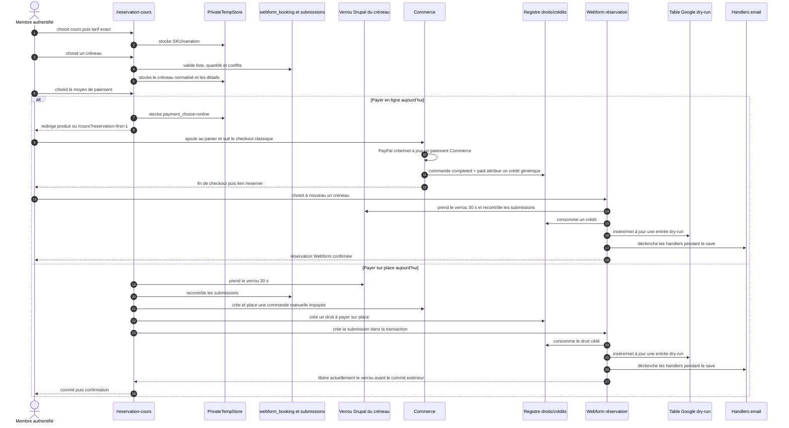

# Paiement en ligne d’un cours après choix du créneau — contrat d’architecture 2026

Date de l’audit : 2 septembre 2026

Référence auditée : `origin/release/prod` à `9021fc0197fc001ac3225e879cfa2c1a0b409e88`

Portée : analyse, contrat d’architecture et plan d’implémentation uniquement

Ce document est le document canonique du handoff « cours et créneau choisis →
commande Commerce → paiement PayPal → réservation durable → synchronisation
Google ». Il remplace le contenu antérieur du même document, dont l’audit datait
du 13 août 2026 et ne correspondait plus exactement au code.

Le livrable demandé proposait le nouveau nom
`course-online-payment-handoff-2026.md`. Le dépôt possédait déjà ce document
canonique couvrant exactement le même flux. Pour ne pas créer deux contrats
concurrents, le présent fichier est mis à jour et le second fichier du livrable
est la checklist propriétaire
`course-online-payment-owner-decisions-2026.md`. Aucun fichier PHP, schéma,
configuration, Twig ou JavaScript n’est modifié par cette phase.

## Statut et vocabulaire de preuve

Les mentions ont le sens suivant :

- **Confirmé — dépôt** : constat démontré par le code ou la configuration du
  commit audité ;
- **Confirmé — source verrouillée** : constat lu dans la version exacte d’une
  dépendance verrouillée par `drupal/composer.lock`, sans exécution runtime ;
- **Confirmé — contrat de PR ouverte** : constat lu sur la branche d’une PR
  ouverte ; il n’est pas considéré comme fusionné ;
- **Risque déduit** : conséquence possible de l’ordre des opérations ou d’une
  garde manquante, à confirmer par un test de concurrence ou d’intégration ;
- **Contrat cible** : exigence imposée aux futures PR d’implémentation ;
- **Décision propriétaire** : choix métier ou opérationnel qui doit être signé
  dans la checklist séparée avant activation.

L’audit est statique. Aucun DDEV, Docker, Drush, Chromium, VPS, appel PayPal ou
appel Google n’a été utilisé. Les valeurs de secrets n’ont été ni lues ni
reproduites. L’état d’une base active, des webhooks et des passerelles ne peut
pas être déduit de la seule configuration exportée.

## Contrat principal

> Une commande de cours payée en ligne correspond à au plus une réservation
> finalisée, pour exactement le créneau sélectionné et exactement une unité de
> capacité.

Ce contrat implique les invariants non négociables suivants :

1. un créneau n’est jamais vendu sur la base du seul tempstore, du navigateur,
   d’un retour PayPal ou de Google ;
2. une acquisition et une finalisation repassent toutes deux par la même
   frontière atomique de capacité Drupal ;
3. un claim ne peut être lié qu’à une commande, une ligne de commande et une
   submission Webform au maximum, et les trois liens sont vérifiés dans les
   deux sens ;
4. une preuve de paiement peut déclencher plusieurs fois le finalizer, mais une
   seule invocation peut gagner la transition atomique de finalisation ;
5. une capture reçue après perte du créneau ne crée jamais silencieusement une
   réservation ni un surbooking ; elle ouvre la politique post-expiration
   approuvée par le propriétaire ;
6. un échec, une annulation vérifiée ou une expiration libère la capacité quand
   aucune capture n’est possible ou ambiguë ;
7. la réservation Drupal est commitée avant toute insertion dans la file
   Google et avant tout envoi d’email ;
8. une panne Google ou email ne remet jamais en cause une réservation payée et
   confirmée.

## Inventaire factuel du dépôt

### Entrée, authentification et état temporaire

La route publique existante `/reservation-cours` pointe vers
`ReservationFirstCourseTunnelForm` et demande la permission générique
`access content` (`unisonges_structure.routing.yml:9-15`). Le formulaire refuse
toute progression à un visiteur anonyme et lui présente les liens de connexion
et d’inscription (`ReservationFirstCourseTunnelForm.php:214-277`). Le contrat
cible conserve cette frontière : **l’authentification est obligatoire avant la
création du claim**.

Le tunnel parcourt les étapes `course`, `slot`, `details`, `payment`, puis
`confirmed` (`ReservationFirstCourseTunnelForm.php:188-240`). Il stocke une
seule structure dans le PrivateTempStore `unisonges_structure`, sous la clé
`course_reservation_first_tunnel` (`:23`, `:1913-1968`). Cette structure :

- n’a ni UUID de tentative, ni génération, ni durée métier ;
- est partagée par les onglets du même compte ;
- n’est liée à aucune commande ;
- est supprimée par « Recommencer » (`:2038-2048`).

Le tempstore est donc un confort d’interface, pas une preuve durable. Deux
onglets peuvent actuellement écraser ou mélanger leur sélection.

### Cours, tarif et variation

Le formulaire ne prend pas arbitrairement la première variation. Il résout les
variations publiées et accessibles à partir d’une liste fermée de SKU de
production (`ReservationFirstCourseTunnelForm.php:27-56`, `:1304-1405`). Les
fixtures locales ne sont permises que sous `IS_DDEV_PROJECT=true` (`:61-90`,
`:1345-1347`). Le choix stocké a la forme `sku:<SKU>` et est revalidé à chaque
reconstruction (`:1333-1339`, `:1561-1607`).

Pour les cours hors essai, la discipline n’est proposée que si ses variations
normale et étudiante existent (`:1408-1433`). Le tarif choisi résout donc bien
une variation précise. En revanche, les libellés de prix du tunnel sont codés
dans le formulaire alors que le prix facturé vient de Commerce
(`:325-360`, `:1435-1477`) : une divergence d’affichage est possible et le
montant affiché ne doit jamais devenir une autorité de paiement.

### Créneau, normalisation et disponibilité actuelle

Le champ `reservation` est un élément contrib `webform_booking`. La
configuration versionnée du Webform
`cours_particuliers_reservation` fixe actuellement :

| Paramètre | Valeur auditée |
|---|---:|
| Horizon visible | 30 jours |
| Durée | 60 minutes |
| Capacité publiée | 1 place par créneau |
| Maximum par réservation | 1 place |

Le tunnel prépare l’élément par son plugin (`ReservationFirstCourseTunnelForm.php:907-937`)
et normalise strictement vers `YYYY-MM-DD HH:MM|N` (`:1622-1641`). Le parser du
module valide date, heure et quantité ; son fuseau vient de la configuration
Google avec repli `Europe/Paris` (`unisonges_structure.module:2549-2580`). Cette
dépendance de fuseau doit être découplée de l’activation Google dans la future
implémentation. Le parser actuel ne détecte pas explicitement une heure locale
inexistante ou répétée lors d’un changement DST ; un snapshot UTC calculé sans
cette garde pourrait figer silencieusement le mauvais instant.

À l’étape créneau, le formulaire vérifie le maximum, les conflits de submissions
et les jours/heures retournés par `webform_booking`, puis écrit le tempstore
(`ReservationFirstCourseTunnelForm.php:472-528`). Aucun hold n’est créé. Lors de
la confirmation sur place, il ne rappelle plus la liste contrib des créneaux :
un créneau retiré, passé ou sorti de l’horizon mais encore sans submission peut
donc franchir cette dernière vérification. C’est un risque déduit à couvrir par
un test et par une revalidation canonique.

La capacité actuelle est calculée directement dans
`webform_submission_data` : les valeurs `reservation` égales au créneau sont
additionnées, tandis que les suffixes `|0` sont inactifs
(`unisonges_structure.module:1263-1388`). La capacité est globale au Webform,
pas au produit. Aucune ligne de claim provisoire n’entre dans ce calcul.

Le Webform exporte `form_submit_once: false` et aucun plafond de submissions.
Le module refuse séquentiellement une seconde réservation active du même UID au
même créneau et utilise un verrou UID pendant la consommation d’un droit, mais
il n’existe ni identifiant de tentative, ni contrainte SQL de slot/SID, ni
déduplication globale d’un double submit.

### Paiement sur place actuellement fonctionnel

Après nouvelle validation, `confirmPayOnSiteReservation()` :

1. acquiert le verrou de créneau existant pour 30 secondes ;
2. démarre une transaction de base ;
3. recontrôle les submissions concurrentes ;
4. crée une commande Commerce `default`, propriétaire du compte, avec une
   unique ligne de la variation sélectionnée et quantité 1 ;
5. affecte la passerelle manuelle, place la commande et la laisse impayée ;
6. crée ou réutilise exactement un droit « à payer sur place » ;
7. crée la submission Webform avec `unisonges_payment_choice=pay_on_site`,
   l’identifiant de commande et les détails autorisés ;
8. le hook d’insertion consomme préférentiellement ce droit, inscrit la demande
   Google dry-run, déclenche les handlers existants et libère déjà le verrou ;
9. la transaction extérieure est ensuite commitée ; le `finally` du formulaire
   tente à nouveau la libération de façon idempotente.

Références : `ReservationFirstCourseTunnelForm.php:1690-1905` et
`unisonges_structure.module:1678-1748`, `:2002-2152`, `:2350-2484`.

Le comportement métier confirmé est donc bien : une commande manuelle impayée,
un droit vérifié, une submission et une entrée Google dry-run.

Deux limites de concurrence sont importantes pour la conception en ligne :

- le hook d’insertion libère lui-même le verrou de créneau
  (`unisonges_structure.module:2431-2433`) alors que
  `submission->save()` retourne avant le commit de la transaction englobante
  (`ReservationFirstCourseTunnelForm.php:1697-1724`) ; un autre processus peut
  donc reprendre le verrou avant que la première ligne soit visible, selon le
  backend de verrouillage et l’isolation ;
- il n’existe ni contrainte SQL d’unicité par créneau ni ligne durable à
  verrouiller. Le verrou applicatif, limité à 30 secondes, est la seule
  sérialisation. Une insertion programmatique qui ne passe pas par le formulaire
  n’acquiert pas nécessairement ce verrou.

Le contrat cible conserve ce verrou comme compatibilité/optimisation, mais ne
le considère plus comme la frontière de correction.

### Droits et crédits actuels

Le registre « à payer sur place » fusionne ses lignes par commande, OrderItem et
index de crédit. Ses états sont `pending_payment`, `consumed`, `paid` et
`cancelled`. La consommation du Webform préfère le droit lié à l’ordre indiqué,
ce qui évite de prendre un crédit prépayé sans rapport. Si l’ordre est payé plus
tard, un droit déjà consommé devient `paid` sans crédit supplémentaire ; un
droit encore pending crédite le compte. L’annulation d’une commande ne passe à
`cancelled` que les droits pending, pas une réservation déjà consommée.

Pour les achats classiques, le hook d’ordre exige `completed` et `isPaid()`,
crédite l’utilisateur, sauvegarde celui-ci, puis écrit le marqueur libre
`order.data['unisonges_course_rights_applied']`
(`unisonges_structure.module:1390-1511`). Ce marqueur donne une idempotence
séquentielle mais pas une transaction/CAS : un crash ou deux hooks concurrents
entre la sauvegarde utilisateur et le marqueur peuvent doubler un crédit. Le
handoff slot-aware ne doit ni emprunter ce mécanisme ni le « compenser » après
coup.

### Branche « Payer en ligne » actuelle

`submitPaymentStep()` écrit seulement `payment_choice=online` dans le tempstore,
explique que le créneau n’est pas réservé, puis redirige vers la page du produit
ou `/cours` avec `?reservation-first=1`
(`ReservationFirstCourseTunnelForm.php:612-705`, `:1675-1688`). Aucun lecteur de
ce paramètre, claim, champ de commande ou finalizer de réservation n’existe dans
le dépôt.

Le client reprend donc le flux Commerce classique : ajout au panier, checkout,
PayPal, puis attribution générique d’un crédit de cours quand la commande est
complétée et payée (`unisonges_structure.module:121-139`, `:1390-1511`). La page
de fin renvoie ensuite vers `/reserver` avec l’instruction de choisir un créneau
(`unisonges_structure.module:824-917`). Le créneau initial n’a pas suivi la
commande ; l’utilisateur doit le choisir une seconde fois, et le Webform
consomme alors un crédit.

### Séquence actuelle exacte

Le diagramme distingue expressément les deux branches observées. Les blocs
« courriel » et « Google » représentent des effets locaux ; aucune API Google
n’est appelée quand le dry-run est actif.



### Commandes, panier, checkout et paiements

`composer.lock:1487-1511` fixe Commerce `3.3.2` et
`composer.lock:1702-1720` fixe Commerce PayPal `2.1.0`.

**Confirmé — dépôt.** Le type de commande `default` utilise le workflow
`order_default`, actualise les commandes brouillon toutes les 300 secondes et
active le reçu Commerce. Le checkout `default` est
`multistep_default`; son panneau de connexion autorise actuellement le checkout
invité et l’inscription, tandis que `guest_order_assign` et
`guest_new_account` sont désactivés. Les panneaux Payment existent au runtime
même s’ils ne figurent pas dans la liste YAML : Commerce instancie les
définitions avec leurs valeurs par défaut. Le flux de cours cible ne doit pas
hériter de l’autorisation invité.

**Confirmé — source verrouillée.** `order_default` ne possède que les états
`draft`, `completed`, `canceled`, avec les transitions `place` et `cancel`. Les
états de paiement de base sont `new`, `authorization`,
`authorization_voided`, `authorization_expired`, `completed`,
`partially_refunded` et `refunded`. Commerce PayPal ajoute son workflow
`payment_paypal_checkout` avec notamment `pending` et `capture_denied`.

Commerce recalcule `total_paid` en additionnant `getBalance()` des Payments dont
le timestamp de completion existe (`isCompleted()` ne teste pas seulement
l’état courant) ; son subscriber de commande payée place une commande brouillon utilisant une
passerelle off-site. Une confirmation serveur peut donc compléter une commande
sans retour navigateur. Le reçu est déclenché au placement, pas au paiement :
ni `completed` ni l’envoi d’un reçu ne prouvent isolément que l’ordre est payé.
Aucun hook de commande actuel ne finalise le créneau initial ; les hooks ne font
qu’attribuer les droits génériques.

L’accès à `/checkout/{commerce_order}/{step}` compare le propriétaire de la
commande au compte authentifié ; un panier anonyme repose sur la session. Au
login, Commerce réassigne les paniers anonymes de la session sans les fusionner
nécessairement avec un panier authentifié existant. Le CartProvider ne renvoie
normalement qu’un panier par type de commande, magasin et compte, et ignore un
panier off-site verrouillé. Réutiliser le panier `default` existant rendrait
possible le mélange ou des paniers multiples. Le contrat cible retient donc un
type de commande dédié, sans nouvelle URL publique, et une commande non
combinable contenant une seule ligne.

La configuration `default` n’exporte aucun réglage
`commerce_cart.cart_expiration`. Le cron du module personnalisé ne traite que
Google (`unisonges_structure.module:145-158`). Il n’existe donc actuellement ni
expiration métier du tempstore/claim, ni cleanup projet des checkouts de cours
abandonnés. Même activé, le cleanup Commerce ne couvrirait pas le contrat des
claims ni tous les paniers off-site verrouillés.

La passerelle `manual` exportée est active et conditionnée au rôle
`authenticated`. Elle est explicitement sélectionnée par la branche sur place.
Cette disponibilité ne doit jamais servir de fallback silencieux si PayPal est
indisponible dans le checkout dédié.

### Comportement PayPal 2.1.0 audité

La passerelle versionnée est marquée active et sélectionne le plugin
`paypal_checkout`, l’intention
de capture et les Smart Payment Buttons. L’export contient des clés de
credential ; leurs valeurs n’ont pas été inspectées. Son identifiant de webhook
est vide et la journalisation de requête webhook est activée. Le mode et le type
de moyen de paiement exportés paraissent hérités d’une version antérieure : le
plugin 2.1.0 attend les modes `test`/`live` et le type
`paypal_checkout`. Avec le type exporté `paypal`, l’intersection des types
supportés peut être vide et retirer l’option du checkout standard. L’état actif
peut déjà avoir reçu un post-update et doit être vérifié en sandbox après PR
#108 ; le document ne prétend pas qu’un simple export est l’état runtime.
Le bouton PayPal de panier suit une garde différente et pourrait encore être
injecté avec `enable_on_cart`; cette possibilité n’a pas été exercée.

**Confirmé — source verrouillée.** Le plugin fournit :

- les routes contrib existantes de création et d’approbation PayPal, protégées
  par `commerce_order.update`, et la route générique de webhook
  `/payment/notify/{commerce_payment_gateway}` ;
- une relecture serveur de l’ordre PayPal au retour, avec contrôle strict du
  montant et de la devise distants contre le solde local et rejet des statuts
  autres que `APPROVED`/`SAVED` avant capture ou autorisation ;
- une vérification de signature du webhook par le mécanisme PayPal supporté par
  le module, à partir des en-têtes, du corps et du `webhook_id` configuré ;
- les événements `PAYMENT.AUTHORIZATION.VOIDED`,
  `PAYMENT.CAPTURE.COMPLETED`, `PAYMENT.CAPTURE.REFUNDED`,
  `PAYMENT.CAPTURE.PENDING` et `PAYMENT.CAPTURE.DENIED` ;
- la mise à jour des entités Commerce Payment, y compris remboursement et
  capture refusée.

Le subscriber Commerce qui réagit à `ORDER_PAID` n'applique la transition
`place` que si l'Order est encore `draft`. Une capture tardive peut donc rendre
`isPaid()` vrai sur un Order déjà `canceled`, mais elle ne le ramène pas à
`completed` : le workflow verrouillé n'offre aucune transition de ce type.

Le module ne fournit pas le contrat applicatif requis ici :

- la création distante peut être redemandée et remplace
  `order.data['paypal_order_id']` sans CAS applicatif ;
- le webhook prend `resource.custom_id` comme identifiant de commande et met à
  jour le paiement local le plus récent de cette commande, sans filtrage
  explicite complet par gateway/mode/remote ID ;
- aucun registre durable et unique de l’identifiant d’événement webhook n’est
  conservé, et `remote_id` du Payment n’est pas unique en base ;
- après vérification de signature, il n’effectue pas les contrôles spécifiques
  au claim : propriétaire, variation, quantité, slot, environnement métier et
  lien immuable ;
- un webhook reçu avant la création du Payment local est journalisé puis
  ignoré ;
- un crash après capture distante mais avant sauvegarde locale laisse un
  résultat ambigu ;
- l’option de log peut enregistrer le corps distant complet ; une erreur de
  vérification capturée peut tout de même produire une réponse HTTP sans signal
  de retry exploitable par le projet.

Le retour navigateur offre donc une vérification serveur utile, mais il n’est
ni une preuve autonome ni un finalizer de réservation. Le navigateur peut
accélérer une lecture de l’état local ; seule une entité Payment issue du plugin
vérifié et repassée par les contrôles du projet devient une preuve recevable.
Le cancel navigateur ne change ni la commande ni le Payment et ne libère jamais
seul le créneau. La route webhook contrib existante doit être réutilisée :
aucune nouvelle URL publique n’est proposée.

Pour une commande `unisonges_course_slot_checkout`, le contrat autorise
seulement le flux PayPal depuis l’étape de revue/paiement. Le shortcut de panier
est masqué et rejeté pour ce type d’ordre, afin qu’il ne contourne ni les
détails, ni l’owner, ni l’extension du claim. Les paniers classiques gardent
leur comportement, couvert par un test de non-régression.

Un risque de dépendance distinct est consigné dans `drupal/composer.json` : une
advisory transitive PayPal est actuellement ignorée par l’audit Composer. La
future revue sécurité doit décider de sa résolution avant activation, sans que
le présent audit conclue à son exploitabilité.

### Google, emails, logs et nettoyage actuels

La table Google personnalisée est indexée par submission/SID et porte une
action `pending_create`, `pending_update` ou `pending_cancel`. Le hook Webform
l’alimente dès l’insertion ou la mise à jour. Le service de synchronisation :

- ne traite rien quand `enabled=false` ;
- marque une opération `skipped` en dry-run ;
- n’a ni lease concurrent, ni backoff/retry automatique robuste ;
- construit aujourd’hui un payload contenant plus de données client que
  nécessaire : SID/UUID/UID, choix de paiement/order ID, nom affiché,
  téléphone, adresse et notes.

`automated_cron.settings.yml` exporte un intervalle de 10 800 secondes. Le hook
cron projet n’appelle que le worker Google ; il ne purge ni tempstore, ni
commande, ni droit, ni claim inexistant à ce jour.

Google ne participe pas au calcul de capacité. La table de submissions Drupal
reste l’autorité de réservation.

Les deux handlers email du Webform sont actifs à l’état `completed`; le
destinataire membre et le reply-to utilisent `[current-user:mail]`. Cette valeur
est incorrecte pour un finalizer déclenché par webhook ou cron. Les handlers
s’exécutent pendant `submission->save()`, avant que la transaction extérieure
ait définitivement réussi. Le reçu Commerce peut, lui aussi, partir au
placement de commande avant la réservation. Il n’existe pas d’outbox ni de clé
d’idempotence email.

Les logs de réservation existants incluent SID, UID, UUID Webform, créneau brut
et libellé de paiement. Le projet n’a pas de journal append-only dédié au cycle
claim/paiement/finalisation. Les échecs de droits ou conflits peuvent transformer
directement une valeur de réservation en `|0`, journaliser puis retourner sans
lever d’exception (`unisonges_structure.module:2364-2421`). Ce comportement ne
constitue pas une annulation transactionnelle fiable pour un paiement capturé.

### Tests et documents actuels

Aucun test versionné ne cible directement
`ReservationFirstCourseTunnelForm`. Les documents de validation du tunnel
rapportent des sondes historiques mais ne sont pas des tests rejouables. Le
script Commerce existant vérifie attribution/consommation de crédits et exclut
explicitement les submissions Webform et Google. Il crée un Payment manuel ; il
ne couvre ni PayPal, retour/cancel/webhook, guest, handoff, replay, expiration
ou concurrence. La distribution Commerce PayPal 2.1.0 ne fournit pas de test du
checkout PayPal couvrant ce contrat applicatif.

## Contrats des PR ouvertes et garde de chevauchement

Les contrats suivants ont été inspectés en lecture seule sur GitHub ou leurs
branches. Ils restent tous **ouverts et non fusionnés** à la date de l’audit.

| PR | Contrat observé | Conséquence pour ce plan |
|---|---|---|
| [#103](https://github.com/Nyoha12/Uni-Songes/pull/103), `codex-implement-editorial-home-blog` à `7ea4ff4d` | PR éditoriale Blog, sans les ressources runtime de ce flux dans ses fichiers audités. | L’instruction fournie dit néanmoins que #103 possède exclusivement les ressources runtime. Ce livrable reste donc strictement documentaire. Avant toute PR runtime, le propriétaire doit confirmer le bon numéro ou le contrat élargi ; aucune équipe ne doit déduire que le périmètre est libre. |
| [#108](https://github.com/Nyoha12/Uni-Songes/pull/108), `codex-remove-tracked-paypal-secret` à `40f8c941` | Retire les credentials suivis, désactive l’export, charge l’environnement seulement quand les deux valeurs sont présentes et conserve la sandbox. Ne traite ni webhook ni finalisation. | Prérequis obligatoire avant toute sandbox. Rotation de l’ancien credential et activation restent des opérations propriétaire. Ne pas modifier en parallèle ses fichiers de passerelle/runtime. |
| [#109](https://github.com/Nyoha12/Uni-Songes/pull/109), `codex-implement-member-dashboard-foundation` à `8e97d90b` | Tableau de bord propriétaire, lecture seule, états français prudents, sans IDs internes ni actions de réservation. | La projection d’états en ligne vient après #109 ou sur une branche rebasée ; aucune promesse d’annulation/replanification libre-service. |
| [#111](https://github.com/Nyoha12/Uni-Songes/pull/111), `codex-implement-google-calendar-state-foundation` à `b18c8885` | Fondation inactive avec états, génération/CAS, lease et référence opaque ; aucun producteur ni appel client actif. | La PR Google future doit réutiliser cette table/repository après fusion, jamais créer une deuxième queue. Elle doit remplacer le payload historique contenant des PII. |

Aucune de ces PR ne modifie les deux documents du présent livrable. Le contrôle
de chevauchement doit être rejoué juste avant chaque future PR, car leurs
branches peuvent évoluer.

## Sources de vérité cibles

| Concept | Source de vérité | Rôle des autres copies |
|---|---|---|
| Cours sélectionné | Avant claim : sélection serveur revalidée ; après claim : `product_id` du claim durable. | Tempstore et libellé UI sont des aides, jamais une autorité. |
| Variation sélectionnée | `variation_id` et SKU résolus puis figés dans le claim ; cohérence obligatoire avec l’unique OrderItem. | Le tarif sert à la présentation, pas à recalculer le prix. |
| Tarif sélectionné | Code de tarif fermé et variation associée dans le claim. | Les libellés 10/25/15 actuels ne prouvent aucun montant. |
| Créneau sélectionné | Valeur canonique validée dans le claim, accompagnée d’une clé de slot, du fuseau, du début UTC et de la durée. | Tempstore, query string et Google n’ont aucune autorité. |
| Claim provisoire | Ligne `unisonges_course_slot_claim` et sa génération CAS. | Un timer client est seulement indicatif. |
| Commande | Entité Commerce Order dédiée pour propriétaire, lignes, total, devise et cycle de checkout. | Le claim garde un snapshot d’intégrité, pas un second moteur de prix. |
| Paiement | Entités Commerce Payment produites par la passerelle vérifiée, plus registre de signaux dédupliqués et expurgés. | PayPal apporte une preuve ; il n’est jamais la base des réservations. |
| Réservation finalisée | Submission active du Webform `cours_particuliers_reservation`, liée de façon unique au claim et à la commande. | Le claim mémorise le SID pour l’idempotence. |
| Capacité | Drupal : capacité publiée moins submissions actives moins claims valides non finalisés. | Ni PayPal ni Google ne sont consultés pour vendre une place. |
| Synchronisation Google | Après #111, son registre d’intentions à référence de réservation opaque. | Google Calendar est une projection réparable, jamais l’autorité. |

## Modèle durable recommandé

### Table dédiée plutôt que content entity

Le claim est un registre interne de concurrence, pas un contenu éditorial. Une
**table dédiée** est préférable à une content entity : elle permet des index
uniques simples, une ligne de génération CAS, des requêtes d’expiration bornées
et un verrouillage SQL explicite, sans route CRUD, révision, traduction, cache
de rendu ou accès Field UI inutiles. Une content entity apporterait du cycle de
vie et des surfaces d’accès supplémentaires sans résoudre la sérialisation.

Les noms ci-dessous sont le contrat recommandé ; ils ne sont pas créés dans
cette PR documentaire.

#### `unisonges_course_slot_claim`

| Colonne logique | Contrat |
|---|---|
| `claim_id` | Clé interne numérique, jamais exposée au client. |
| `claim_uuid` | UUID v4/CSPRNG non devinable, unique et immuable ; ce n’est pas une autorisation. |
| `support_ref` | Référence opaque aléatoire unique, distincte et non dérivée de l’UUID ; visible seulement aux opérations autorisées. |
| `claim_kind` | `checkout`, `paid_resolution`, `pay_on_site`, `prepaid_credit` ou `direct`; liste fermée qui choisit les préconditions du writer. Seuls les deux premiers couvrent le paiement en ligne. |
| `resolution_id` | Nullable ; lien vers le dossier tardif pour un `paid_resolution`, jamais une commande transférée. |
| `attempt_uuid` | Identifiant serveur unique du submit/opération, lié au propriétaire et à la source ; les re-submits retrouvent le même claim. |
| `owner_uid` | UID authentifié non nul, immuable. |
| `product_id`, `variation_id` | Cours et variation exacts, revalidés au claim et au finalizer. |
| `tariff_code` | Valeur issue d’une liste fermée, cohérente avec la variation. |
| `webform_id`, `element_key` | Respectivement `cours_particuliers_reservation` et `reservation` en V1. |
| `canonical_slot_value` | Snapshot strict `YYYY-MM-DD HH:MM\|1`. |
| `slot_key` | SHA-256 stable de webform, élément et début local canonique `YYYY-MM-DD HH:MM`; il reproduit l’identité historique et n’inclut ni quantité ni produit. |
| `slot_start_utc`, `slot_timezone`, `duration_seconds` | Snapshots normalisés qui empêchent une ambiguïté DST ou de format. |
| `schedule_generation` | Hash/version de la définition publiée (fuseau, durée, règles) ; une mutation ne crée pas silencieusement une autre lane de capacité. |
| `capacity_units` | `1` en V1 ; doit égaler quantité Commerce et suffixe Webform. |
| `published_capacity_snapshot` | Trace de diagnostic ; la capacité courante est néanmoins relue lors de chaque décision. |
| `claim_state` | Une valeur exacte du modèle ci-dessous. |
| `claim_generation` | Entier croissant du cycle claim/renouvellement ; le scellement en fige la valeur de preuve. |
| `active_owner_slot_key` | Hash nullable de owner+slot, présent pour toute tentative active et unique en base. |
| `active_resolution_key` | Nullable et unique ; au plus un claim de remplacement actif par dossier tardif. |
| `active_expiry_at` | Copie nullable de l’échéance uniquement pour un `checkout` actif non scellé ; clé du worker, effacée au scellement/terminal. |
| `created`, `changed`, `expires_at`, `hard_expires_at` | Horodatages serveur UTC ; expiry/hard sont requis pour `checkout`, nuls pour les claims atomiques ou `paid_resolution` sans TTL. |
| `checkout_started_at`, `payment_seen_at`, `finalized_at` | Jalons, pas statuts composites. |
| `sealed_payment_id`, `sealed_payment_state` | Payment Commerce local exact et état `completed` ayant gagné A_checkout ou A_resolution. |
| `sealed_amount_number`, `sealed_currency`, `sealed_gateway_id`, `sealed_gateway_mode` | Snapshot immuable de la preuve locale, relu en B_checkout ou B_resolution. |
| `payment_sealed_at`, `payment_seal_generation` | Date et génération du scellement. Pour `checkout`, elles prouvent le commit avant expiration ; pour `paid_resolution`, elles identifient A_resolution autorisée par le dossier tardif. |
| `finalization_generation`, `finalization_lease_token` | Génération distincte et token CSPRNG ; un ancien worker ne peut pas committer après takeover. |
| `finalization_lease_owner`, `finalization_lease_expires_at` | Propriétaire/échéance du lease réessayable de B ; jamais une preuve de réservation. |
| `order_id`, `order_item_id`, `right_id`, `submission_id` | Liens applicables nullables puis immuables, chacun protégé par un index unique. `paid_resolution` remonte à l’order par son dossier ; `right_id` vise le registre sur-place, pas le solde de crédits scalaire actuel. |
| `credit_balance_before`, `credit_balance_after` | Null sauf `prepaid_credit`; journal de la décrémentation atomique du scalaire existant sous garde owner. |
| `expected_total_number`, `expected_currency` | Snapshot d’intégrité de la commande ; Commerce reste propriétaire du calcul du prix. |
| `reservation_state`, `resolution_state` | Colonnes orthogonales décrites plus bas. |
| `release_reason`, `last_result_code` | Codes issus de listes fermées, sans texte libre ni payload distant. |

Contraintes minimales : unicité sur `claim_uuid`, `support_ref`, `attempt_uuid`,
`active_owner_slot_key`, `active_resolution_key`, `order_id`, `order_item_id`,
`right_id` et `submission_id`; index sur `(active_expiry_at, claim_id)`,
`(reservation_state, finalization_lease_expires_at, claim_id)`, `resolution_id`,
`slot_key`, `owner_uid` et `changed`.
Les valeurs nulles restent nulles jusqu’au lien ; une commande, ligne ou
submission ne peut donc être revendiquée par deux claims. Les liens sont
également comparés dans les entités concernées : l’unicité unilatérale ne suffit
pas.

Les colonnes d’identité, slot, unité, génération et dates applicables sont
`NOT NULL`; `capacity_units` et la génération sont positives/non négatives, et
un `checkout` exige `expires_at <= hard_expires_at`. Les autres kinds exigent
ces deux colonnes nulles. Une contrainte `CHECK` n’est utilisée que si le
moteur/version cible la garantit ; le repository réapplique toujours les mêmes
préconditions. Des clés étrangères destructrices vers les content entities ne
sont pas recommandées : la conservation d’un incident de paiement prime sur un
cascade delete. Les accès admin ordinaires doivent plutôt refuser la
suppression d’un ordre lié.

`active_owner_slot_key` est obligatoirement écrit à l’acquisition et mis à null
à la libération/finalisation. Son index unique sur la valeur dérivée empêche deux
double-submits du même compte et du même slot sans empêcher l’historique. Cette
clé ne remplace ni le verrou de capacité ni le contrôle des submissions déjà
confirmées.

`active_resolution_key` vaut le hash du dossier uniquement entre le commit de
A_resolution et le commit terminal de B_resolution/clôture. L’insert/CAS unique
retrouve le même claim pour un retry ; deux résolveurs ne peuvent en créer deux.
La clé est effacée dans la **même transaction** qui finalise ou libère ce claim,
jamais sur timeout de lease. Avant le commit A_resolution, un échec rollbacke
tout et ne laisse aucun replacement ; une nouvelle exécution peut alors relire
un consentement encore valide ou en exiger un nouveau. Après ce commit, aucun
replacement ne peut être superseded ou remplacé par un autre slot : seuls
B_resolution ou la clôture après remboursement intégral sont permis. Un dossier
`reservation_confirmed` ou `refunded` interdit toute nouvelle clé, même si la
colonne active a été effacée.

#### Résolution d’un paiement tardif

Un claim expiré/libéré reste terminal et son slot, ses champs Order/OrderItem et
son UUID ne changent jamais. Pour rendre les options « slot original encore
libre » ou « alternative consentie » réellement implémentables, la table
`unisonges_course_payment_resolution` porte un dossier unique par
`source_claim_id` et `order_id` : UUID interne, génération, état
`open|awaiting_consent|slot_claiming|finalizing|reconciliation_required|reservation_confirmed|refund_required|refunded`,
politique choisie, horodatage/canal de consentement, `active_claim_id`,
`confirmed_claim_id`, `final_submission_id`, dates et codes fermés.

`reconciliation_required` est un état non terminal du dossier : il conserve le
replacement et sa capacité s'ils existent. Seule une action étroite, avec
génération attendue et preuves revalidées, peut le ramener au chemin de
finalisation admissible ou le passer à `refund_required`. Les états
`reservation_confirmed` et `refunded` sont terminaux.

Une résolution vers un slot crée sous la garde habituelle un nouveau claim
`claim_kind=paid_resolution`, relié au dossier mais **sans recopier**
`order_id/order_item_id` (ils restent uniques sur le claim source). Le service
suit la chaîne immuable
`order → source claim → resolution → paid_resolution claim → submission`,
revérifie le Payment source et produit un **nouveau** snapshot scellé sur le
claim de remplacement ; le source expiré n’est jamais prétendu scellé avant son
échéance. Une
alternative exige un consentement durable avant acquisition. L’unicité du
dossier par order, de son `final_submission_id` et du claim actif garantit une
seule réservation pour ce paiement. Une tentative A qui échoue avant commit ne
laisse aucune ligne ; le seul replacement qui commit devient l’engagement
durable du dossier jusqu’à confirmation ou remboursement intégral.

Si cette table et ce workflow ne sont pas implémentés/testés, les options de
réacquisition sont indisponibles : la V1 doit choisir remboursement ou
réconciliation sans confirmation. Une replanification d'une réservation déjà
confirmée est un autre problème et n'utilise pas ce dossier.

Une commande source déjà `canceled` constitue une frontière plus stricte : une
capture serveur vérifiée ultérieure ouvre le dossier directement en
`refund_required` (ou `reconciliation_required` si sa preuve est incomplète),
mais ne peut jamais créer un `paid_resolution`. La V1 ne ressuscite pas la
commande et n'invente pas une transition Commerce. Ce cas est **refund-only**,
avec remboursement manuel ou automatique selon DEC-10/11.

#### Lien de réservation symétrique

`unisonges_course_reservation_link` est écrit dans le commit du writer
(transaction B_checkout/B_resolution pour l’online, transaction unique pour les
autres sources) avec `claim_id`, `source_claim_id` nullable, `resolution_id`
nullable, `order_id`/`order_item_id`/`right_id` applicables et nullables,
`submission_id`, `reservation_ref` opaque, source et date. Chaque identifiant
non nul porte un index unique. Cette ligne permet de partir de la submission
aussi bien que de l’ordre ou du droit ; elle complète le SID du claim et les
champs UUID Order/OrderItem sans ajouter un UUID client-visible au Webform. Pour
un paiement tardif, `claim_id` est le claim de résolution et
`source_claim_id/order_id` conservent la chaîne originale.

L’identité de capacité reste celle réellement utilisée aujourd’hui par les
submissions : Webform + élément + date/heure locale, sans produit. Fuseau,
durée ou règles de planning sont des snapshots versionnés, pas des composantes
qui ouvriraient une nouvelle garde. Une modification de ces paramètres est
refusée tant qu’un claim actif/non terminal ou une réservation future affectée
existe, ou passe par une migration qui verrouille les slots affectés et
libère/recrée explicitement les claims. Les snapshots historiques terminaux ne
bloquent pas la configuration et ne changent jamais de lane. La V1 interdit les
changements créant des intervalles qui se chevauchent sans une conception de
capacité d’intervalle séparée.

Le normalizer V1 énumère les instants UTC compatibles avec le mur local et le
fuseau publié. Il exige exactement un résultat : zéro (gap DST) ou deux (fold
DST) échouent fermé avec un nouveau choix de créneau. Accepter un fold exigerait
une future UI/version de schéma qui transporte explicitement offset ou index de
fold ; PHP ne peut pas choisir silencieusement. Le test oracle utilise les
transitions réelles de `Europe/Paris` et compare valeur locale, offset et
`slot_start_utc`.

#### `unisonges_course_slot_guard`

Une ligne par `slot_key`, avec clé primaire, `generation` et `changed`, fournit
la cible stable du `SELECT … FOR UPDATE`. Elle est créée de manière idempotente
avant acquisition, puis verrouillée. Sans elle, deux transactions ne trouvant
encore aucun claim ni submission pourraient toutes deux conclure qu’une place
est libre.

La création ne fait aucun « vérifier puis insérer » : elle tente l’insert sous
clé primaire unique ; le perdant d’un duplicate-key recharge la ligne puis
reprend la transaction/verrou. Un advisory lock peut réduire ce retry mais ne
le remplace pas. Les lignes de garde ne sont **jamais supprimées en V1**, même
sans claim/submission : les supprimer pendant qu’un waiter existe pourrait
recréer deux voies de sérialisation.

#### Garde owner et unicité du cours d’essai

`unisonges_course_owner_guard` contient `owner_uid` en clé primaire,
`generation` et `changed`; sa ligne persistante est créée/reprise comme la garde
de slot et n’est pas supprimée en V1. Toute opération qui touche un slot prend
d’abord sa garde puis la garde owner ; un achat de crédit sans slot commence par
la garde owner. Aucun de ces chemins ne verrouille d’abord une commande ou un
claim.

`unisonges_course_trial_usage` porte une ligne par owner, avec état
`available`, `claimed`, `reconciliation_required` ou `confirmed`, génération,
et liens uniques claim/order/right/submission/resolution. Un claim d’essai CAS
`available → claimed` avec son claim et sa génération sous le même commit ;
expiry/refus sûr ne CAS vers `available` que si ces deux valeurs correspondent,
paiement ambigu CAS vers `reconciliation_required`, et le commit du writer CAS
`claimed → confirmed` avec son SID. Une
migration préactivation audite et reprend `field_essai_utilise`, les commandes,
droits et submissions historiques avant d’ajouter l’unicité. Tous les chemins
online, sur-place et crédit utilisent ensuite ce registre : deux slots ou deux
canaux ne peuvent plus chacun accorder le même essai. La restitution après
annulation/refund dépend de DEC-33 et n’est pas déduite silencieusement.

Le sur-place effectue `available → claimed → confirmed` avec les liens
order/right/SID dans son unique transaction slot→owner ; un rollback ne laisse
aucun email ni état intermédiaire. Si DEC-32 conserve le crédit classique pour
un SKU d’essai, l’ordre prend `available → claimed` sous garde owner avant
d’augmenter le solde scalaire. La réservation ultérieure décrémente ce solde et
confirme la même ligne trial sous gardes slot→owner ; le claim, et non un
`right_id` inexistant, journalise cette consommation. Un `paid_resolution` ne
peut reprendre qu’une ligne
`reconciliation_required` liée à son source claim/résolution, ou une ligne encore
`available`, par CAS vers `claimed`; si un autre canal l’a confirmée, la
résolution refuse le slot/essai et suit la politique refund. Aucun lien repris
par une autre génération n’est écrasé.

#### Détails personnels prépaiement

Les détails applicables saisis avant le paiement doivent survivre à un retour
webhook, à une fermeture d’onglet et à un changement de session. Les laisser
uniquement en tempstore rendrait la finalisation serveur impossible. Ils ne
doivent pas non plus gonfler la ligne de concurrence.

Le contrat recommande une table privée 1:1
`unisonges_course_slot_claim_detail` contenant seulement une version de schéma,
un JSON de clés autorisées déjà normalisées et ses dates de création/purge. Pas
de nom de clé libre, pas de donnée de paiement, pas de copie vers PayPal, Google
ou les logs. La ligne 1:1 et le claim sont écrits dans **la même transaction** ;
une exception rollbacke les deux. Le tempstore source n’est purgé qu’après ce
commit durable, par un marqueur/retry idempotent : un crash claim→purge laisse
un duplicata temporaire, jamais une perte de détails. Après transfert réussi
dans la submission, le duplicata durable est purgé dans le commit du writer. Pour
`claim_expired`, `claim_released` et les incidents payés, `purge_due_at` suit
les délais DEC-20/21 et le worker est idempotent. « Recommencer » et
l’échéance serveur programment aussi la purge de leur tentative ; le TTL du
tempstore doit être mesuré et borné par la même décision pour un onglet jamais
rouvert. Le chiffrement applicatif n’est utilisé que si une gestion de clé
maintenable est disponible ; il ne faut pas inventer un secret statique
versionné.

L’allowlist cible est explicite : `mode_cours`, `telephone`, `instrument`,
`niveau_cours`; conditionnellement `plateforme_visio`,
`adresse_domicile` + `code_postal_domicile`, et `didgeridoo_pret`; facultativement
`notes_supplementaires` avec une limite approuvée. Les valeurs suivent les enums,
patterns et conditions du Webform, et `instrument` peut être dérivé seulement
d’une discipline serveur non ambiguë.

L’audit révèle un écart à fermer : le Webform marque `niveau_cours` requis,
alors que le tunnel actuel le classe legacy et ne l’inclut pas dans sa liste de
détails (`ReservationFirstCourseTunnelForm.php:25`, `:99-107`, `:1273-1287`).
DEC-20 doit approuver soit sa collecte, soit une dérivation exacte depuis la
variation ; l’activation échoue fermée tant que cette donnée Webform requise
n’est pas satisfaite. Aucun champ de paiement, claim/order ID ou libellé interne
n’entre dans la table de détails personnels.

### Transactions, contraintes et isolation

Chaque opération qui change la capacité suit le même ordre :

1. ouvrir une transaction Drupal ;
2. créer idempotemment la ligne de garde si nécessaire ;
3. verrouiller la garde du slot en base ;
4. recharger la définition publiée du créneau et sa capacité ;
5. compter les submissions actives et les claims valides avec une lecture
   verrouillée/cohérente ;
6. verrouiller, dans l’ordre global ci-dessous, garde owner, ligne trial si
   applicable, claim/résolution puis commande, item et Payments ;
7. vérifier les contraintes et effectuer la transition CAS ;
8. écrire les entités locales et le marqueur de travail post-commit ;
9. committer ;
10. laisser un worker d’outbox exécuté dans une requête/connexion ultérieure
    observer uniquement les marqueurs réellement commités, puis dispatcher
    Google/email.

Le verrou applicatif actuel peut sérialiser l’accès à la création de la ligne de
garde et préserver la compatibilité avec les chemins historiques. La correction
repose toutefois sur la transaction, la ligne SQL verrouillée, les index uniques
et les CAS. Aucun appel PayPal, Google ou email n’a lieu sous ce verrou.

Une transaction Drupal imbriquée peut n’être qu’un savepoint. Aucun callback
inline ne prétend donc être « post-commit » : les effets sont toujours repris
par un worker séparé, et un rollback de la transaction englobante efface aussi
leur marqueur. Les tests couvrent explicitement un rollback outermost après
A_checkout/B_checkout, A_resolution/B_resolution et
`submission->save()`.

Les identifiants nécessaires sont d’abord résolus par lecture sans verrou ni
mutation. L’ordre global est ensuite : gardes de slot par `slot_key` lexical,
gardes owner par UID croissant, lignes trial, claims par ID, dossiers de
résolution par ID, puis commandes/items/Payments par ID. Une opération sans
slot commence au premier niveau applicable. Aucun chemin ne peut acquérir un
niveau antérieur après un niveau ultérieur. La V1 ne réserve qu’un slot mais cet
ordre évite un deadlock futur. Les tests doivent s’exécuter contre le moteur et
le niveau d’isolation réellement utilisés en staging ; une lecture issue d’un
snapshot antérieur ne doit pas être confondue avec la lecture courante sous
verrou.

Les suppressions en cascade sont déconseillées : supprimer une commande ou un
compte ne doit pas effacer la trace permettant de résoudre un paiement. Une
référence devenue orpheline passe en `reconciliation_required`.

### Mise à jour de schéma et rollback futur

La future PR de schéma sera additive et idempotente : tables, index et version
de schéma d’abord, feature désactivée. Elle documentera sauvegarde, commande de
mise à jour, contrôle d’index et métriques avant activation. Elle ne modifiera
pas le module contrib `webform_booking`.

Le rollback fonctionnel utilise d’abord un coupe-circuit projet, cible
`accept_new_course_payments=false`. Il bloque les nouveaux claims/orders,
l’initialisation PayPal et toute nouvelle création/capture locale. Il ne
désactive pas l’entité gateway ni la route de notification : vérification et
inbox webhook, retour servant à relire/rattacher une capture déjà faite,
reconstruction de Payment, finalizer et reconciler restent actifs pour les
tentatives en vol. Le bridge doit empêcher `onReturn()` de provoquer une
nouvelle capture quand ce coupe-circuit est fermé, tout en acceptant la preuve
serveur d’une capture existante.

La gateway n’est entièrement désactivée qu’après inventaire sans tentative
`creating`, `ready`, `pending`, `authorization` ou `ambiguous`, ou selon une
procédure d’urgence approuvée en cas de compromission. Dans tous les cas, le
worker draine/expire les claims sûrs et conserve les tables. Une down migration
ne supprime jamais des claims liés à des paiements ou réservations. Toute
suppression physique ultérieure nécessite une migration de conservation
distincte et approuvée.

## Calcul de disponibilité et frontière atomique

Pour un `slot_key` donné :

```text
disponibilité = max(0,
  capacité publiée courante
  - unités des submissions Drupal actives finalisées
  - unités des claims non expirés qui ne sont pas encore représentés par une submission
)
```

Sont comptés : les claims `slot_claimed` non scellés seulement tant que
`now < expires_at`, et tout claim dont `reservation_state` vaut
`reservation_finalizing`, indépendamment de l’échéance après scellement payé.
`claim_expired`, `claim_released` et `claim_finalized` ne sont pas soustraits ;
pour `claim_finalized`, la submission est déjà le terme compté. La formule ne
descend jamais sous zéro dans l’interface, mais un total de réservations
supérieur à la nouvelle capacité crée une alerte : il n’efface ni ne modifie une
réservation confirmée.

Une « submission active finalisée » a un prédicat exact : Webform
`cours_particuliers_reservation`, élément `reservation`, entité existante et non
draft, valeur parsée strictement pour ce début local, quantité `N > 0`. Une
valeur `|0` est annulée ; une ligne supprimée n’existe plus. Le SID courant est
exclu uniquement lors d’une mise à jour tenue par le writer. Le code historique
compte actuellement les lignes de données sans filtrer `in_draft`; PR 2 doit
inventorier puis normaliser les drafts positifs, valeurs legacy/malformées et
éventuels dépassements avant de changer ce prédicat. Tant que l’inventaire n’est
pas propre, le service échoue fermé plutôt que de rendre une place.

À l’acquisition, la transaction exige :

```text
submissions actives + claims valides + unités demandées <= capacité publiée
```

Pour un retry, le service recherche d’abord `attempt_uuid`. S’il retrouve le
même owner et exactement le même snapshot, il verrouille le slot déjà stocké et
utilise un delta de capacité `0`, puis retourne le claim/order existant. Un
snapshot différent est rejeté. Si aucune ligne n’existe, il verrouille le slot
candidat, recontrôle l’attempt, utilise le delta demandé et tente l’insert
unique ; un duplicate-key recharge le gagnant. Ainsi, un retry en capacité 1 ne
se refuse pas à cause de son propre claim.

Pour une variation d’essai, la même transaction verrouille ensuite la garde
owner et exige/crée `trial_usage=claimed` pour ce claim/génération. Un retry du
même claim est delta zéro ; un autre slot ou canal est refusé. Un achat crédit
classique sans slot, s’il reste autorisé par DEC-32, verrouille seulement la
garde owner et le même registre avant d’attribuer l’essai.

À la finalisation d’un claim encore valide, le cas normal exige :

```text
submissions actives + autres claims valides + unités du claim <= capacité publiée
```

Puis elle remplace dans la même transaction l’unité du claim par l’unité de la
submission. La place ne connaît donc aucun intervalle où elle est ni claimée ni
réservée.

Pendant `submission->save()`, le hook voit potentiellement déjà la nouvelle
ligne alors que `submission_id` n’est pas encore écrit dans le claim. Le writer
porte donc une identité interne non forgeable et calcule exactement :

```text
submissions actives hors SID courant
+ claims valides hors claim courant
+ unités de la submission courante
```

Le résultat doit respecter la capacité. Le champ Webform `source=online`, un
UUID caché ou une valeur POST ne suffisent jamais à activer cette exclusion.

Si un administrateur a réduit la capacité **après** l’acquisition, cette
inégalité peut devenir fausse sans nouvelle vente. La revalidation détecte et
alerte toujours. Selon DEC-16, la recommandation est d’autoriser uniquement
l’échange 1:1 d’un claim préexistant et encore valide/scellé : le total engagé
n’augmente pas, la disponibilité reste affichée à zéro et aucune nouvelle
acquisition n’est admise. Si le propriétaire refuse ce grandfathering pour les
claims non payés, ils expirent avec notification ; un paiement ultérieur suit
la politique tardive. Une réservation déjà confirmée n’est jamais invalidée.

Tous les producteurs de réservation — tunnel en ligne, paiement sur place,
formulaire `/reserver` et insertions programmatiques — doivent appeler le même
service de capacité. L’affichage contrib peut être enrichi par un hook/service
projet pour masquer les claims, mais le serveur revalide toujours au submit. Il
n’est pas prévu de forker ou modifier `webform_booking`. Tant que le chemin
historique n’utilise pas la frontière commune, l’activation en ligne reste
interdite.

Ce service expose un unique `CourseReservationWriter`. Lui seul ouvre la
transaction, verrouille la garde et installe un contexte serveur typé à durée
de vie de l’appel contenant source, claim/SID/génération attendus et, selon la
source, order/right/résolution. `checkout` et `paid_resolution` reçoivent un claim
déjà scellé. Pour `pay_on_site`, `prepaid_credit` ou `direct`, le writer crée
un claim d’opération durable du `claim_kind` correspondant, puis le fait passer
de `slot_claimed` à `claim_finalized` avec la submission dans **le même commit** ;
il n’existe jamais comme hold exposé entre deux requêtes. Le pay-on-site lie son
order/right. Le chemin `prepaid_credit` garde `right_id=NULL`, verrouille le
solde `field_seances_restantes`, exige une unité disponible, décrémente de un et
enregistre before/after dans le claim ; tout rollback restaure solde, claim et
SID ensemble. Une future granularisation en droits par unité serait une PR
distincte. Une insertion `direct` exige permission, source fermée et
`attempt_uuid` serveur.

Le presave/hook Webform échoue avant insert si une submission porte une capacité
positive sans ce contexte et son claim d’opération ; il ne tente pas d’acquérir
trop tard le verrou dans un hook insert. Le chemin utilisateur `/reserver`, le
tunnel sur-place et toute insertion programmatique autorisée passent par le
writer. Un simple champ `unisonges_payment_choice`, un `claim_kind` venant du
POST ou un UUID caché n’est jamais une preuve de contexte.

| `claim_kind` | TTL / preuve | Liens obligatoires | Entitlement | Commit de confirmation |
|---|---|---|---|---|
| `checkout` | TTL initial/limite dure ; A_checkout scelle avant expiry. | Order + unique item directs. | Aucun droit/crédit consommé. | B_checkout. |
| `paid_resolution` | Aucun TTL après A_resolution ; snapshot Payment neuf. | Dossier + source claim ; order/item par cette chaîne. | Trial CAS si applicable, aucun droit/crédit. | B_resolution. |
| `pay_on_site` | Aucun hold inter-requêtes ni preuve Payment. | Order manuel + item + `right_id`. | Droit créé puis consommé. | Transaction writer unique. |
| `prepaid_credit` | Aucun hold inter-requêtes ni preuve Payment. | Aucun order/item/right de réservation ; claim + SID. | Solde scalaire CAS sous owner, before/after journalisés. | Transaction writer unique. |
| `direct` | Aucun hold inter-requêtes ni preuve Payment. | Claim + SID + source/permission fermées. | Aucun, sauf contrat source explicitement ajouté plus tard. | Transaction writer unique. |

Le chemin sur-place cible verrouille dans l’ordre garde du slot puis garde DB de
l’owner, et conserve les deux jusqu’au commit : claim `pay_on_site`, éligibilité
essai, création de l’ordre/droit, consommation du droit, sauvegarde Webform et
lien de réservation sont une seule unité.
Le registre `unisonges_course_trial_usage` empêche deux transactions sur deux
slots ou deux canaux de créer chacune un droit/usage d’essai avant le verrou UID
actuel.

Une mise à jour, annulation ou suppression de submission liée passe aussi par
le writer. L’annulation verrouille l’ancien slot, écrit `|0`, passe
`reservation_state=reservation_cancelled` et crée le marqueur Google cancel
dans la même transaction ; elle ne déduit ni crédit ni refund. Une suppression
physique d’une réservation payée est refusée. La V1 ne déplace pas une
submission confirmée : toute replanification est refusée tant qu’une PR dédiée
n’a pas défini un registre de changement, le consentement, les deux gardes
lexicales, l’échange atomique ancien/nouveau slot, Google et le prix. Le dossier
de paiement tardif ne sert pas à contourner cette absence.

Deadlock, serialization failure ou lock timeout rollbackent toute l’opération.
Seule une opération locale idempotente peut être retentée avec jitter, au plus
trois fois par défaut et sans aucun appel PayPal/Google/email ; après la limite,
le client reçoit une erreur neutre et une alerte expurgée est créée.

## Durée du claim

La durée est une décision propriétaire, pas une constante silencieuse. Le
profil recommandé pour un pilote est :

- durée initiale : **20 minutes à partir du commit serveur** ;
- avertissement : **5 minutes avant l’échéance serveur** ;
- extension recommandée : une seule CAS au premier état serveur
  `payment_attempt=creating/ready` ou Payment `pending`/`authorization`, qui
  porte `expires_at` au plus à `hard_expires_at`; jamais au refresh ;
- pas d’extension qui change le propriétaire, la variation, le slot, la
  commande ou la génération attendue ;
- limite dure : **45 minutes depuis la création**, extensions comprises ;
- chaque extension est une CAS idempotente et auditée ; le navigateur affiche
  l’échéance renvoyée par le serveur.

Alternatives à approuver : `15/30 minutes` pour une capacité très tendue, ou
`30/60 minutes` pour davantage d’accessibilité, d’usage mobile et de marge de
redirection. Une durée longue réduit les abandons injustes mais immobilise plus
de places ; une durée courte augmente les captures tardives et la charge du
support. La latence d’un webhook ne prolonge pas indéfiniment la capacité.

Avant de créer une tentative PayPal, le serveur vérifie qu’il reste la fenêtre
minimale approuvée et applique, au besoin, l’unique extension recommandée. Un
Payment pending au-delà de la limite dure ne bloque plus la place : toute
capture ultérieure suit la politique `payment_received_after_expiry`. Le timer
client n’expire, ne libère et ne renouvelle rien lui-même.

## Modèle d’états orthogonal

Un seul champ « statut » rendrait impossibles les cas « paiement remboursé mais
réservation encore confirmée » ou « paiement capturé mais slot expiré ». Les
axes suivants restent séparés.

### Phase UI non autoritative

| Valeur | Sens |
|---|---|
| `selection_in_progress` | Cours, tarif, créneau ou détails uniquement en tempstore ; aucune capacité retenue. |
| `checkout_started` | Jalon dérivé de `checkout_started_at` après lien claim/commande ; ce n’est pas un état de commande. |

### `claim_state`

| Valeur exacte | Entrées autorisées | Sorties autorisées |
|---|---|---|
| `slot_claimed` | Acquisition atomique depuis aucune ligne active. | `claim_expired` avant scellement ; `claim_released` avant paiement sûr ou après clôture remboursée contrôlée ; `claim_finalized` après échange avec la submission. |
| `claim_expired` | Pour `checkout`, horloge serveur atteint `expires_at`, sous garde, avant scellement et sans réservation confirmée. | Terminal ; une résolution payée tardive ne ressuscite pas cette ligne automatiquement. |
| `claim_released` | Capacité libérée par CAS : échec sûr avant scellement, ou clôture sans SID après remboursement intégral vérifié et politique approuvée. | Terminal ; preuve et liens historiques conservés. |
| `claim_finalized` | Même transaction que la création et le lien unique de la submission. | Terminal ; la réservation peut ensuite être annulée indépendamment. |

### Commerce Order

Le workflow verrouillé reste `draft` → `completed` ou `draft` → `canceled`.
Il n’est pas étendu pour porter les états métier. `completed` signifie placé,
pas nécessairement payé. Une commande de cours `draft` ne peut plus être payée
si son claim est expiré ou libéré ; une commande payée n’est jamais supprimée.

### Commerce Payment et projection métier

Les états natifs PayPal restent la source technique : `new`, `pending`,
`authorization`, `authorization_voided`, `authorization_expired`, `completed`,
`capture_denied`, `partially_refunded`, `refunded`.

| Concept requis | Projection exacte |
|---|---|
| `payment_pending` | Payment `new` ou `pending` avec tentative connue ; durée bornée du claim. |
| `payment_authorized` | Payment `authorization` uniquement. L’état distant `APPROVED` n’est jamais assimilé à payé. Avec l’intention de capture actuelle, cette phase est exceptionnelle, notamment review. |
| `paid` | Exactement un Payment PayPal local avec timestamp completed et balance égale au total, order `isPaid()`, montant/devise/gateway/environnement et liens tous validés. Plusieurs captures sont un incident V1. |
| `payment_failed` | `capture_denied`, `authorization_expired` ou autre refus serveur terminal, sans capture ambiguë. |
| `payment_cancelled` | Autorisation voided/annulation serveur terminal prouvée. Le bouton cancel du navigateur n’est pas cette valeur. |
| `refunded` | Payment `refunded`; `partially_refunded` reste distinct et force la politique de réconciliation. |

### `reservation_state`

| Valeur exacte | Sens |
|---|---|
| `not_created` | Aucune submission durable. |
| `reservation_finalizing` | Une CAS gagnante a scellé durablement un paiement valide : avant échéance pour `checkout`, ou sous A_resolution approuvée pour `paid_resolution`; le claim continue de compter et un worker peut reprendre avec lease/génération. |
| `reservation_confirmed` | Une submission active, unique et liée existe après commit. |
| `reservation_abandoned` | Aucun SID n’a été créé et une clôture approuvée, normalement après remboursement intégral vérifié, a rendu la capacité. |
| `reservation_cancelled` | La réservation Drupal a été annulée explicitement selon une politique approuvée ; ce n’est pas déduit d’un refund. |

La CAS vers `reservation_finalizing` est commitée dans une courte transaction
de scellement avant la création Webform. Cela évite qu’un crash local fasse
expirer une place dont le paiement a déjà été accepté pendant le claim. Un
lease/génération permet au reconciler de reprendre le travail ; il ne faut pas
écrire `reservation_confirmed` avant le SID unique.

### `resolution_state`

| Valeur exacte | Sens |
|---|---|
| `none` | Aucun incident métier. |
| `payment_received_after_expiry` | Paiement capturé, claim expiré/libéré ou slot non garanti ; aucune réservation automatique. |
| `reconciliation_required` | Résultat distant/local ambigu, incohérence de lien, surpaiement, suppression ou mutation administrative. |
| `refund_required` | Décision métier approuvée demandant un remboursement ; ne signifie pas qu’il est exécuté. |
| `resolved` | Incident clos avec référence d’audit et états paiement/réservation restant explicites. |

### État Google après PR #111

Le registre #111 garde ses propres états : `queued`, `processing`, `synced`,
`retryable_failure`, `permanent_failure`, `cancel_pending`, `cancelled` et
`reconciliation_required`. Ils ne changent ni le paiement, ni le claim, ni la
réservation. Avant fusion de #111, aucune implémentation ne suppose ces états
disponibles.

### Transitions métier résumées

Les tuples montrent explicitement quelle colonne change ; `—` signifie « axe
inchangé ».

| Événement | `claim_state` avant → après | `reservation_state` avant → après | `resolution_state` avant → après | Précondition atomique principale |
|---|---|---|---|---|
| Acquisition checkout | aucune → `slot_claimed` | aucune → `not_created` | aucune → `none` | Capacité et attempt uniques. |
| Sur-place/crédit/direct atomique | aucune → `slot_claimed` → `claim_finalized` | aucune → `not_created` → `reservation_confirmed` | aucune → `none` | Claim d’opération, droit/order applicables, SID et lien dans un seul commit writer. |
| Échéance | `slot_claimed` → `claim_expired` | `not_created` → — | `none` → — | Non scellé et `now >= expires_at`. |
| Échec terminal sûr | `slot_claimed` → `claim_released` | `not_created` → — | `none` → — | Aucun paiement possible/ambigu. |
| A_checkout | `slot_claimed` → — | `not_created` → `reservation_finalizing` | `none` → — | Paiement recevable et `now < expires_at`. |
| B_checkout | `slot_claimed` → `claim_finalized` | `reservation_finalizing` → `reservation_confirmed` | `none` → — | SID unique, échange 1:1 et génération/lease gagnants. |
| A_resolution | aucun replacement → `slot_claimed` | aucune → `reservation_finalizing` | source tardif → — | Dossier/consentement, capacité et Payment frais ; snapshot scellé sur replacement, clé active, commit A_resolution. |
| B_resolution | replacement `slot_claimed` → `claim_finalized` | `reservation_finalizing` → `reservation_confirmed` | source tardif/incident → `resolved` | Chaîne source complète, SID/lien/dossier/source et clear clé active dans un seul commit B_resolution. |
| Clôture payée sans SID | `slot_claimed` → `claim_released` | `reservation_finalizing` → `reservation_abandoned` | incident/`refund_required` → `resolved` | Aucun SID/lien, remboursement intégral vérifié, décision DEC-10 et CAS sous les mêmes gardes. |
| Capture tardive | `claim_expired`/`claim_released` → — | `not_created` → — | `none` → `payment_received_after_expiry` | Signal vérifié mais aucune garantie locale. |
| Capture sur Order déjà `canceled` | état terminal → — | `not_created` → — | état courant → `refund_required` | Capture serveur exactement rattachée, mais preuve normale `completed + isPaid()` impossible ; refund-only, aucun replacement. |
| Clôture tardive source-only | `claim_expired`/`claim_released` → — | `not_created` → — | `payment_received_after_expiry`/`refund_required` → `resolved` | Aucun replacement/SID/clé active ; remboursement intégral vérifié et CAS dossier `refund_required → refunded`, delta capacité zéro. |
| Incident | — | — | état courant → `reconciliation_required` | Code fermé et preuve durable. |
| Résolution | — | état explicite conservé ou confirmé/annulé | état incident → `resolved` | Workflow de résolution/refund approuvé. |
| Annulation réservation | `claim_finalized` → — | `reservation_confirmed` → `reservation_cancelled` | — | Writer, SID rendu `\|0`, aucune déduction implicite du refund. |

Les états Payment natifs et Google ne figurent pas dans ces tuples : leurs
transitions restent dans leurs propres registres.

## Liaison du claim à Commerce

### Type de commande et champs dédiés

Le flux cible utilise les quatre configurations distinctes suivantes :

- Order type `unisonges_course_slot_checkout`, workflow verrouillé
  `order_default`, `sendReceipt=false` et refresher compatible snapshot ;
- OrderItem type `unisonges_course_slot_checkout`, créé manuellement pour la
  variation malgré le `default` actuel des trois types de variation ;
- checkout flow `unisonges_course_slot_checkout`, sans guest/registration et
  avec completion slot-aware sans message de crédit ni lien `/reserver` ;
- gateway entity `paypal_course_slot`, basée sur le bridge vérifié, applicable
  uniquement à ce type d’ordre et injectée par l’environnement selon #108.

L’ordre ne passe pas par le CartProvider du panier général et ne combine jamais
d’autre achat. Il possède exactement une OrderItem, quantité `1`, variation
égale à `variation_id` et unité égale à `capacity_units`. La compatibilité prix,
taxes et profil de l’OrderItem dédié doit être prouvée contre Commerce 3.3.2.

Deux champs dédiés sont justifiés :

| Entité | Champ cible | Raison |
|---|---|---|
| Commerce Order | `field_unisonges_course_claim_uuid` | Marque tout l’ordre comme handoff, permet l’autorisation/lookup sans note libre et interdit l’attribution générique d’un crédit. |
| Commerce OrderItem | `field_unisonges_course_claim_uuid` | Prouve quelle ligne unique porte la place et interdit qu’une ligne étrangère soit mélangée. |
| Commerce OrderItem | `field_unisonges_course_slot` | Snapshot canonique du créneau pour détecter toute mutation ou incohérence avec le claim. |

Les champs sont cachés des formulaires et affichages clients. Après leur
première sauvegarde atomique, un presave refuse toute mutation. Le claim garde
simultanément `order_id` et `order_item_id`; le finalizer exige les références
symétriques et les index uniques. Le champ Order ne peut être copié vers un
autre panier, même du même compte. Une note d’ordre ou une clé libre `data`
n’est jamais le lien principal.

Le type de commande dédié isole le panier général et permet un checkout sans
invité. Il n’exige pas de nouvelle URL : les routes Commerce existantes servent
la commande. Sa configuration, ses champs et son activation appartiennent à
une future petite PR, jamais au présent document.

À l’activation, les SKU de cours ne peuvent plus entrer dans un panier
`default`/Smart Payment Button sans claim. La recommandation est de bloquer leur
add-to-cart classique et d’orienter vers `/reservation-cours`; les achats de
crédits éventuels doivent utiliser une offre/SKU explicitement distinct. DEC-32
doit confirmer cette politique et le drainage des vieux carts. Un ordre legacy
déjà payé conserve son contrat crédit ; un draft non payé ne devient jamais un
handoff par simple ajout d’UUID.

### Propriétaire, contenu et prix

Au moment de créer ou retrouver l’ordre, le service vérifie :

- compte courant authentifié et `owner_uid > 0` ;
- `order.customer_id == claim.owner_uid == compte courant` pour toute action
  navigateur ; un worker serveur compare seulement les deux premiers ;
- exactement une ligne avec les deux mêmes UUID, variation et quantité ;
- produit/variation cohérents avec le snapshot et le tarif fermé ;
- magasin autorisé et passerelle attendue ;
- total et devise calculés par Commerce, puis snapshot d’intégrité écrit sur le
  claim.

Commerce reste propriétaire du prix et de la devise. Le claim ne recalcule
jamais un montant à partir du texte du tunnel. La recommandation est d’honorer
le snapshot Commerce pendant la durée valide du claim ; tout nouveau claim
prend le prix courant. Une politique de repricing différente exige consentement
explicite du client et décision propriétaire.

La commande dédiée demande d’abord à Commerce de résoudre prix, devise,
ajustements et taxes, puis fige ce résultat pour la courte vie du claim. Son
refresher ne peut pas modifier silencieusement une commande claimée. Juste avant
l’initiation PayPal, le service relit le total et exige l’égalité au snapshot ;
une divergence bloque et ouvre un nouveau consentement/claim selon DEC-15. Le
verrou off-site de Commerce n’est pas, à lui seul, une politique de prix.

Le claim ne peut pas être transféré après login, changement de session, fusion
de panier ou action admin. Un visiteur anonyme ne peut ni le créer ni payer sa
commande. Un ancien panier anonyme réassigné par Commerce n’acquiert aucun
claim. Un item obsolète ne renouvelle pas l’échéance et ne peut ressusciter un
prix ou un slot expiré.

### Création ou réutilisation idempotente

Le tempstore cible n’utilise plus une clé unique partagée. Après
authentification, le serveur génère un `attempt_uuid` CSPRNG pour chaque nouveau
départ et namespace la sélection sous
`course_reservation_first.attempt.<attempt_uuid>`. La valeur cachée du
formulaire n’est qu’un locator : le serveur exige le même UID, la même session
régénérée, le build/form token attendu et la ligne tempstore. Deux nouveaux
onglets reçoivent deux tentatives ; back/refresh/double-submit du même build
conserve la même. « Recommencer » abandonne la tentative courante et en crée
une autre.

Une sélection faite avant login reste un brouillon de session sans droit sur la
capacité. Après login, le serveur la copie seulement dans une nouvelle tentative
liée au UID, puis exige une revalidation/confirmation ; si la continuité de
session ne peut pas être prouvée, il redemande la sélection. Aucun claim/order
anonyme n’est créé. Cette règle préserve la frontière d’authentification actuelle
sans faire de l’UUID une autorisation.

Le submit « Payer en ligne » porte le token Form API et cet identifiant de
tentative serveur. Sous la garde du slot :

1. il revalide authentification, sélection, détails, définition du créneau et
   capacité ;
2. il retrouve le claim actif de cette tentative et de ce propriétaire, ou en
   crée un seul ;
3. il retrouve la commande déjà liée, ou crée l’ordre dédié et son unique ligne
   dans la même unité transactionnelle ;
4. il copie l’allowlist des détails dans la ligne 1:1, puis écrit liens et
   snapshots symétriques dans cette même transaction ;
5. il commit, puis purge le namespace tempstore par un travail local
   idempotent ;
6. les re-submits avec la même tentative renvoient la même commande et
   retrouvent les détails durables.

Une sélection différente ne recycle jamais un claim déjà lié. L’ancien claim
doit être libéré de façon sûre ou expirer, puis un nouvel UUID est créé. Une
violation d’un index unique recharge le gagnant et vérifie son propriétaire au
lieu de créer un second ordre.

## Parcours client cible et redirections

Le parcours conserve les URLs publiques existantes :

1. `/reservation-cours` : sélection du cours ;
2. même formulaire : sélection du tarif/variation exact ;
3. même formulaire : sélection et normalisation du créneau ;
4. même formulaire : détails applicables ;
5. même formulaire : choix « Payer en ligne » ;
6. submit serveur : acquisition atomique et création/réutilisation du claim ;
7. même submit : création/réutilisation de la commande dédiée, puis redirection
   vers `/checkout/{commerce_order}` ;
8. checkout existant : informations, revue et initiation PayPal ;
9. routes Commerce PayPal existantes : approbation/capture et retour ;
10. résultat serveur vérifié : déclenchement idempotent du finalizer ;
11. réservation Webform commitée, puis intentions Google/email post-commit ;
12. étape de completion Commerce : confirmation ou état d’attente dérivé du
    serveur.

Le return PayPal, le webhook, les événements Order/Payment et le reconciler
écrivent le même marqueur durable ; un worker post-commit appelle le finalizer.
L’ordre d’arrivée ne change pas le résultat.

```mermaid
sequenceDiagram
    autonumber
    actor U as Membre authentifié
    participant T as /reservation-cours
    participant DB as Garde et claim Drupal
    participant C as Order et OrderItem dédiés
    participant P as Commerce PayPal
    participant F as Finalizer idempotent
    participant W as Submission Webform
    participant O as Marqueurs post-commit
    participant G as État Google de PR #111
    participant M as Outbox email

    U->>T: sélectionne cours, tarif, slot et détails
    T->>DB: transaction, garde slot, revalidation capacité
    DB->>DB: crée ou retrouve slot_claimed
    T->>C: crée/retrouve un ordre à une ligne et lie l’UUID
    C-->>U: redirection /checkout/{order}
    U->>P: initie puis approuve le paiement
    par Retour navigateur
        P->>C: sauvegarde/met à jour Commerce Payment
        C->>O: upsert travail paiement dans la transaction
    and Webhook vérifié
        P->>C: sauvegarde/met à jour Commerce Payment
        C->>O: upsert signal et travail vérifiés
    end
    O->>F: worker après commit recharge Order/Payment
    F->>DB: verrouille slot puis owner/claim/liens; CAS finalizing
    F->>C: revalide owner, item, total, devise, gateway et paiement
    F->>W: crée au plus une submission online
    W->>DB: lie SID et passe claim_finalized/confirmed
    F->>O: écrit les marqueurs de travail local
    F-->>F: commit réservation
    O->>G: worker ultérieur enqueue create idempotent
    O->>M: worker ultérieur enqueue emails idempotents
    F-->>U: confirmation ou état serveur d’attente
```

### Pages de récupération

- Claim encore valide, pas de paiement : le checkout existant reprend la même
  commande ; aucun second ordre n’est créé.
- Cancel navigateur : retour à l’étape précédente du checkout avec « Paiement
  non finalisé » ; le claim reste jusqu’à l’échéance, sans être marqué annulé.
- Claim expiré avant paiement : garde serveur refuse l’initiation et renvoie vers
  `/reservation-cours` avec « Créneau expiré » ; l’item obsolète n’est plus
  payable.
- Paiement pending : completion affiche « Paiement en attente » et permet la
  consultation ultérieure de l’état, sans annoncer une réservation.
- Paiement capturé mais finalisation non commitée : « Paiement reçu,
  vérification en cours » et lien vers le tableau de bord propriétaire après
  #109 ; le reconciler continue.
- Incident payé : « Action de l’association nécessaire » avec le contact
  support approuvé, sans montrer d’identifiant interne.

Aucune nouvelle route publique de récupération ou d’administration n’est
validée ici. Le panneau de completion et le tableau de bord #109 sont les
supports recommandés. Toute nouvelle URL future exige la validation prévue par
`AGENTS.md`.

## Contrat PayPal et preuve de paiement

### Gates de configuration

PR #108 est un prérequis, sans être présumée fusionnée. Après reprise de son
contrat :

- aucun credential n’est suivi ; les deux credentials proviennent uniquement
  de l’environnement ;
- si l’un manque, la passerelle reste indisponible ;
- le plugin, le type et le mode actifs sont normalisés pour la version 2.1.0 ;
- `test` est utilisé en sandbox, puis `live` seulement après double approbation ;
- chaque environnement possède le `webhook_id` correspondant et ne partage pas
  son contexte ;
- la journalisation du corps webhook est désactivée ; seuls des codes expurgés
  restent dans les logs ;
- retour, webhook, pending, denied, cancel, refund et replay sont prouvés en
  sandbox avant activation live ;
- l’advisory transitive ignorée dans Composer est résolue ou acceptée par une
  décision sécurité tracée.

La passerelle dédiée est applicable seulement au type de commande de cours et
au membre propriétaire. La passerelle manuelle n’est pas proposée dans ce
checkout. Si les credentials, le mode ou le webhook sont incomplets, le tunnel
masque/refuse « Payer en ligne » avant de créer un claim et affiche une
indisponibilité neutre ; aucun fallback de gateway n’est choisi.

L’absence d’un de ces éléments rend le moyen de paiement invisible ou
indisponible ; elle ne provoque jamais un fallback silencieux vers une
passerelle ou un mode différent.

### Initiation distante sans double paiement

Une table interne `unisonges_course_payment_attempt`, unique par claim et
génération active, porte `not_started`, `creating`, `ready`, `processing`,
`ambiguous` ou `terminal`. Elle conserve l’opération (`create`/`capture`),
claim/order, génération, lease, clé d’idempotence déterministe, hash et valeur
privée minimale du remote order/capture ID, dates et code résultat. Elle ne
stocke aucun payload et rien de distant n’est exposé ou logué.

L’initiation suit un protocole en deux phases car aucun appel distant ne doit
rester dans une transaction SQL :

1. sous CAS claim/order, réserver une génération `creating`, une lease et une
   clé PayPal-Request-Id stable par opération, puis committer ;
2. appeler le bridge PayPal avec cette même clé, sans transaction SQL ouverte ;
3. sous nouvelle CAS, persister remote ID/hash et `ready` si la réponse est
   certaine ;
4. après crash/timeout, un worker reprend la lease : il relit le remote order si
   son ID est connu ; sinon il ne répète la requête qu’avec **la même** clé et
   seulement si le contrat PayPal de l’opération garantit l’idempotence ;
5. si cette garantie n’est pas disponible — notamment capture non protégée par
   Commerce PayPal 2.1.0 — passer `ambiguous`, ne pas retenter et demander une
   lecture distante ciblée/réconciliation.

Le comportement contrib actuel (Request-Id temporel à la création et aucune clé
de capture durable) ne satisfait pas ce contrat. Le bridge doit pouvoir injecter
et tester les clés déterministes ; sinon l’activation est bloquée. Un crash
après succès distant avant CAS locale ne devient jamais une deuxième création
ou capture.

Un double clic relit la génération active. Les routes contrib de création et
d’approbation sont protégées en plus par méthode POST, token CSRF compatible et
contrôle owner/claim/order. Cette protection doit décorer les routes existantes,
pas ajouter un nouvel endpoint public. La faisabilité exacte est verrouillée
par des tests contre Commerce PayPal 2.1.0 avant activation.

### Webhook vérifié et dédupliqué

La route `/payment/notify/{commerce_payment_gateway}` reste l’unique endpoint.
Une intégration projet étroite autour du plugin 2.1.0 doit, dans cet ordre :

1. plafonner la taille de requête et appliquer le rate limiting adapté aux
   callbacks ;
2. appeler la vérification de signature supportée par Commerce PayPal avec le
   `webhook_id` de l’environnement ;
3. refuser avant toute mutation un résultat non vérifié ;
4. extraire seulement l’event ID, le type autorisé, la référence de commande,
   la ressource, sa capture parente éventuelle, le montant, la devise, le statut
   et l’horodatage nécessaires ;
5. dans une transaction, insérer une inbox
   `unisonges_course_payment_signal` avec hash SHA-256 unique de
   `(gateway_id, mode, event_id)`, état initial `received` et données canoniques
   minimales ;
6. créer/retrouver dans `unisonges_course_payment_resource` la ressource
   distante sous hash unique et la lier immuablement à un seul
   claim/order/Payment ; plusieurs événements peuvent concerner la même
   capture ;
7. upserter le marqueur de worker et committer avant toute réponse 2xx ;
8. dans une requête ultérieure, prendre le signal par lease, sélectionner ou
   créer le Payment exact, vérifier order/claim/montant/devise/mode et appliquer
   une transition monotone ;
9. passer le signal à `applied`, `stale`, `permanent_failure` ou
   `reconciliation_required`, puis upserter le travail du finalizer.

L’inbox conserve event/resource hashes, type fermé, IDs locaux, montant/devise
normalisés, statut distant allowlisté, date provider/received, génération,
`received|processing|retryable_failure|applied|stale|permanent_failure|reconciliation_required`,
lease owner/token/expiry, tentatives, `next_attempt_at` et code résultat. La
valeur distante minimale nécessaire pour créer/retrouver Commerce Payment est
privée et chiffrée seulement si une gestion de clé maintenable existe ; elle
n’est jamais affichée/loguée. Signatures, en-têtes et corps complet ne sont pas
persistés.

Un replay dont l’event hash existe est un no-op seulement si son état est
terminal. En `received`, `processing` avec lease échu ou `retryable_failure`, il
réveille/reprend le même travail ; un crash insert→Payment ne perd donc pas le
signal. La table resource empêche qu’une capture serve deux commandes, tandis
que les événements pending/completed/refund distincts peuvent progresser sur la
même ressource sans collision.

Un `CAPTURE.COMPLETED` vérifié peut créer le Payment local manquant sous les
mêmes contraintes, puis laisser Commerce recalculer l’ordre. Pour un refund,
le resource ID du remboursement reste distinct du capture ID parent : le bridge
préserve l’identité canonique de capture, déduplique chaque refund, valide sa
devise et agrège les montants. Plusieurs remboursements ou un total incohérent
ouvrent une réconciliation ; aucun événement ne réécrit aveuglément le
`remote_id` canonique.

La réponse HTTP n’accuse réception en succès qu’après signal vérifié et durable,
ou doublon durable reconnu. Une signature invalide ne mute rien et reçoit un
rejet. Une panne locale **ou de l’API PayPal de vérification** avant persistance
produit une réponse réessayable et une alerte. Le wrapper remplace/expurge aussi
les logs d’erreur bruts de create, capture, refund, approbation et vérification ;
désactiver la seule option de body logging ne suffit pas avec la 2.1.0.

Commerce PayPal 2.1.0 ne publie pas un événement applicatif suffisant après sa
vérification. La future PR doit donc choisir et tester un wrapper/plugin dérivé
maintenable ou une décoration équivalente de son traitement, tout en réutilisant
la route contrib. Une simple réaction à un Payment modifié ne suffit pas pour
prouver l’event ID ; une copie non vérifiée du payload est interdite. Si cette
intégration ne peut être garantie avec la version verrouillée, le gateway reste
désactivé jusqu’à mise à niveau/revue.

### Preuve locale recevable

Le finalizer n’accepte `paid` que si toutes ces conditions sont vraies au même
instant :

- claim, ordre et unique OrderItem se référencent mutuellement ;
- owner UID authentifié initial est inchangé et non nul ;
- produit, variation, tarif, quantité et slot correspondent aux snapshots ;
- gateway et mode correspondent à l’environnement approuvé ;
- commande `completed` **et** `order->isPaid()` ;
- exactement **un** Payment PayPal recevable avec timestamp completed, balance
  égale au total de commande et devise identique ; toute pluralité de captures
  passe en réconciliation, même si leur somme semble exacte ;
- aucun refund, double remote ID, sous/surpaiement ou résultat ambigu ;
- le Payment utilisé est relié à l’ordre exact et sa transition a été produite
  par un chemin serveur vérifié.

Un order `completed` seul, un reçu, un paramètre de return, un écran PayPal, un
cancel navigateur, un Payment `pending`, un état distant `APPROVED` ou un
webhook non vérifié ne sont jamais une preuve. Un sous/surpaiement, plusieurs
captures concurrentes, un remboursement partiel ou un chargeback non supporté
passent en réconciliation ; aucun n'est reclassé artificiellement en `pending`.

Exception de traitement, pas de preuve de réservation : une capture
`COMPLETED` issue d'un signal serveur vérifié, exactement liée à l'Order, au
gateway/mode et au montant/devise attendus, peut être conservée comme **preuve
de fonds à rembourser** si l'Order est déjà `canceled`. Elle ne satisfait jamais
la preuve `paid` ci-dessus, ne déclenche ni A_checkout ni A_resolution, et ne
permet pas de repasser l'Order à `completed`. Toute identité ou exposition
ambiguë reste en `reconciliation_required` sans appel de refund aveugle.

### Remboursement idempotent

Une action de refund approuvée crée d’abord
`unisonges_course_refund_attempt`, unique par demande métier, avec Payment et
capture parents, montant/devise, raison fermée, génération, clé d’idempotence,
lease, dates et états `requested`, `processing`, `ambiguous`, `completed`,
`failed` ou `reconciliation_required`. L’appel distant n’a lieu qu’après commit
de `requested`.

Commerce PayPal 2.1.0 génère aujourd’hui une nouvelle corrélation à chaque
`refundPayment()` et ne fournit pas au projet une idempotence de retry suffisante.
Le bridge doit injecter une clé provider stable si le contrat PayPal le permet.
Après timeout, il ne rappelle jamais refund avec une nouvelle clé : il relit la
ressource connue ou passe `ambiguous` pour rapprochement. Le webhook refund
associe son resource ID unique à la capture parente et fait progresser la même
tentative ; les refunds multiples/cumulatifs sont agrégés sans écraser le
capture ID.

Un refund peut aussi être exécuté hors Drupal, par exemple dans l’interface du
provider. Son signal vérifié est toujours persisté et agrégé dans les registres
event/resource, même si aucune `refund_attempt` locale ne le précède. Il écrit
un audit `refund_observed_external` et ouvre d’abord
le dossier et l'axe source en `reconciliation_required` ; il ne fabrique jamais
rétroactivement une demande, une approbation ou une clé d'idempotence locale.
Après reconnaissance explicite par la politique et la permission approuvées,
une CAS peut passer le dossier à `refund_required` et cette observation peut
participer à la preuve de remboursement puis à une clôture sans SID. Si une
tentative locale correspond, le worker la fait progresser ; sinon, zéro
tentative est un cas externe valide, pas une tentative fictive.

`refund_required` reste une décision, `requested` une intention, et seul un
résultat distant vérifié produit `completed`/Payment `refunded`. Aucun de ces
états n’annule implicitement la submission ; DEC-10 gouverne séparément
`reservation_cancelled`.

Une **preuve de remboursement intégral vérifié** utilisable pour rendre la
capacité exige, dans la même lecture verrouillée :

- toutes les ressources refund provider vérifiées, dédupliquées et rattachées à
  l’unique capture ; leur somme cumulée vaut exactement le montant capturé dans
  la même devise. Chaque `refund_attempt` locale présente est terminale/certaine ;
  zéro tentative est recevable uniquement pour un refund externe observé,
  audité et explicitement reconnu, jamais pour masquer une demande locale
  ambiguë ;
- le Payment Commerce exact rechargé est `refunded`, son montant remboursé vaut
  son montant initial et son `getBalance()` vaut zéro ; son timestamp completed
  persistant n’est pas, à lui seul, une preuve contraire ;
- aucune autre capture/Payment, authorization, pending, refund, chargeback ou
  tentative `ambiguous` n’expose encore l’ordre ;
- `PaymentOrderUpdater` a fini son recalcul : l’ordre rechargé porte
  `total_paid=0` et `isPaid()=false`. Tant que ce recalcul n’est pas visible, la
  clôture se reprogramme sans libérer.

Toute différence d’arrondi, montant, devise, cumul ou identité passe en
`reconciliation_required`. Cette preuve n’annule toujours pas une submission
déjà confirmée ; elle autorise seulement la CAS de clôture sans SID décrite
ci-dessous, quand DEC-10 l’a approuvée.

## Finalizer idempotent de réservation

### Déclencheurs

Les événements ne lancent pas le finalizer au milieu d’une sauvegarde : ils
upsertent un marqueur durable de travail, repris après commit réel par un worker.
Les producteurs sont :

- signal webhook vérifié et dédupliqué ;
- événement Commerce `ORDER_PAID` après recalcul de `total_paid`, puis
  `place.post_transition`, avec ordre/priorités verrouillés par test ;
- changement Payment/Order qui crée seulement un marqueur, jamais une
  finalisation inline ;
- GET de completion après le retour, qui relit/nudge le travail déjà durable ;
- worker de réconciliation après crash ou callback perdu ;
- action admin étroite « réessayer la finalisation locale ».

Dans Commerce 3.3.2, `Payment::postSave()` programme le
`PaymentOrderUpdater`; le recalcul et l’événement paid arrivent plus tard, puis
le subscriber off-site place l’ordre. Un subscriber Payment seul est donc trop
tôt. Le worker recharge toujours l’ordre après ce cycle et attend/reprogramme
si `isPaid()` ou `completed` ne sont pas encore visibles.

Le return n'est pas passif : `onReturn()` de Commerce PayPal recharge l'ordre
distant et peut capturer/autoriser puis sauvegarder un Payment. Ce travail
serveur est recevable ; les paramètres et l'écran du navigateur ne le sont pas.
La requête de completion suivante n'utilise que l'état local recalculé.

Comme `ORDER_PAID` ne place pas un Order déjà `canceled`, l'inbox de signal et
le reconciler doivent aussi détecter explicitement cette combinaison. Ils
ouvrent le chemin refund-only décrit ci-dessous ; ils ne reprogramment pas le
finalizer de réservation.

Chaque marqueur/appel peut être répété. Le finalizer ne capture jamais à nouveau
un paiement et n’appelle pas PayPal. Un service de réconciliation séparé peut
faire une lecture distante ciblée d’une tentative `ambiguous`, sous permission,
rate limit et audit, sans jamais capturer.

### Algorithme transactionnel

Le finalizer sépare le **scellement du paiement** de l’**échange atomique
claim/submission**. Aucune opération distante ne se trouve dans l’une ou l’autre
transaction.

Transaction A_checkout — scellement court :

1. Lire l’ordre sans verrou pour résoudre son UUID de claim, slot et owner ;
   refuser toute absence, puis ne plus faire confiance à ces valeurs avant leur
   relecture verrouillée.
2. Verrouiller garde du slot, garde owner/ligne trial si applicable, claim,
   puis ordre/item/Payments selon l’ordre global ; recharger et comparer les
   liens locaux.
3. Si `reservation_confirmed`, vérifier le SID unique et retourner le résultat
   existant sans nouvel effet.
4. Recharger cours/variation, définition du slot, capacité, order, unique item
   et tous les Payments pertinents.
5. Revalider owner, UUIDs, SKU/variation/tarif, unité, prix snapshot, total,
   devise, gateway/mode, preuve `completed + isPaid()`, et pour un essai
   `trial_usage=claimed` par ce claim, sans ambiguïté.
6. Lire une heure UTC fraîche **après** le lock. La CAS gagnante exige
   `claim_state=slot_claimed`, `reservation_state=not_created`, génération
   attendue et `expires_at > now`. À égalité, le claim est expiré. Si le worker
   d’expiration a gagné, si la place n’est plus garantie ou si le claim est
   terminal, écrire `payment_received_after_expiry` puis arrêter sans
   submission.
7. CAS vers `reservation_finalizing`, poser
   `claim_generation=ancienne+1` et copier cette nouvelle valeur dans
   `payment_seal_generation`, initialiser `finalization_generation`, effacer
   `active_expiry_at`, puis écrire lease et snapshot scellé complet (Payment
   ID/état, amount/currency, gateway/mode et date). Le lock de garde linéarise
   le commit contre le cleanup.

Transaction B_checkout — finalisation réessayable :

8. Résoudre les IDs sans lock, puis verrouiller de nouveau garde slot, garde
   owner/ligne trial, claim et entités Commerce selon l’ordre global ; exiger
   `reservation_state=reservation_finalizing`,
   `claim_generation=payment_seal_generation` et acquérir/vérifier par CAS
   `finalization_generation` avec token/owner/expiry de lease attendus. Une
   autre invocation active retourne `in_progress`; un lease abandonné est
   repris avec un nouveau token et une génération de finalisation incrémentée,
   sans modifier la génération scellée.
9. Recharger le Payment scellé, l’ordre et les autres Payments ; exiger
   l’égalité au snapshot. Un refund/void, une mutation admin ou une seconde
   capture apparue entre A et B ouvre `reconciliation_required` et conserve la
   place scellée jusqu’à décision ; aucun SID automatique n’est créé.
10. Revalider la frontière avec
    `submissions hors SID courant + claims hors claim courant + unités
    courantes`, puis créer exactement une submission Webform via le contexte
    serveur du writer, avec source fermée `online`, détails autorisés, créneau
    canonique, ordre et référence opaque du claim.
11. Le hook projet vérifie ce contexte non forgeable : il ne crée/consomme aucun
    droit ou crédit, n’envoie aucun mail et n’écrit pas encore dans la queue
    Google. Aucun changement du contrib `webform_booking` n’est requis.
12. Sauvegarder le SID sous index unique, remplacer atomiquement l’unité du
    claim par celle de la submission, passer `claim_state=claim_finalized` et
    `reservation_state=reservation_confirmed`; pour un essai, utiliser la garde
    owner/trial déjà tenue et CAS `trial_usage: claimed → confirmed` avec ce SID. Écrire
    ensuite le lien symétrique et les clés uniques de travail post-commit.
13. Committer. Un worker dans une requête distincte dispatchera Google et
    emails. En cas
    d’exception Webform/DB, B_checkout est rollbackée ; le Payment reste
    payé et le claim scellé conserve la place pendant que le reconciler réessaie
    ou alerte.

Une erreur permanente ne peut pas immobiliser silencieusement la capacité. Le
reconciler garde le claim scellé tant qu'un Payment non remboursé ou ambigu
existe. Si DEC-10 ordonne une clôture sans réservation, une transaction dédiée
reprend la chaîne complète. Pour un claim checkout scellé, elle suit
`claim → order/item/Payments`. Pour un replacement `paid_resolution`, elle suit
obligatoirement
`replacement → resolution → source_claim → order/item/Payments`, puis verrouille
garde slot, garde owner/trial, replacement et source par `claim_id` croissant,
dossier, Order/item et Payments selon l'ordre global. Elle revalide
`active_claim_id`, `active_resolution_key`, générations du source, replacement
et dossier, snapshot scellé, `reservation_finalizing`, absence de SID/lien et
de worker actif, remboursement **intégral vérifié** et absence d'autre Payment
exposé. Pour un `paid_resolution`, une décision de refund fait d'abord CAS du
dossier `finalizing → refund_required` sans libérer. Après la preuve intégrale,
le commit unique CAS le claim vers
`claim_released + reservation_abandoned + resolved`, le dossier attendu
`finalizing` ou `refund_required` vers `refunded`, renseigne la preuve de
refund, efface `active_claim_id` et `active_resolution_key`, et ferme le
`resolution_state` du source ; une incohérence rollbacke tout. Elle libère alors
la capacité et l'éligibilité d'essai uniquement selon DEC-33. Un remboursement
partiel, un timeout ambigu, un simple échec Webform ou une décision admin non
adossée à ces preuves ne libèrent rien.

Le refund direct d'un paiement tardif dont aucun replacement n'a jamais été
créé utilise une **clôture source-only distincte**, car la capacité est déjà
libre et le source reste légitimement
`claim_expired|claim_released + not_created`. Le worker résout d'abord tous les
IDs sans verrou. Si DEC-33 autorise une mutation d'éligibilité d'essai, il
verrouille la garde owner/trial ; il verrouille ensuite le source, le dossier,
l'Order/item et tous les Payments dans l'ordre global. La CAS exige
simultanément : dossier
`refund_required` à la génération attendue, `active_claim_id` et
`active_resolution_key` nuls, aucun replacement, SID ou lien, Order/Payment et
capture source exactement rattachés, et preuve de remboursement intégral
vérifié ci-dessus. Elle passe le dossier `refund_required → refunded`, inscrit
la preuve, puis le `resolution_state` du source à `resolved`, dans un seul
commit. Elle ne change ni `claim_state`, ni `reservation_state`, ni capacité ;
l'essai ne change que selon DEC-33. Un replay rend le résultat existant, un
worker concurrent perd la CAS, et un crash rollbacke tout. Toute divergence
passe en réconciliation. Cette clôture est aussi celle du cas Order `canceled` :
aucune transition Commerce n'est tentée.

Le hook générique d’attribution de crédits reconnaît le type de commande et
l’UUID de claim, puis s’arrête pour cette unité. Le flux ne crée pas de droit
pay-on-site et ne décrémente aucun crédit prépayé. Les chemins classique et sur
place conservent leur comportement jusqu’à leur migration explicite vers la
frontière commune.

### Finalizer d’une résolution payée tardive

Les transactions A/B précédentes sont la variante **checkout**. Une résolution
tardive partage seulement leur noyau d’échange writer ; elle utilise deux
transactions explicitement différentes et ne prétend pas que le source expiré a
été scellé avant son échéance.

**A_resolution — acquisition et scellement du replacement :**

1. Résoudre sans verrou dossier, source claim/order, éventuel
   `active_claim_id`, slot cible et owner ; ces lectures seront toutes
   revalidées.
2. Verrouiller garde du slot cible, garde owner et ligne trial applicable, puis
   revalider planning/capacité. Verrouiller source et replacement existant par
   `claim_id` croissant. S’il n’existe pas, insérer le replacement
   `paid_resolution` avec `active_resolution_key` unique après le source, mais
   sans encore muter trial/dossier ; un conflit unique rollbacke et reprend
   depuis l’étape 1 avec le gagnant.
3. Verrouiller ensuite le dossier resolution, puis order/item/tous les Payments,
   conformément à l’ordre global, et tout recharger. Si le dossier est déjà
   `finalizing`, exiger que `active_claim_id`, clé active, source, slot, owner,
   génération et snapshot scellé désignent exactement le replacement verrouillé.
   Le retry utilise un delta de capacité zéro, ne refait ni CAS trial ni
   scellement, upsert le marqueur B_resolution et retourne après commit. Toute
   divergence passe en `reconciliation_required` sans nouveau claim.
4. Pour une nouvelle A_resolution seulement, exiger le dossier
   `open|awaiting_consent|slot_claiming` avec génération attendue, source terminal
   sans SID/lien, Order `completed` et `isPaid()` — jamais `canceled` — ainsi
   que Payment toujours recevable, aucun
   refund/void/seconde capture, politique DEC-06/07 permettant la réacquisition
   et consentement durable courant si le slot diffère.
5. Revalider variation, unité, planning et capacité en excluant exactement le
   replacement déjà inséré/retrouvé. Pour un essai, CAS la ligne `available` ou
   `reconciliation_required` liée au source vers `claimed` lié au
   dossier/replacement ; toute confirmation par un autre canal fait échouer.
6. Le replacement n’a aucun `order_id/order_item_id`; il porte `resolution_id`,
   `active_owner_slot_key`, la clé active, un **nouveau** snapshot
   Payment/amount/currency/gateway/mode, sa propre génération et son lease. Dans
   ce même commit il entre directement
   `slot_claimed + reservation_finalizing`, avec `active_expiry_at=NULL` : une
   place payée ne dépend plus d’un TTL.
7. CAS le dossier vers `finalizing`, renseigner `active_claim_id`, conserver le
   source en `payment_received_after_expiry`/incident, écrire le marqueur de
   B_resolution et committer. Un crash avant commit ne retient rien ; un crash
   après commit est repris par dossier+clé active+lease.

**B_resolution — échange et clôture :**

8. Depuis le replacement, résoudre sans verrou
   `replacement → resolution → source_claim → order/item/Payment`, puis
   verrouiller garde slot, owner/trial, replacement et source claims par
   `claim_id` croissant, dossier, puis order/item/Payments dans l’ordre global.
9. Acquérir/reprendre le lease par token et génération ; revalider le snapshot
   frais porté par le replacement, le consentement enregistré, l’absence de
   SID/lien/refund/void/seconde capture et la capacité hors replacement.
10. Appeler le noyau writer dans **cette transaction** : créer l’unique
   submission, échanger l’unité du replacement, confirmer le trial applicable
   et écrire le lien symétrique avec
   `claim_id/source_claim_id/resolution_id/order_id/order_item_id/submission_id`.
11. Dans le même commit, CAS replacement vers
    `claim_finalized + reservation_confirmed`, dossier vers
    `reservation_confirmed` avec `confirmed_claim_id/final_submission_id`,
    source `resolution_state=resolved`, effacer `active_resolution_key` et
    `active_claim_id`, et écrire les marqueurs post-commit.

Deux A_resolution concurrentes se sérialisent sur les gardes/dossier et l’index
de clé active ; deux B_resolution se sérialisent par lease/génération. Un refund,
une seconde capture, un retrait/une péremption de consentement, ou un autre SID
avant le commit pertinent passe en réconciliation sans submission. Après
A_resolution commitée, la place reste tenue jusqu’à B_resolution ou à la
clôture remboursée contrôlée ; une expiration de lease seule n’efface jamais la
clé. Ce service n’existe pas si DEC-06/07 a retenu refund sans réacquisition.

### Courses entre finalizers et reprises de crash

- Deux finalizers : un seul gagne la CAS ; l’index `submission_id` et le lien
  inverse empêchent un deuxième SID.
- Webhook avant return : le Payment serveur déclenche la finalisation ; le
  return relit la réservation déjà confirmée.
- Return avant webhook : le return du plugin peut sauvegarder le Payment et
  finaliser ; le webhook devient `duplicate`/no-op.
- Webhook avant Payment local : le signal canonique vérifié est durable ; son
  worker crée ou rattache le Payment Commerce exact sous unicité avant de
  demander le finalizer.
- Crash après capture mais avant Payment local : tentative `ambiguous`, aucune
  seconde capture ; un webhook vérifié peut reconstruire le Payment, sinon une
  lecture distante ciblée ou une intervention est requise.
- Crash après Payment local mais avant submission : worker retrouve `paid` et
  `not_created`, puis réessaie.
- Crash pendant la transaction Webform : rollback complet et retry sûr.
- Rollback d’une transaction englobante après A, B ou le save Webform : aucun
  worker séparé ne voit le marqueur non commité ; gardes et données rollbackent.
- Crash après commit réservation mais avant Google/email : les clés de travail
  uniques permettent le rattrapage sans recréer la submission.

Un paiement distant possiblement capturé n’est jamais automatiquement retenté.
Un retry local du finalizer, du dispatcher Google ou de l’outbox email ne lance
aucune opération de capture.

## Expiration, abandon et cleanup

L’expiration est évaluée côté serveur de deux manières complémentaires :

- opportuniste, sous la garde du slot, avant toute lecture/acquisition de
  capacité ;
- par un worker borné dont le prédicat est
  `active_expiry_at IS NOT NULL AND active_expiry_at <= now`, paginé par
  `(active_expiry_at, claim_id)`. Le scellement et tout état terminal mettent
  cette colonne à null ; un vieux claim scellé ne monopolise donc jamais les
  premiers lots.

Pour chaque claim, le worker résout d’abord slot/owner/IDs sans verrou, puis
verrouille garde slot, garde owner/ligne trial si applicable, claim et ordre
selon l’ordre global, et relit tous les Payments avant de décider. **Le paiement
gagne sur l’expiration** seulement si A_checkout l’avait déjà scellé avant
échéance. Sinon, toute capture découverte après expiration est
`payment_received_after_expiry` et ne reprend pas la place automatiquement.

Même un timestamp distant indiquant une capture antérieure à l’échéance ne peut
pas recréer silencieusement une garantie locale si Drupal a déjà libéré puis
réalloué la place. Cette preuve aide la réconciliation/refund ; elle ne contourne
pas la garde de capacité.

Un `pending` ou `authorization` peut étendre le claim selon la politique
approuvée, jamais au-delà de `hard_expires_at`. Au-delà, la capacité est libérée
et une capture future devient un cas payé tardif. Un refus terminal ou une
autorisation voided libère immédiatement si aucune capture/ambiguïté n’existe.
Un simple cancel navigateur ne suffit pas.

Expiry/refus sûr d’un essai CAS son usage `claimed → available` seulement si
claim et génération correspondent encore. Une capture/issue ambiguë passe
l’usage à `reconciliation_required` au lieu de le libérer ; un autre canal ne
peut donc accorder un second essai pendant le rapprochement.

Après libération sûre, le worker peut annuler la commande dédiée encore
`draft`, la déverrouiller selon l'API Commerce et la rendre non payable. Il ne
supprime ni commande, ni Payment, ni claim historique. Une commande verrouillée,
mutée ou contenant un résultat ambigu passe en réconciliation au lieu d'être
forcée. Le cleanup Commerce natif reste indépendant et ne peut ressusciter un
claim. Avant ce cancel, les endpoints locaux create/capture sont déjà refusés et
aucun Payment pending/authorization/ambigu n'est connu. Cela ne permet pourtant
pas d'affirmer qu'une capture distante tardive est impossible : si une preuve
serveur arrive ensuite, la commande reste `canceled`, aucun slot n'est repris et
la clôture source-only refund-only s'applique.

Recommandation opérationnelle : exécution chaque minute, lot borné, alerte si
le plus vieux claim échu non traité dépasse cinq minutes. Ces seuils de worker
sont à tester en staging ; ils ne modifient pas la durée métier approuvée.

## Effets post-commit

### Google Calendar

Le commit du writer écrit seulement un marqueur local
`google_create_required`, unique par claim confirmé. Après le retour réussi du
commit, un dispatcher :

1. recharge la submission confirmée ;
2. construit une `reservation_ref` opaque et stable, distincte du claim UUID ;
3. après fusion de #111 uniquement, demande à son repository un seul
   `create` avec unicité `(reservation_ref, operation)` ;
4. marque le travail local comme dispatché par CAS.

Si PHP tombe entre commit et dispatch, un reconciler retrouve le marqueur et
réessaie. L’unicité/génération #111 fait des retries un no-op après le premier
enqueue. Avant #111, le producteur reste désactivé : il ne crée pas une seconde
table Google concurrente et ne retombe pas sur le payload historique.

Le payload Google contient seulement la référence opaque, début/fin/fuseau et
un libellé générique approuvé, par exemple « Cours Uni-Songes — réservé ». Il ne
contient ni claim UUID, UID, nom, téléphone, adresse, note, montant, statut de
paiement, order ID, SID, transaction PayPal ni webhook ID. Une panne
`retryable_failure`, `permanent_failure` ou `reconciliation_required` reste
visible aux opérations et ne rollbacke jamais la réservation.

Cette allowlist est fermée en V1 : une donnée supplémentaire exige une nouvelle
PR et une décision confidentialité, pas un simple réglage admin. Le passage
Google live a son propre gate après #111 et après le paiement : compte/application
organisationnel, calendrier cible, ACL minimales, credentials environnementaux,
rotation, rétention/cancel/delete, incident et rollback sont approuvés dans
DEC-26. Le paiement peut être live avec le dispatcher Google off et le backlog
local intact ; l’inverse ne doit pas servir à tester de vraies données.

Google n’est consulté ni lors de l’affichage, ni lors du claim, ni lors de la
finalisation. Il ne décide jamais qu’un slot est disponible.

### Emails membre et association

Le type de commande dédié exporte `sendReceipt=false` et n’envoie pas de reçu
annonçant prématurément une réservation. Les handlers Webform synchrones sont
désactivés/gardés pour **toutes** les sources de ce Webform, puis remplacés par
l’outbox post-commit. Les textes et destinataires métier des flux sur-place et
crédit sont conservés, mais leur timing dangereux actuel ne l’est pas. Cette
migration ciblée et ses tests de régression sont un prérequis à l’activation
online.

Le writer écrit deux clés de travail distinctes, par exemple
`(reservation_ref, customer_confirmation)` et
`(reservation_ref, admin_notification)`, sous index unique, quelle que soit la
source. Un worker exécuté dans une requête ultérieure les prend sous lease.
Pour le membre, la source recommandée est l’email principal **courant** du
compte Drupal actif au moment de l’envoi, jamais `[current-user]`, une valeur
POST ou la submission. Compte bloqué/supprimé, email absent ou source
incohérente produit `recipient_unavailable` et une revue ; aucun fallback
automatique n’est inventé. L’association utilise seulement une adresse/rôle
organisationnel configuré.

Le modèle membre contient au plus cours/tarif lisible, date/heure/fuseau, statut
confirmé et contact public. Le modèle association utilise la référence opaque et
les seules identité/contact approuvées ; téléphone, adresse et notes sont exclus
par défaut des deux emails. Toute exception est une allowlist DEC-27 testée,
pas un rendu libre de la submission. Une clé réussie passe à `sent` ; un
bounce/rejet prend un état distinct et un retry avant envoi relit l’état et le
destinataire.

Un crash après acceptation par le transport mais avant `sent` rend l’issue
ambiguë. Un transport offrant une clé d’idempotence ou un Message-ID déterministe
doit être utilisé si disponible. Sinon, le worker marque `send_ambiguous` et
n’effectue pas de retry aveugle ; une action étroite décide de renvoyer. Cette
stratégie évite les doublons automatiques tout en reconnaissant qu’un « exactly
once » réseau absolu n’est pas possible sans support du transport.

Un renvoi manuel revalide l’email courant, affiche au seul opérateur autorisé le
destinataire final, crée une nouvelle génération et trace la raison ; il ne
réutilise pas silencieusement une ancienne adresse. La politique de changement
d’email, bounce et compte supprimé reste bloquée par DEC-27.

Une panne email ne change ni `paid` ni `reservation_confirmed`. Elle apparaît
dans une file opérationnelle avec code expurgé et compteur de tentatives.

## Politique post-expiration

Le propriétaire doit choisir avant activation. Toutes les options interdisent
le surbooking et la substitution silencieuse.

| Option | Traitement d’une capture reçue après expiration | Avantage | Coût/risque |
|---|---|---|---|
| **A — recommandée pour le pilote : réconciliation manuelle** | Marquer `payment_received_after_expiry`; si le slot est encore libre, un opérateur peut lancer la même acquisition atomique. Sinon proposer un autre slot avec consentement, ou rembourser intégralement. | Aucun remboursement automatique non maîtrisé ; offre une solution humaine. | SLA et charge support indispensables ; le client attend. |
| B — remboursement automatique | Ne jamais reprendre le slot ; créer `refund_required`, puis exécuter un workflow de remboursement idempotent approuvé. | Résolution rapide et uniforme. | Risque opérationnel/comptable ; gestion des échecs et frais nécessaire. |
| C — réacquisition automatique conditionnelle | Sous garde, réserver le slot original uniquement s’il est encore disponible ; sinon refund ou manuel selon sous-politique. | Peut confirmer sans support quand aucune autre vente n’a eu lieu. | Politique client plus complexe ; doit prouver consentement et cohérence du cours toujours disponible. |
| D — alternative automatique | **Interdite.** | Aucun. | Change le créneau sans consentement. |
| E — surbooking temporaire | **Interdite.** | Aucun compatible avec l’invariant. | Viole la capacité Drupal. |

La recommandation A n’est pas activable par défaut sans signature propriétaire.
Elle exige un responsable et un délai de réponse. Un autre créneau n’est réservé
qu’après consentement explicite et passage par la même frontière atomique.

## Matrice d’échecs et de reprise

| Situation | Traitement automatique sûr | Capacité et état | Suite client/opérations |
|---|---|---|---|
| Onglet fermé avant PayPal | Aucun effet immédiat ; worker à l’échéance. | Claim libéré si aucun Payment possible/ambigu. | Le client peut reprendre avant échéance, puis voit « Créneau expiré ». |
| Cancel PayPal navigateur | Message « Paiement non finalisé », aucun cancel serveur déduit. | Claim reste jusqu’à échéance. | Reprise du même checkout possible ; pas de second ordre. |
| Refus/capture denied vérifié | CAS vers échec terminal, puis release si aucune autre capture. | Place libérée ; draft annulée si sûr. | « Paiement non abouti » et nouveau choix possible. |
| Claim expiré avant checkout | Refuser l’accès/initiation, invalider le panier dédié. | Place déjà libérée sous garde. | Retour `/reservation-cours`; nouveau claim requis. |
| Claim expire pendant le checkout, avant capture | Refuser toute nouvelle création/capture locale après relecture serveur. | Place libérée à la limite dure. | Recommencer ; si capture distante arrive, politique payée tardive. |
| Payment `pending` longtemps | Extensions CAS approuvées jusqu’à la limite dure. | Après limite, expiry et libération. | « Paiement en attente » puis support si capture ultérieure. |
| Capture après expiry, Order non `canceled` | Aucun SID automatique ; résolution seulement selon DEC-06/07. | `payment_received_after_expiry`; slot non bloqué. | SLA support ; autre slot avec accord ou refund selon décision. |
| Capture vérifiée après Order `canceled` localement | Ouvrir `refund_required`; ne pas replacer l'Order, ne pas créer de replacement/SID. | Claim source reste terminal, delta capacité zéro. | Refund-only manuel/automatique selon DEC-10/11, notification et rapprochement. |
| Double clic / double submit | Index tentative/claim/order et CAS renvoient le gagnant. | Une seule unité claimée. | Même checkout ; audit `duplicate`. |
| Deux clients visent la dernière place | Ligne de garde + transaction ; le second revoit capacité 0. | Jamais de capacité négative. | Le second choisit un autre slot avant paiement. |
| Webhook dupliqué/rejoué | Hash event unique + transitions monotones + finalizer idempotent. | Aucun deuxième Payment/SID/effect. | No-op expurgé. |
| Webhook avant return | Finalise si preuve complète. | Submission unique. | Le return affiche l’état déjà confirmé. |
| Return avant webhook | Payment local peut finaliser ; replay webhook no-op. | Submission unique. | Confirmation serveur. |
| Webhook avant Payment local | Persister un signal canonique reprenable ; le worker crée/rattache le Payment exact avant finalisation. | Claim selon TTL ; aucun faux paiement ni signal perdu. | Reprise locale puis alerte si association impossible. |
| Timeout réseau après capture possible | Aucune seconde capture/création. | Tentative `ambiguous`; à la limite, claim libéré sauf scellement payé déjà acquis. | « Vérification en cours », rapprochement obligatoire. |
| Crash PHP après paiement local, avant scellement | Worker relit Payment/claim. | S’il relit avant expiry, scelle ; sinon paiement tardif. | État d’attente, jamais faux succès. |
| Crash après scellement, avant submission | Lease repris par worker. | Claim payé continue de compter. | Retry local sûr et alerte si SLA dépassé. |
| Ancien worker reprend après expiration/takeover de lease | Son token et sa génération ne correspondent plus : CAS refusée. | Aucun SID ni effet post-commit de l’ancien worker. | Le nouveau propriétaire du lease poursuit. |
| Refund/void ou seconde capture entre transactions A et B | B recharge toutes les preuves et refuse l’échange. | Claim scellé conservé, `reconciliation_required`. | Intervention paiement/réservation obligatoire. |
| Échec de sauvegarde Webform | Rollback de B_checkout/B_resolution, pas du Payment/scellement. | Place payée reste claimée ; aucune submission partielle. | Retry local ; réconciliation si erreur permanente. |
| Échec Webform permanent, aucun SID | Aucun release tant que le paiement reste exposé. Après décision et refund intégral vérifié, CAS de clôture sans réservation. | `claim_released`, `reservation_abandoned`; trace conservée. | Notification et politique DEC-10/33. |
| Rollback de la transaction englobante après save/hook | Gardes, SID, liens et marqueurs disparaissent ensemble. | Aucun worker ne voit un effet non commité. | Retry local depuis l’état durable précédent. |
| Échec d’insertion Google | Retry du marqueur post-commit. | Réservation confirmée inchangée. | Pas de message d’échec de paiement ; alerte Google séparée. |
| Échec email | Retry idempotent ou `send_ambiguous`. | Réservation confirmée inchangée. | Support peut renvoyer via action étroite. |
| Commande supprimée | Suppression normalement refusée ; aucun cascade. | Claim orphelin en `reconciliation_required`; release seulement après preuve d’absence de paiement. | Audit et rapprochement admin. |
| Produit/variation dépublié avant paiement | Bloquer initiation et release sûre. | Aucune vente nouvelle. | Expliquer indisponibilité et refaire une sélection. |
| Produit/variation dépublié après paiement | Aucun SID automatique sans politique. | Scellé avant changement : finalisation/revue selon raison ; sinon paiement tardif. | Association décide exécution ou refund. |
| Slot retiré | Avant paiement, release ; après paiement, pas de substitution silencieuse. | Réservations confirmées conservées ; claim payé en revue. | Contact client et décision documentée. |
| Prix changé | Claim valide honore le snapshot recommandé ; claim nouveau prend le prix courant. | Aucune mutation du total après initiation. | Si ordre modifié, réconciliation/consentement. |
| Capacité réduite | Bloquer nouvelles acquisitions ; afficher `max(0, …)`. | Confirmés jamais invalidés ; claims actifs selon décision propriétaire. | Alerte si engagements > nouvelle capacité. |
| Fuseau, durée ou planning modifié | Refuser la configuration affectant des engagements, ou exécuter la migration gardée approuvée. | Aucune nouvelle lane de capacité silencieuse. | Inventaire et intervention avant publication. |
| Update/cancel/delete/move d’une submission | Writer obligatoire ; cancel écrit `\|0`, delete payé et move V1 refusés. | Ancien/nouveau slot toujours sous garde adaptée. | Politique annulation ; aucune replanification promise. |
| Admin modifie owner/item/total/gateway/state | Gardes presave quand possible ; finalizer détecte toute divergence. | `reconciliation_required`, jamais de SID forcé. | Audit admin et action étroite. |
| Refund intégral | Commerce Payment devient `refunded`; aucun cancel réservation implicite. | Claim finalisé reste historique ; claim scellé sans SID ne libère qu’avec la CAS de clôture approuvée. | Appliquer séparément DEC-10 et DEC-33. |
| Refund partiel, litige ou chargeback | Aucun automatisme de réservation. | `reconciliation_required`. | Traitement comptable et client manuel. |

### Classification des actions

- **Retry automatique sûr** : finalisation locale après preuve inchangée,
  expiration sous garde, enqueue Google, email avant résultat ambigu.
- **Release automatique sûre** : aucune preuve/ambiguïté de capture et état
  terminal refusé/voided, ou limite dure dépassée avant scellement.
- **Réconciliation obligatoire** : capture possiblement réussie, incohérence
  owner/order/item/montant/devise, suppression, mutation admin, refund partiel,
  événement non associé ou erreur locale permanente.
- **Notification client obligatoire** : expiration, paiement non abouti,
  paiement reçu sans réservation, changement/suppression du cours ou résolution
  manuelle.
- **Refund obligatoire** : seulement quand la politique signée le décide ; le
  code ne le déduit jamais d’un simple incident technique.

## Intégration au compte membre

Après #109, le tableau de bord calcule des libellés métier français à partir des
axes paiement/réservation/résolution. Il ne copie pas le workflow brut et ne
montre ni claim UUID, transaction PayPal, webhook ID, SID Webform, état interne
de queue ni identifiant technique de commande.

| Situation dérivée | Libellé membre recommandé | Détail sûr |
|---|---|---|
| Payment `new`/`pending`, aucune capture certaine | **Paiement en attente** | « La réservation n’est pas encore confirmée. » |
| Capture validée, finalisation scellée ou en retry | **Paiement reçu, vérification en cours** | Contact et délai approuvés, sans promettre le slot si le paiement était tardif. |
| Submission active liée | **Réservation confirmée** | Cours, tarif lisible et date/heure du créneau. |
| Claim expiré sans réservation | **Créneau expiré** | Invitation à refaire une sélection ; pas de reprise d’ancien panier. |
| Incident payé ou incohérent | **Action de l’association nécessaire** | Support et délai ; aucun détail PayPal. |
| Payment intégralement refunded | **Paiement remboursé** | Affiché séparément de l’état de réservation. |
| Submission explicitement annulée | **Réservation annulée** | Seulement après application de la politique d’annulation. |

Le libellé isolé « Remboursée » est ambigu : un remboursement ne prouve pas
qu’une réservation a été annulée. Si le propriétaire veut conserver cette
formulation, elle n’est utilisable qu’avec deux badges séparés et une définition
métier signée. `partially_refunded` affiche « Remboursement partiel —
association contactée », pas « remboursée ».

Le tableau de bord est en lecture seule. Aucun texte ne promet une annulation,
un remboursement ou une replanification libre-service. Les priorités de
libellés et le wording exact sont des décisions propriétaire.

## Opérations administratives

### Vue protégée de réconciliation

Une future vue dédiée utilise une permission étroite distincte de
`administer commerce_order` et de l’accès client. Son chemin n’est pas fixé par
ce document, car toute nouvelle URL doit être validée. Elle affiche seulement :

- `support_ref` aléatoire distinct, numéro public de commande et lien interne
  de réservation ; jamais un préfixe de claim UUID, SID ou identifiant distant ;
- propriétaire sous la forme minimale nécessaire au support ;
- cours, variation/tarif, créneau canonique et unité ;
- résumés séparés claim, order, paiement, réservation et résolution ;
- dates création/échéance/initiation/paiement/scellement/finalisation ;
- existence et statut synthétique du Payment, sans transaction distante ni
  payload ;
- indicateurs `refund_required`, résultat ambigu et SLA ;
- résumé Google seulement après disponibilité de #111 ;
- dernières actions d’audit sous codes lisibles.

Les listes et exports excluent notes, adresse et téléphone. Une fiche support
n’accède à ces détails que par une permission séparée, avec motif audité, si
le cas le nécessite. Lecture/export d’audit, lecture de files, détails personnels,
support, opérations paiement et approbation refund ont des permissions
distinctes et une matrice de séparation des rôles approuvée.

### Actions étroites

Chaque action est POST, Form API/CSRF, soumise à une permission spécifique, une
confirmation, une raison issue d’une liste fermée et un événement d’audit. Les
actions Payment/refund/clôture exigent MFA ou réauthentification récente ; si la
plateforme ne peut le garantir, elles restent désactivées ou utilisent la double
approbation hors bande définie par DEC-29. L’initiateur d’un refund ne peut pas
être son unique approbateur.

| Action | Préconditions impératives | Effet permis |
|---|---|---|
| Réessayer la finalisation locale | Payment déjà recevable, liens inchangés, aucun finalizer actif. | Appeler le même service ; aucun appel de capture. |
| Libérer un claim périmé sûr | Échu, non scellé, aucun Payment completed/pending/ambigu. | CAS `claim_expired`/`claim_released`, annulation draft si sûre. |
| Marquer pour réconciliation | Incident documenté et génération courante. | `resolution_state=reconciliation_required`; aucun effet paiement/réservation. |
| Initier le workflow de remboursement approuvé | Paiement vérifié, décision/SLA et permission comptable ; double confirmation selon choix propriétaire. | Créer une demande idempotente ; ne pas annuler automatiquement la réservation. |
| Clore un claim scellé sans réservation | Aucun SID/lien, refund intégral vérifié, aucun Payment exposé/ambigu, politique DEC-10 et génération courante. | CAS de clôture dédiée ; jamais une confirmation ni un remboursement distant. |
| Lier un paiement déjà vérifié | Payment Commerce exact, owner/montant/devise/gateway/mode/remote ID unique et claim non déjà lié. | CAS de lien puis finalizer ; aucune saisie libre d’un résultat PayPal. |
| Renvoyer un email ambigu | Réservation confirmée, destinataire revalidé, raison explicite. | Nouvelle génération email auditée. |

Il n’existe **aucun** bouton « forcer la confirmation ». Un opérateur ne peut
pas outrepasser capacité, owner, variation, montant, devise ou unicité. Une
réservation tardive éventuelle repasse par la frontière atomique.

## Sécurité, confidentialité et audit

### Menaces et contrôles exigés

| Menace | Contrat de contrôle |
|---|---|
| CSRF | Form API sur le tunnel/admin ; POST et token sur les mutations checkout existantes ; webhook exempt de CSRF uniquement parce que signature serveur obligatoire. |
| Autorisation / IDOR | Auth avant claim, comparaison UID claim/order/compte à chaque accès, permissions admin étroites ; un UUID valide ne donne aucun droit. |
| Deviner ou voler un claim | UUID CSPRNG, jamais dans un log/écran/Google ; lookup toujours accompagné de l’owner et d’un access check. |
| Cart takeover / session fixation | Aucun claim anonyme, session régénérée par le mécanisme auth, ordre immuable et non transférable ; ignorer les carts anonymes réassignés. |
| Webhook forgé | Vérification module-supported pour le `webhook_id` et l’environnement avant mutation ; gateway indisponible si configuration incomplète. |
| Replay ou événements désordonnés | Hash d’event unique, transition monotone, sélection du Payment exact et CAS finalizer. |
| Course de capacité | Ligne de garde SQL, transaction, lecture courante, contraintes uniques et ordre de verrouillage fixe. |
| Duplicate submit / double paiement | Token Form API, tentative et order uniques, génération de Payment attempt ; timeout ambigu jamais retenté aveuglément. |
| Montant altéré | Total recalculé par Commerce, snapshot d’intégrité, contrôle strict somme/currency/balance sur return, webhook et finalizer. |
| Devise ou environnement incohérents | Égalité exacte currency, gateway et mode ; aucune conversion ni fallback. |
| Prix périmé | Politique snapshot signée, ordre non mutable après initiation, aucun ancien panier réactivable. |
| Logs sensibles | Liste blanche de codes ; désactivation du body webhook ; aucune credential, signature, remote ID, PII, query string ou payload. |
| Conservation excessive | Durées distinctes et purge pour détails de claim, claims terminaux, audit, logs, commandes/paiements selon obligations comptables. |
| Données client excessives | Détails allowlist séparés ; Google générique ; PayPal reçoit seulement ce que son plugin exige ; dashboard sans IDs internes. |
| Abus / saturation | Rate limits par compte/IP sur acquisition et initiation, limite de taille webhook, lots cron bornés, métriques sans PII ; ne jamais bloquer un webhook valide par une règle non testée. |
| Action admin non traçable | Permission par action, confirmation, raison fermée, génération attendue et audit append-only. |

Les protections applicatives complètent TLS, cookies sécurisés et politiques de
session de la plateforme ; elles ne les remplacent pas. Un test d’accès couvre
systématiquement compte A contre claim/commande du compte B, anonyme, compte
désactivé et worker serveur.

### Journal d’audit immuable

Une table append-only enregistre des événements fermés, notamment :

`claim_created`, `claim_renewed`, `checkout_started`, `claim_expired`,
`claim_released`, `payment_attempt_started`, `payment_signal_verified`,
`payment_signal_rejected`, `payment_seen`, `finalization_sealed`,
`reservation_confirmed`, `late_payment_detected`, `reconciliation_opened`,
`refund_requested`, `refund_observed`, `reservation_cancelled`,
`google_enqueued`, `email_enqueued` et `admin_action`.

Chaque ligne contient timestamp UTC, type d’acteur (`member`, `system`,
`webhook`, `admin`), UID admin/membre seulement si nécessaire, IDs locaux
internes, générations avant/après, code résultat et identifiant de corrélation
aléatoire. Elle ne contient aucun payload, secret, signature, adresse, téléphone,
note, remote transaction ID ou texte admin libre. Les applications n’offrent ni
update ni delete ; la purge suit la durée approuvée et produit elle-même une
trace agrégée.

L’immutabilité est une propriété vérifiable, pas seulement une convention du
repository : rôle DB runtime sans UPDATE/DELETE sur cette table, ou garde DB
équivalente testée ; séquence monotone, hash canonique de l’événement et hash
du précédent ; checkpoint périodique authentifié par une clé environnementale
rotatable distincte de la base. Un job de vérification alerte toute rupture.
Une purge de rétention utilise un rôle maintenance séparé, écrit d’abord un
checkpoint/tombstone agrégé, et ne devient jamais une action UI générique.
Lecture et export ont leurs permissions propres et sont eux-mêmes audités.

Les métriques portent sur des nombres et âges : claims actifs/échus, finalizers
en retard, paiements tardifs, signaux rejetés, files Google/email et cas de
réconciliation. Les alertes ne recopient pas les données client.

### Rétention, suppression de compte et données au repos

DEC-21 fixe une durée distincte pour tempstore, claim/details, owner guard et
trial usage, lien/résolution, attempts/resources/refunds, signals, outboxes,
audit, logs, Commerce/Webform et sauvegardes. Aucune ligne non terminale, aucun
incident ouvert et aucune preuve comptable n’est purgé sans règle de legal hold
et approbation. Une suppression de compte déclenche la politique approuvée de
pseudonymisation/anonymisation : elle minimise `owner_uid` et les détails sans
casser les obligations légales, la preuve d’unicité d’essai ni un rapprochement
ouvert.

Les sauvegardes héritent du contrôle d’accès et de la protection au repos de la
base, ont un délai d’expiration connu et propagent une purge selon un délai
approuvé. Les clés de chiffrement/HMAC ne sont ni dans Git ni dans la base
protégée par elles. Avant activation, une tâche propriétaire inventorie et purge
selon DEC-21 les logs historiques qui contiennent aujourd’hui SID, UID, UUID ou
créneau brut. Le rate limiter ne conserve un IP brut que transitoirement si la
plateforme l’exige ; sa clé pseudonymisée et son TTL sont documentés.

## Roadmap en petites PR

Toutes les PR runtime ci-dessous sont bloquées tant que le propriétaire n’a pas
clarifié le contrat « #103 possède les ressources runtime ». Elles partent de
la dernière `release/prod`, vérifient à nouveau les chevauchements #108/#109/#111
et restent désactivées jusqu’à leur propre gate. Une PR ne récupère pas le
périmètre de la suivante.

### PR 1 — Schéma claim et états, inertes

| Rubrique | Contrat |
|---|---|
| Propriétaire | Responsable runtime à nommer après clarification #103 ; revue DB/concurrence indépendante. |
| Fichiers probables | Nouveau module ciblé `drupal/web/modules/custom/unisonges_course_payment/` : `.info.yml`, `.install`, `.services.yml`, repository/DTO d’états et tests de schéma. |
| Prérequis | Décisions conservation/données minimales ; coordination avec #111 pour éviter deux modifications concurrentes de schéma. |
| Frontière d’activation | Tables `slot_claim`, `slot_guard`, `owner_guard`, `trial_usage`, `claim_detail` et audit seulement ; aucun producteur, route, cron ou hook actif. Feature `online_course_handoff=false`. Les tables paiement arrivent en PR 5 et lien/résolution/outbox en PR 6. |
| Tests | Installation/update idempotents, premier insert concurrent de guard, index uniques, nullabilité, CAS/génération, rollback transaction, absence de route/content entity, redaction audit, refus update/delete runtime, chaînage/checkpoint et détection d’altération. |
| Rollback | Désactiver le module fonctionnel sans drop ; conserver toutes les lignes. Une corrective additive répare le schéma. |
| Interdits | Aucune URL, passerelle, credential, modification de `webform_booking`, changement du flux actuel ou suppression de données. |

### PR 2 — Frontière de capacité et worker d’expiration

| Rubrique | Contrat |
|---|---|
| Propriétaire | Équipe réservation/DB ; revue par une personne n’ayant pas écrit le service. |
| Fichiers probables | `src/Capacity/CourseSlotCapacityService.php`, repository guard/claim, worker/cron borné, intégrations étroites dans `ReservationFirstCourseTunnelForm.php` et `unisonges_structure.module`, tests Kernel/concurrence. |
| Prérequis | PR 1 ; durées/extension/capacité réduite signées ; moteur/isolation staging documentés. |
| Frontière d’activation | Online toujours caché. D’abord lecture en shadow, puis frontière commune pour direct/sur-place avec métriques concordantes. |
| Tests | Premier insert concurrent de guard ; capacité 1 avec retry de la même tentative à delta 0 ; conflit online/sur-place/direct ; échange Webform excluant exactement son SID et son claim ; update/cancel/delete/move ; online↔sur-place↔crédit pour l’essai ; deux consommations concurrentes d’un solde crédit 1 et rollback before/after ; source `direct` sans permission refusée ; libération avant commit interdite ; deadlock/timeout et trois retries locaux ; expiry/CAS ; slot retiré ; oracles DST gap/fold, fuseau/durée/génération ; drafts/valeurs legacy/surcapacité préactivation ; capacité réduite ; lots/reprise cron. |
| Rollback | Couper l’acquisition online ; laisser claims existants drainer. Le chemin historique ne revient en arrière que si aucune ligne active n’est perdue. |
| Interdits | Aucun patch contrib, PayPal, Google, email, nouvelle URL ou changement de capacité produit implicite. |

### PR 3 — Commande dédiée et liaison Order/OrderItem

| Rubrique | Contrat |
|---|---|
| Propriétaire | Équipe Commerce ; revue ownership/prix par équipe réservation. |
| Fichiers probables | Config des Order type, OrderItem type, checkout flow et gateway entity `unisonges_course_slot_checkout`/`paypal_course_slot`, avec `sendReceipt=false`, champs dédiés Order/OrderItem, service `CourseClaimOrderManager`, presave immutabilité et tests. |
| Prérequis | PR 1–2 ; politique de prix signée ; preuve que l’OrderItem dédié conserve pricing/taxes résolus par Commerce. |
| Frontière d’activation | Création par service interne seulement, flag off dans le tunnel ; aucun Payment réel. |
| Tests | Les quatre configs dédiées et `sendReceipt=false` ; un item/quantité 1 ; liens symétriques ; duplicate submit ; owner A/B ; anonymous rejeté ; cart anonyme réassigné ignoré ; paniers multiples ; mutation variation/total/devise refusée ; prix snapshot ; SKU cours/Smart Payment Button classique bloqué sans régression des vrais produits crédit ; vieux carts et orders legacy classés selon DEC-32. |
| Rollback | Arrêter les créations, annuler seulement les drafts sans paiement, conserver orders liés. |
| Interdits | Ne pas altérer le panier `default`, les crédits, le workflow verrouillé, la passerelle PayPal ou une URL publique. |

### PR 4 — Handoff tunnel vers checkout

| Rubrique | Contrat |
|---|---|
| Propriétaire | Équipe tunnel/Commerce ; revue accessibilité et sécurité Form API. |
| Fichiers probables | `ReservationFirstCourseTunnelForm.php`, service tentative/claim/order, garde d’accès du checkout dédié, messages de recovery et tests fonctionnels. |
| Prérequis | PR 1–3 ; wording expiration/reprise signé. |
| Frontière d’activation | Flag désactivé ; en test, fausse passerelle seulement. Les routes publiques restent celles déjà présentes. |
| Tests | Parcours complet auth, deux onglets, back/refresh/double clic, reprise même ordre, expiry avant/durant checkout, cart takeover, CSRF, IDOR, slot/produit retiré. |
| Rollback | Cacher « Payer en ligne », laisser worker expirer les claims sûrs ; aucun ordre payé possible à cette étape. |
| Interdits | Aucun secret/API PayPal, finalisation Webform, droit/crédit, Google ou nouvelle route. |

### PR 5 — Signal PayPal vérifié et déclencheur de finalizer

| Rubrique | Contrat |
|---|---|
| Propriétaire | Équipe paiement/sécurité, distincte de l’auteur du tunnel. |
| Fichiers probables | Tables/repositories `payment_attempt`, inbox `payment_signal`, `payment_resource` et `refund_attempt`, wrapper ou décoration versionnée du plugin `paypal_checkout`, marqueur depuis `ORDER_PAID`/placement, gardes des routes contrib, logs expurgés et tests du double. |
| Prérequis | PR 1–4 ; contrat #108 fusionné/repris, secret ancien rotaté, advisory Composer décidée, plugin/type/mode normalisés. |
| Frontière d’activation | Passerelle réelle encore indisponible ; doubles locaux signés, puis sandbox seulement dans PR 10. |
| Tests | Flux review/mark autorisé, shortcut refusé sur l'ordre dédié et inchangé sur panier classique, owner mismatch, signature acceptée/refusée via double, return↔webhook dans les deux ordres, event dupliqué/concurrent/désordonné, crash après inbox avant Payment puis replay, lease inbox expiré, ressource liée à deux orders refusée, mauvais Payment « dernier », montant/devise/mode faux, Payment local absent reconstruit, pending/denied/refund, clé provider stable, timeout create/capture/refund ambigu sans second appel, webhook de remboursements multiples, refund externe sans `refund_attempt` observé sans demande fictive, `ORDER_PAID` après recalcul et capture vérifiée sur Order `canceled` classée refund-only sans transition `place`. |
| Rollback | Fermer `accept_new_course_payments`, conserver gateway/verification/inbox/finalizer/reconciler pour les tentatives en vol et rapprocher toute tentative `ambiguous`; désactiver entièrement la gateway seulement après drainage prouvé ou urgence approuvée. |
| Interdits | Aucun credential, payload logué, nouvelle route webhook, confiance au return, capture retentée, submission/Google/email. |

### PR 6 — Finalisation Webform et emails post-commit

| Rubrique | Contrat |
|---|---|
| Propriétaire | Équipe réservation ; revue Commerce et messagerie indépendantes. |
| Fichiers probables | `CourseReservationFinalizer`, `CourseReservationWriter`, tables/repositories `reservation_link` et `payment_resolution`, adaptation ciblée des hooks `unisonges_structure.module`, marqueurs/outbox, conditions des handlers dans `webform.webform.cours_particuliers_reservation.yml`, templates email et tests. |
| Prérequis | PR 1–5 ; politique paiement tardif, email et annulation signée. |
| Frontière d’activation | Feature toujours off ; finalizer exercé avec fake Payment seulement. |
| Tests | Deux finalizers ; stale worker après takeover/ABA ; refund/void/seconde capture entre A/B ; crash avant/après scellement ; rollback outermost après A/B/save ; Webform save failure ; SID/lien inverse uniques ; writer générique contourné refusé ; deux A_resolution/B_resolution concurrentes, replay A sur dossier `finalizing` à delta 0, crash A_resolution→B_resolution, clé active stale, clôture refund du replacement avec chaîne source complète/générations/clé/pointeurs, retrait de consentement et refund/seconde capture pendant résolution ; Order `canceled` + capture tardive sans A_resolution ; clôture source-only après refund direct, y compris refund externe reconnu sans attempt locale, avec delta capacité zéro, replay/crash/concurrence ; aucun droit pay-on-site/crédit dans l'online ; claims d'opération et essai online↔sur-place↔crédit ; handlers synchrones de toutes les sources neutralisés ; rollback sur-place sans email ; email après commit/dédoublé/ambigu ; régressions sur-place et crédit. |
| Rollback | Stopper nouveaux checkouts ; garder le reconciler local actif pour les Payments déjà validés. Ne jamais supprimer un SID/Payment. |
| Interdits | Aucun appel PayPal/Google, force-confirm, modification contrib ou changement implicite des politiques de refund/cancel. |

### PR 7 — Handoff Google après commit

| Rubrique | Contrat |
|---|---|
| Propriétaire | Propriétaire de la fondation #111, avec revue confidentialité. |
| Fichiers probables | Après rebase #111 : son repository/state service, dispatcher post-commit du module cours, payload builder minimal, tests de générations/retry. |
| Prérequis | PR 6 et #111 fusionnée/reprise ; libellé/données Google signés. |
| Frontière d’activation | Client Google et worker réseau restent désactivés ; seule l’intention locale est testée. |
| Tests | Aucun row avant commit, exactement un create par réservation, crash commit→enqueue, replay/génération, retry/permanent failure, payload sans PII/paiement, Google failure sans rollback réservation. |
| Rollback | Couper le dispatcher/worker ; conserver `reservation_confirmed` et backlog réparable. |
| Interdits | Pas de deuxième queue, payload legacy, disponibilité Google, secret, appel API ou annulation de réservation sur erreur Google. |

### PR 8 — États compte et administration minimale

| Rubrique | Contrat |
|---|---|
| Propriétaire | Propriétaire #109 pour le compte ; responsable opérations/sécurité pour l’admin. |
| Fichiers probables | Après rebase #109 : mapper/builder du dashboard et tests ; permission, contrôleur/formulaire et vue de réconciliation dans le module cours ; documentation d’exploitation. |
| Prérequis | PR 6–7, #109 fusionnée/reprise, URL/permissions/actions/wording/SLA signés. |
| Frontière d’activation | Dashboard en lecture seule ; permissions admin non attribuées par défaut et actions derrière feature flag. |
| Tests | Table de vérité des libellés, absence UUID/PayPal/webhook/SID/queue/raw state, `support_ref` non dérivée, IDOR, CSRF, permissions support/PII/audit/files/paiement/refund séparées, MFA/réauth ou action bloquée, double approbation, export audité, CAS stale, paiement tardif et `paid_resolution`, demande de refund ambiguë sans retry aveugle, pas de force-confirm ni self-service. |
| Rollback | Retirer permissions/liens/actions sans masquer les incidents aux opérateurs autorisés ; données inchangées. |
| Interdits | Aucune URL publique sans validation, action générique, détail sensible, promesse de cancel/reschedule ou contournement de capacité. |

### PR 9 — Fake gateway et matrice de concurrence

| Rubrique | Contrat |
|---|---|
| Propriétaire | QA indépendante des auteurs runtime, avec revue sécurité/concurrence. |
| Fichiers probables | Modules/fixtures de test seulement, doubles de gateway/mail/Google, tests Kernel/Functional et scripts CI sans réseau. |
| Prérequis | PR 1–8 ; environnement de test reproductible depuis GitHub. |
| Frontière d’activation | Aucune production ; toutes les interfaces externes sont des fakes. |
| Tests | Matrice exhaustive ci-dessous : deux clients/dernier slot, premier guard concurrent, retry delta 0, deux submits/finalizers, takeover de lease, return/webhook ordonnés et concurrents, expiry/capture, mutation Payment entre A/B, crash/outer rollback à chaque frontière, stale/legacy cart, trial tous canaux, Webform update/cancel/delete, owner/CSRF/IDOR, logs/PII, cleanup, refund, Google/email. |
| Rollback | Supprimer/désactiver seulement les modules de test ; aucun état production. |
| Interdits | Aucun réseau PayPal/Google, secret, PII fixture, délai `sleep` fragile ou test qui dépend d’un état local non versionné. |

### PR 10 — Pilote sandbox

| Rubrique | Contrat |
|---|---|
| Propriétaire | Responsable PayPal sandbox nommé, opérations, sécurité et support. |
| Fichiers probables | Configuration/runtime selon contrat #108, runbook staging, checklist/observabilité ; pas de credential versionné. |
| Prérequis | PR 1–9, décisions du gate sandbox signées, rotation confirmée, revue sécurité et comptable, sandbox/webhook organisationnels prêts. |
| Frontière d’activation | Environnement staging/sandbox uniquement, comptes/testeurs limités, kill switch testé. |
| Tests | Parcours réels sandbox approuvés : capture, return perdu, webhook perdu/rejoué, pending/denied/refund/cancel, alertes/SLA et réconciliation sans PII loguée. |
| Rollback | Fermer l’acquisition/création/capture, garder gateway, webhooks, retours de preuve, reconstruction, finalizer et reconciler actifs pour l’en-vol ; inventaire et rapprochement avant une éventuelle désactivation complète. |
| Interdits | Aucun mode live, compte personnel, secret dans GitHub/log, donnée client réelle, appel Google live ou validation par le seul navigateur. |

### PR 11 — Activation production progressive

| Rubrique | Contrat |
|---|---|
| Propriétaire | Double approbation propriétaire métier + responsable technique ; comptabilité et support informés. |
| Fichiers probables | Feature/config d’activation, runbook production/rollback, dashboards d’alertes expurgés et preuve de validation ; idéalement aucun nouveau code métier. |
| Prérequis | Pilote accepté, checklist sans blocage, secrets live environnementaux, webhook live vérifié, capacité support/refund, sauvegarde et fenêtre approuvées. |
| Frontière d’activation | Petit périmètre/temps surveillé, puis élargissement explicite ; Google reste indépendant et peut demeurer off. |
| Tests | Smoke sans données artificielles sensibles, métriques claims/paiements/finalizers, alertes, un scénario contrôlé de rollback et rapprochement comptable. |
| Rollback | Fermer immédiatement nouvelles initiations/claims/créations/captures ; garder gateway, webhooks, retours de preuve, reconstruction, finalizer et reconciler actifs pour l’en-vol. Désactivation complète seulement après drainage prouvé ou procédure d’urgence ; aucun drop/force delete. |
| Interdits | Pas de merge/activation avec décision ouverte, mode sandbox, webhook non vérifié, logging payload, dette de réconciliation non vidée ou merge de PR automatique. |

### PR 12 — Activation Google indépendante

| Rubrique | Contrat |
|---|---|
| Propriétaire | Propriétaire organisationnel Google + opérations + confidentialité ; distinct du seul auteur paiement. |
| Fichiers probables | Configuration/feature flag du worker #111, runbook Google versionné, alertes/backlog et preuves d’ACL/rotation ; idéalement aucun nouveau code métier. |
| Prérequis | #111 et PR 7 fusionnées/reprises, DEC-21/26 et parties Google de DEC-29/31 signées, compte/calendrier/ACL/credentials organisationnels, sandbox ou calendrier de test approuvé. |
| Frontière d’activation | Flag Google distinct : dry-run/backlog d’abord, petit lot surveillé, puis live explicite. Le paiement et les réservations restent valides si ce flag retourne off. |
| Tests | Credential absent, ACL minimale, rotation/révocation, create/cancel rejoués, backlog et reprise, payload allowlist, rétention/delete, panne/rate limit et rollback sans mutation de réservation. |
| Rollback | Couper uniquement le dispatcher/client Google, conserver la queue et ses générations ; révoquer immédiatement en compromission, sinon drainer selon le runbook. |
| Interdits | Aucun couplage au paiement/capacité, PII supplémentaire, compte personnel, secret suivi, deuxième queue, appel live depuis un test ou nouvelle URL publique. |

## Matrice de validation obligatoire avant production

### Réservation et concurrence

- capacité 1 et capacité supérieure à 1 ;
- deux transactions créent la première garde absente ; duplicate-key recharge
  puis verrouille l’unique ligne ;
- deux comptes acquièrent simultanément la dernière unité ;
- online contre sur-place, online contre `/reserver`, et insertion
  programmatique ;
- même compte, deux namespaces d’onglet, même/différente sélection, back,
  refresh et double submit ; retry du même `attempt_uuid` en capacité 1 avec
  delta 0 ;
- claim et `claim_detail` commitent/rollbackent ensemble, puis purge tempstore
  réessayable ;
- hook Webform d’échange excluant exactement le SID courant et le claim courant,
  plus tentative d’appel sans contexte serveur ;
- essai en courses online↔sur-place↔crédit, y compris expiry, ambiguïté,
  `paid_resolution`, annulation et génération reprise ;
- deux consommations `prepaid_credit` concurrentes avec solde 1, journal
  before/after et rollback ; `direct` sans permission/source fermée refusé ;
- expiry exactement avant, pendant et après chaque CAS ;
- changement de slot, oracles DST gap/fold `Europe/Paris`,
  fuseau/durée/génération de planning, slot retiré et quantité trafiquée ;
- inventaire de drafts positifs, valeurs legacy/malformées et surcapacité
  avant activation ;
- update, cancel `\|0`, delete et tentative de move d’une submission ;
- deadlock/serialization failure/timeout avec retries locaux bornés ;
- exception entre chaque écriture, y compris hook Webform, commit et rollback
  de la transaction englobante.

### Commerce et paiement

- order owner/item/variation/quantity/total/currency/store/gateway corrects et
  chaque mismatch séparément ;
- invité refusé, cart session réassigné et paniers multiples ;
- order `completed` non payé, payé encore `draft`, Payment pending,
  authorization, completed, denied, voided, partial/refunded et surpaiement ;
- return avant/après webhook, événement dupliqué, replay concurrent,
  out-of-order, Payment absent/mauvais, callback perdu ;
- crash après inbox avant Payment, reprise d’un signal `processing` au lease
  expiré et collision d’une ressource distante entre deux orders ;
- flux review/mark du cours, shortcut rejeté pour ce type et non-régression du
  shortcut des paniers classiques ;
- checkout dédié sans guest avec `sendReceipt=false`, et vieux
  carts/orders/SKU de cours classés sans les convertir en claims ;
- marqueur créé après `ORDER_PAID`/placement, jamais sur la seule sauvegarde
  Payment avant recalcul ;
- timeout après création/capture/refund possible, clé provider persistée et
  absence de second appel aveugle ;
- capture après expiry avec Order recevable ; capture après Order `canceled`
  classée refund-only sans transition Commerce ni replacement ; produit
  dépublié ; refund/void/seconde capture entre les transactions A et B ;
- deux finalizers, lease repris et ancien worker/ancien token refusés, y compris
  tentative ABA ;
- deux A_resolution/B_resolution concurrentes, crash entre leurs commits,
  replay A sur dossier `finalizing` à delta 0, `active_resolution_key` stale,
  clôture refund avec dossier/pointeur/key terminalisés,
  retrait/péremption du consentement, refund/seconde capture et source/order
  mutés pendant la résolution ;
- remboursement intégral vérifié avant SID, clôture/libération CAS ; refund
  partiel ou ambigu sans libération ; preuve incluant Payment `refunded`/balance
  zéro et Order recalculé `total_paid=0`/non payé ; clôture source-only après
  refund tardif direct, delta capacité zéro, replay/crash/concurrence ; refund
  externe sans attempt locale conservé comme observation, jamais comme demande
  inventée ; clôture replacement avec chaîne source, générations et clés
  revérifiées.

### Effets, sécurité et confidentialité

- SID, Google create, email membre et email admin chacun créés au plus une fois ;
- aucune entrée Google/email avant commit de réservation ;
- panne Google/email indépendante de la réservation ;
- sur-place/crédit/online : rollback du writer sans email ni Google, puis
  modèles et destinataires propres à chaque source après commit ;
- email compte changé/bloqué/supprimé/absent, bounce, renvoi et allowlists
  membre/association sans téléphone/adresse/notes ;
- accès owner A/B, anonyme, admin sans permission, CSRF et UUID deviné ;
- permissions distinctes support/PII/audit/files/paiement/refund,
  MFA/réauthentification, double approbation et export audité ;
- signature/refus webhook avec doubles, rate limit et taille limite ;
- snapshot des logs, audit, UI membre/admin et payload Google sans secret, remote
  ID ni PII interdite ;
- purge et rétention avec horloge contrôlée, sans suppression d’un paiement ;
- suppression de compte, pseudonymisation, legal hold, propagation aux backups,
  purge des logs historiques et preuve d’intégrité/checkpoint audit ;
- gate Google off/dry-run/live, credential absent/révoqué, ACL, allowlist,
  backlog, cancel/delete et rollback indépendant.

### Opérations et rollback

- cleanup borné, idempotent, concurrent avec webhook/finalizer et compatible
  avec un order off-site verrouillé ;
- reprise après crash de chaque lease/génération ;
- actions admin avec précondition devenue obsolète ;
- gateway/feature coupés pendant claims actifs, pending, capture ambiguë et
  réservation finalizing ;
- coupe-circuit d’acquisition : aucun create/capture nouveau, mais webhook,
  retour de preuve, reconstruction, finalizer et reconciler en-vol encore
  opérationnels ; désactivation gateway seulement après drainage ;
- rapprochement de zéro claim/paiement orphelin avant élargissement ;
- restauration selon RPO/RTO et contrôle post-restore des liens
  claim/order/Payment/SID ; runbook, suppléant et procédure de compromission.

## Gates d’acceptation

Le flux n’est implementation-ready pour activation que lorsque :

1. la checklist propriétaire séparée n’a plus de décision bloquante ;
2. le contrat #103 est clarifié et les dépendances #108/#109/#111 réellement
   fusionnées ou explicitement reprises sur la branche d’implémentation ;
3. les identités et liens applicables par `claim_kind` sont uniques et
   symétriques (order/item obligatoires pour `checkout`, chaîne source pour
   `paid_resolution`, right seulement sur-place, SID pour tout confirmé) ;
4. tous les chemins de capacité partagent la garde SQL ;
5. les tests de concurrence et de crash passent de façon répétable sans réseau ;
6. la preuve PayPal sandbox couvre signature, event dedupe, montant/devise,
   environnement, return et webhook sans payload logué ;
7. Google/email ne peuvent s’exécuter avant commit ;
8. le dashboard et l’admin n’exposent aucune donnée interne interdite ;
9. cleanup, alertes, SLA support, remboursement et rollback ont un propriétaire ;
10. l’approbation identifie exactement SHA, configuration, environnement,
    flags/modes, runbook et preuves du release candidate ; toute différence
    réouvre les gates affectés ;
11. l’activation production paiement est séparée, réversible et surveillée ;
    Google live possède ensuite son propre gate et peut rester off.

## Références auditées

- `drupal/web/modules/custom/unisonges_structure/src/Form/ReservationFirstCourseTunnelForm.php`
- `drupal/web/modules/custom/unisonges_structure/unisonges_structure.module`
- `drupal/web/modules/custom/unisonges_structure/unisonges_structure.install`
- `drupal/web/modules/custom/unisonges_structure/src/GoogleCalendar/BookingCalendarSyncService.php`
- `drupal/config/sync/webform.webform.cours_particuliers_reservation.yml`
- `drupal/config/sync/commerce_order.commerce_order_type.default.yml`
- `drupal/config/sync/commerce_checkout.commerce_checkout_flow.default.yml`
- `drupal/config/sync/commerce_checkout.commerce_checkout_flow.paypal_checkout.yml`
- `drupal/config/sync/commerce_payment.commerce_payment_gateway.manual.yml`
- `drupal/config/sync/commerce_payment.commerce_payment_gateway.paypal.yml`
- `drupal/composer.lock` : Commerce 3.3.2, Commerce PayPal 2.1.0, Webform
  6.3.0-beta7 et Webform Booking 1.1.11 ;
- sources verrouillées Commerce 3.3.2 et Commerce PayPal 2.1.0 : workflows,
  CartProvider, CheckoutController, PaymentOrderUpdater, OrderPaidSubscriber et
  plugin PayPal Checkout ;
- PR GitHub #103, #108, #109 et #111, branches et SHAs indiqués dans le tableau
  de chevauchement.

## Décisions restantes

Les durées, politiques client/comptables, textes, responsabilités et gates
d’activation ne sont volontairement pas silencieusement tranchés ici. La source
de décision est
[`course-online-payment-owner-decisions-2026.md`](course-online-payment-owner-decisions-2026.md).
Tant qu’une ligne marquée bloquante n’est pas renseignée, le flux reste
désactivé.
